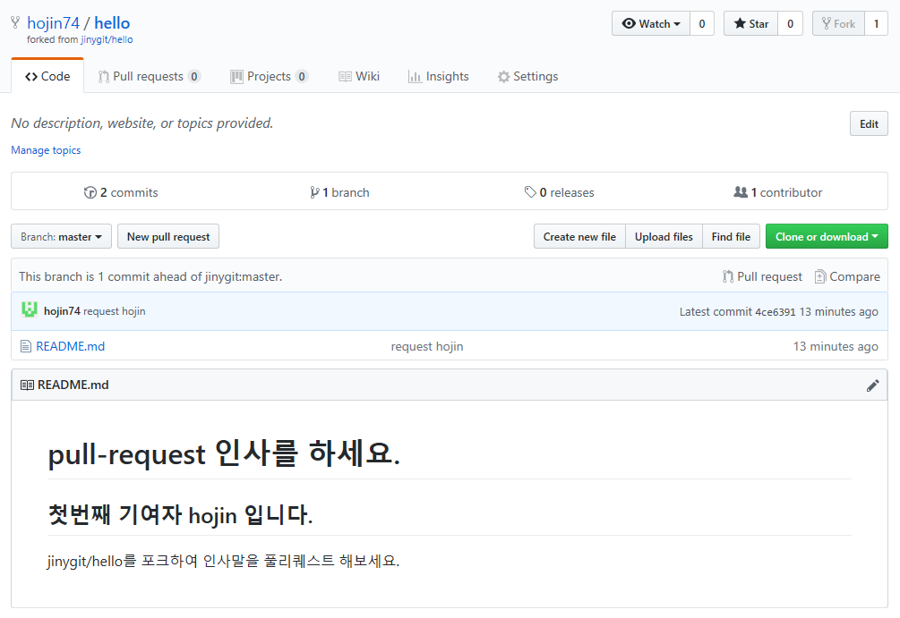
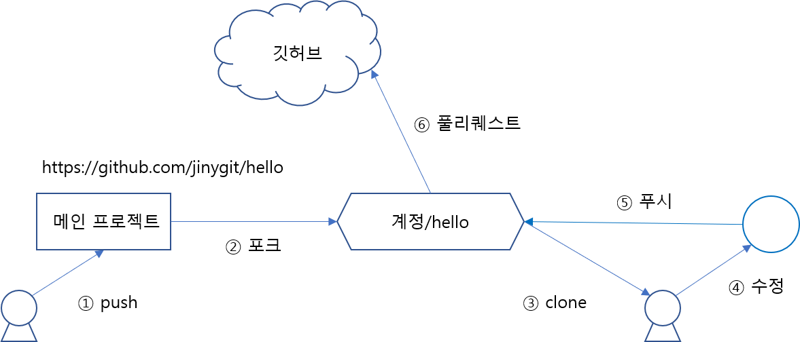

# 코드 수정
이제 코드를 수정할 수 있게 되었습니다. 
수정된 코드를 포크 저장소로 푸시하여 풀-리퀘스트를 요청할 수 있습니다.

## 계정 재등록
2개의 계정을 이용하여 실습하는 독자도 있을 것입니다. 
풀-리퀘스트를 실습하기 위해서는 깃의 환경 설정이 계정별로 분리되어 있어야 합니다.

* 글로벌 설정
처음 깃을 설치할 때 사용자 계정 이름과 이메일을 글로벌로 등록하였습니다. 
글로벌로 등록하면 깃의 모든 커밋 작업에는 등록한 계정 정보가 삽입됩니다.

* 개별 설정
하나의 로컬 컴퓨터에서 두 개 이상의 깃 계정을 사용할 수 있습니다. 
이런 경우에는 저장소마다 계정을 설정합니다. 

포크 저장소를 복제한 로컬 저장소로 이동합니다.

```
infoh@DESKTOP-VAKLOFQ MINGW64 /e/jinygit/hello_fork (master)
$ git config user.name "hojin74"

infoh@DESKTOP-VAKLOFQ MINGW64 /e/jinygit/hello_fork (master)
$ git config user.email "infohojin@naver.com"
```

계정을 설정하는 방법은 동일합니다. --global 옵션을 제외하면 됩니다. 

* 설정 파일
저장소별로 저장된 설정값은 .git/config 파일 안에 저장됩니다.

```
infoh@DESKTOP-VAKLOFQ MINGW64 /e/jinygit/hello_fork (master)
$ cat .git/config
[core]
        repositoryformatversion = 0
        filemode = false
        bare = false
        logallrefupdates = true
        symlinks = false
        ignorecase = true
[remote "origin"]
        url = https://github.com/hojin74/hello.git
        fetch = +refs/heads/*:refs/remotes/origin/*
[branch "master"]
        remote = origin
        merge = refs/heads/master
[user]
        name = hojin74
        email = infohojin@naver.com
```

이제 자신의 로컬 컴퓨터에서 코드를 수정합니다. 
이 저장소에서 생성되는 커밋은 `.git/config` 파일 안에 등록된 정보로 커밋이 이루어집니다.

## 코드 수정
컨트리뷰션 내용으로 코드를 수정해합니다. 간단하게 인사말을 추가해봅니다.

README.md
```md
# pull-request 인사를 하세요.
## 첫번째 기여자 hojin입니다.
jinygit/hello를 포크하여 인사말을 풀-리퀘스트 해보세요.
```

```bash
infoh@hojin1 MINGW64 /e/jinygit/hello_fork (master)
$ git commit -am "request hojin"
[master 4ce6391] request hojin
 1 file changed, 3 insertions(+), 1 deletion(-)
```
수정하고 로그를 확인해봅니다. 

  

변경한 계정의 정보로 커밋이 이루어진 것을 확인할 수 있습니다.

```
infoh@hojin1 MINGW64 /e/jinygit/hello_fork (master)
$ git log
commit 4ce639124ba46b21e58ca6ff28febaf9433534f2 (HEAD -> master)
Author: hojin74 <infohojin@naver.com>
Date:   Thu Feb 21 19:28:17 2019 +0900
    request hojin

commit 4b595ecba9a79ee7ff6fb1ce4e969fb77d8d6159 (origin/master, origin/HEAD)
Author: hojin <infohojin@gmail.com>
Date:   Thu Feb 21 19:16:42 2019 +0900
    first
```

두 번째 추가한 계정으로 커밋된 것을 확인할 수 있습니다.

## 코드 전송
수정한 코드를 포크된 원격 저장소로 전송합니다. 여기서 원격 저장소란 포크한 자신의 저장소를 말합니다.

```
infoh@hojin1 MINGW64 /e/jinygit/hello_fork (master)
$ git push origin master
Enumerating objects: 5, done.
Counting objects: 100% (5/5), done.
Delta compression using up to 8 threads
Compressing objects: 100% (2/2), done.
Writing objects: 100% (3/3), 375 bytes | 375.00 KiB/s, done.
Total 3 (delta 0), reused 0 (delta 0)
To https://github.com/hojin74/hello.git
 ! [remote rejected] master -> master (permission denied)
error: failed to push some refs to 'https://github.com/hojin74/hello.git'
```

접속 오류가 발생합니다. 
오류 메시지를 확인해보면 깃허브 접속 권한 실패입니다. 
우리는 지금 2개의 계정을 이용하여 실습하고 있습니다. 

만일 다른 컴퓨터를 이용하여 실습한다면 이와 같은 메시지는 출력하지 않습니다. 
이를 해결하기 위해 두 번째 계정으로 환경 설정을 변경해봅니다.

원격 저장소의 리모트 설정은 `.git/config`에 기록되어 있습니다.

```
$ cat .git/config

[remote "origin"]
        url = https://github.com/hojin74/hello.git
        fetch = +refs/heads/*:refs/remotes/origin/*
```

원격 서버의 접속 정보를 2번째 계정의 호스트 형식으로 변경합니다.

```
url = git@호스트이름:계정/저장소.git
```

다음은 이를 적용한 예제입니다. 이 부분이 이해되지 않는다면, 호스팅의 이중 계정 설정 부분을 참고해보길 바랍니다.

```
[remote "origin"]
    url = git@github.com-2:hojin74/hello.git
    fetch = +refs/heads/*:refs/remotes/origin/*
```

접속 계정을 변경한 후에 다시 푸시합니다.

   

```
infoh@hojin1 MINGW64 /e/jinygit/hello_fork (master)
$ git push origin master
Warning: Permanently added the RSA host key for IP address '192.30.255.112' to the list of known hosts.
Enter passphrase for key '/c/Users/infoh/.ssh/id_rsa2':
Enumerating objects: 5, done.
Counting objects: 100% (5/5), done.
Delta compression using up to 8 threads
Compressing objects: 100% (2/2), done.
Writing objects: 100% (3/3), 375 bytes | 375.00 KiB/s, done.
Total 3 (delta 0), reused 0 (delta 0)
To github.com-2:hojin74/hello.git
   4b595ec..4ce6391  master -> master
```

접속 비밀번호를 입력하면 정상적으로 2번째 계정으로 푸시가 이루어집니다.

   

변경된 `README.md`가 포크 저장소에 반영되었습니다.