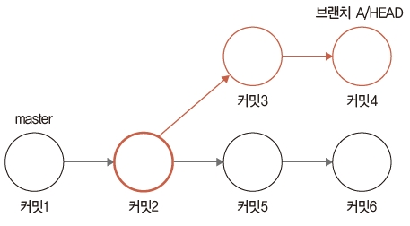

# 브랜치 생성
---
브랜치는 `가상`의 작업 폴더입니다.  

 

## 시작 브랜치
---
처음 깃을 `초기화`할 때 워킹 디렉터리는 `master 브랜치`를 `생성`합니다.  
브랜치를 생성하려면 `기준`이 되는 브랜치 또는 `커밋`이 하나 있어야 합니다.  
그리고 깃은 master 브랜치를 기준으로 `새로운 브랜치`를 생성합니다.  

 

## 브랜치는 커밋을 가리키는 별칭
---
브랜치는 `공통된 커밋`을 가리키는 지점입니다. 그리고 브랜치는 커밋처럼 `SHA1` 해시키를 가리킵니다.  
하지만 커밋의 SHA1 해시키는 `기억`하기가 어렵기 때문에 특정 커밋을 가리키는 `별칭`을 만드는 것입니다.  
이렇게 만든 별칭이 브랜치입니다.  

즉, 브랜치를 생성한다는 의미는 기존 브랜치 또는 커밋에 새로운 `연결 고리`를 하나 더 만드는 것과 같습니다.  

브랜치는 공통된 커밋을 가리키는 지점  

 

## 브랜치 포인터
---
새 브랜치를 생성하면 `포인터만 있는 브랜치`가 생성됩니다.  
일반적으로 브랜치 생성 명령을 실행하면 현재 커밋을 가리키는 `HEAD`를 기준으로 생성됩니다. HEAD는 현재 `마지막 커밋`을 가리킵니다.  

 

## 실제 브랜치의 생성시점
---
> Note: 브랜치는 마지막 커밋 위치를 가리키는 역할만 할 뿐 실제 브랜치는 아닙니다. 그렇다면 실제 브랜치는 언제 만들까요? 일반적으로 실제 커밋이 추가될 때 만듭니다.  

예를 들어 브랜치를 생성한 후 생성된 브랜치로 이동합니다.  
이동한 브랜치에서 파일을 수정하고 커밋합니다.  

그리고 새로운 브랜치에 추가 커밋이 발생할 때, 브랜치는 `새로운 커밋`으로 브랜치의 `포인터`를 `이동`합니다.  
즉, 브랜치는 `실제 커밋`이 `추가`될 때 만듭니다.  

 

## 독립된 영역
---
새롭게 브랜치가 생성되면 `독립된 공간`을 할당합니다.  
기존 작업 영역에는 영향을 주지 않는 새로운 가상 공간입니다.  
이것으로 기존 브랜치의 소스 코드에 영향을 주지 않고 새로운 작업을 할 수 있습니다.  

 

+ [브랜치 생성](create) 
+ [브랜치 이름](name) 
+ [소스트리 브랜치](sourcetree) 

 