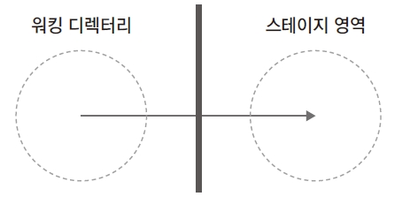
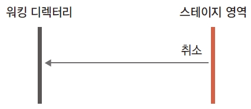

# 깃에 새 파일 등록
---
깃의 워킹 디렉터리에 새 파일이 생성되었습니다. 워킹 디렉터리에 있는 파일은 깃이 자동으로 추적 관리하지 않습니다. 커밋을 하려면 파일의 상태가 추적 가능해야 합니다.  

워킹 디렉터리에 새로 추가된 untracked 상태의 파일을 추적 가능 상태로 변경하는 것을 등록이라고 합니다. 또 파일을 등록하면 워킹 디렉터리의 파일이 스테이지 영역에 추가됩니다. 스테이지 영역의 관리 목록에 추가된 파일만 깃에서 이력을 추적할 수 있습니다.  

그림 4-6] 새 파일 등록  
 

워킹 디렉터리는 작업을 위한 일종의 샌드박스(서로 분리되어 있는 영역)와 같습니다.  

<br>
<a name="1"></a>

## 스테이지에 등록
---
깃에서 등록이란 정확히 무엇을 의미할까요? 등록이란 워킹 디렉터리에 있는 파일을 스테이지(stage) 영역으로 복사하는 것을 의미합니다. 여기서 ‘복사’는 실제 파일을 복사하는 것을 의미하지는 않습니다. 깃 내부에서 논리적인 기록을 변경하는 과정일 뿐입니다. 복사라고 표현한 것은 이해하기 쉽게 풀어 쓴 것입니다.  

워킹 디렉터리에 추가된 모든 파일을 커밋할 때는 반드시 이 과정을 거쳐야 합니다. 그래야 깃에서 버전 이력을 관리할 수 있습니다. 스테이지에 등록되지 않은 unstage 상태의 파일들은 커밋할 수 없습니다. 깃은 커밋하기 전에 파일들이 stage 상태인지 unstage 상태인지를 판단합니다. 스테이지 영역으로 등록된 파일들은 tracked 상태로 자동 변경됩니다.  


* 명령어로 등록: add 명령어
현재는 커밋 명령어를 실행하기 이전의 중간 단계입니다. 깃의 add 명령어는 워킹 디렉터리의 파일을 스테이지 영역으로 등록합니다. 깃은 안정적인 커밋을 할 수 있도록 add 명령어를 기준으로 이전과 이후 단계를 구별합니다.  

터미널에서는 다음 형태의 명령어를 입력합니다.  

```
$ git add 파일이름
```

그럼 index.htm 파일을 등록합시다.

```
infoh@hojin MINGW64 /e/gitstudy04 (master)
$ git add index.htm ☜ 스테이지 등록
```

index.htm 파일을 등록하는 과정은 다음과 같이 표현할 수 있습니다.  

그림 4-7] 스테이지 영역에 등록
 

add 명령어를 실행하면 지정한 파일은 스테이지 영역으로 등록됩니다. 스테이지 영역에 파일이 등록되면 파일은 tracked 상태로 변경됩니다.  

파일 이름 대신 점(.)을 이용하면 전체 파일과 폴더를 모두 등록할 수 있습니다. 점(.)은 리눅스와 같은 운영 체제에서 현재 디렉터리를 의미하는 기호입니다.  

```
$ git add .
```

워킹 디렉터리에 생성된 모든 파일을 스테이지 영역에 추가할 필요는 없습니다. 필요한 파일만 스테이지 영역에 등록하여 이력을 추적하면 됩니다. 스테이지 영역에 등록하지 않은 파일은 커밋 작업에 포함되지 않습니다. 등록 명령으로 파일들의 이력을 커밋 기록에 포함할지 여부를 결정할 수 있습니다. 정보 이력을 추적하고 싶은 파일만 스테이지 영역에 추가합니다. 단 빈 폴더는 스테이지 영역에 등록할 수 없습니다. 폴더 안에 파일이 하나 이상 있어야 등록이 가능합니다.  

* 소스트리에서 등록
이번에는 소스트리를 이용하여 스테이지 영역에 파일을 등록해 봅시다. 소스트리는 스테이지 영역에 등록되는 파일을 직관적으로 확인할 수 있습니다.  

untracked 상태인 파일은 소스트리의 스테이지에 올라가지 않은 파일 영역에서 확인할 수 있습니다. 파일을 선택하여 상위 영역의 스테이지에 올라간 파일 부분으로 옮깁니다.  

소스트리는 추적 상태와 추적하지 않음을 쉽게 구별할 수 있도록 파일 이름 앞에 아이콘을 함께 표시합니다. 보라색 아이콘 4-a.jpg은 untracked 상태의 파일입니다. 또는 새로 생성된 파일을 의미하기도 합니다.  

그림 4-8] 스테이지에 올라가지 않은 파일  
 

untracked 상태의 파일 여러 개를 4-b.jpg로 한 번에 등록할 수 있습니다. 전체 파일을 스테이지 영역에 등록할 때는 모두 스테이지에 올리기를 누릅니다.  

스테이지 영역에 등록된 파일은 스테이지에 올라간 파일 목록에서 확인할 수 있습니다. 스테이지에 등록되면 파일 이름 앞에 녹색 아이콘 4-c.jpg을 표시합니다.  

그림 4-9] 스테이지에 파일이 등록됨  
 

`선택내용 스테이지에 올리기`를 사용하면 한 번에 하나씩 파일을 등록할 수 있습니다. 등록할 파일 이름을 목록에서 선택한 후 선택 내용 스테이지에 올리기를 누릅니다.  

<br>
<a name="2"></a>

## 파일의 추적 상태 확인
---
워킹 디렉터리에 있는 새로운 파일이 스테이지 영역에 등록되었습니다. 콘솔창에서 status 명령어를 사용하여 등록 상태를 다시 한 번 확인해 보겠습니다.  

```
infoh@hojin MINGW64 /e/gitstudy04 (master)
$ git status ☜ 상태를 확인합니다.
On branch master
No commits yet
Changes to be committed:
  (use "git rm --cached <file>..." to unstage)
        new file:   index.htm ☜ 스테이지 등록, 새 파일 상태
```

이전 상태와 달리 new file 메시지가 출력됩니다. 이는 스테이지 영역에 파일을 정상적으로 등록했다는 의미입니다.  

앞으로 좀 더 학습해야 하지만, 스테이지 영역에 등록되었다고 커밋이 된 것은 아닙니다. 아직 커밋 명령어를 학습하지 않았습니다. 등록은 커밋을 하기 전 선행 작업일 뿐입니다.  

<br>
<a name="3"></a>

## 파일 등록 취소
---
이번에는 tracked 상태의 파일을 untracked 상태로 변경해 보겠습니다. 스테이지에 등록하는 것과 반대 과정입니다. 등록 취소는 워킹 디렉터리와 스테이지 영역을 서로 왔다 갔다 할 수 있는 방법입니다.  

unstage 상태로 변경하려면 삭제(rm)나 리셋(reset) 명령어를 사용합니다.  

그림 4-10] 스테이지 영역의 파일 등록 취소
 

rm 명령어로 삭제해 보겠습니다. 스테이지 영역에서만 등록된 파일을 삭제하려고 `--cached` 옵션을 함께 사용합니다.  

```
infoh@hojin MINGW64 /e/gitstudy04 (master)
$ git rm --cached index.htm ☜ 스테이지 삭제
rm 'index.htm'
```

스테이지의 캐시 목록에서 파일이 삭제됩니다. 다시 status 명령어를 실행하여 확인합시다.  

```
infoh@hojin MINGW64 /e/gitstudy04 (master)
$ git status ☜ 상태 확인
On branch master
No commits yet
Untracked files: ☜ 추적하지 않음
  (use "git add <file>..." to include in what will be committed)
        index.htm ☜ 스테이지 삭제

nothing added to commit but untracked files present (use "git add" to track)
```

등록하기 이전의 untracked 상태로 변경되었습니다. 다음 실습에 대비하여 다시 tracked 상태로 변경해 놓습니다.  

```
infoh@hojin MINGW64 /e/gitstudy04 (master)
$ git add index.htm ☜ 스테이지 다시등록
```

파일을 등록한 후 커밋하지 않고 바로 삭제하려면 rm --cached 명령어를 사용합니다. 하지만 한 번이라도 커밋을 했다면 reset 명령어를 사용해야 합니다. 리셋 방법은 9장에서 자세히 설명합니다.  

예를 들어 커밋한 index.htm 파일을 rm 명령어로 삭제했다고 합시다.  

```
infoh@hojin MINGW64 /e/gitstudy04 (master)
$ git rm --cached index.htm
rm 'index.htm'
```

삭제한 후 status 명령어를 실행하면 다음과 같이 이전과 다른 결과가 나옵니다.  

```
infoh@hojin MINGW64 /e/gitstudy04 (master)
$ git status
On branch master
Changes to be committed:
  (use "git reset HEAD <file>..." to unstage)
        deleted:    index.htm
Untracked files:
  (use "git add <file>..." to include in what will be committed)
        index.htm ☜ 스테이지 삭제
```

파일이 untracked 상태가 되고, 스테이지 영역에서 파일이 삭제 처리됩니다. 커밋 후 삭제는 파일이 삭제 또는 변화된 것으로 간주합니다. 따라서 커밋된 파일은 리셋으로 삭제한 후 정리해 주어야 합니다. 다음은 간단한 리셋 후 정리하는 명령어를 사용한 예입니다.  

```
infoh@hojin MINGW64 /e/gitstudy04 (master)
$ git reset HEAD index.htm ☜ 리셋을 시도합니다.
```

그리고 다시 status 명령어로 확인하면 정상적으로 커밋이 정리되었습니다.  

```
infoh@hojin MINGW64 /e/gitstudy04 (master)
$ git status ☜ 상태 확인
On branch master
nothing to commit, working tree clean
```

이처럼 터미널에서 unstage 상태 및 untracked 상태로 변경하는 것은 복잡합니다. 소스트리를 이용하면 스테이지 영역에 등록된 파일을 좀 더 쉽게 등록 취소할 수 있습니다. 모두 스테이지에서 내리기와 선택 내용 스테이지에서 내리기를 사용하면 untracked 상태로 쉽게 변경할 수 있습니다.  

<br>
<a name="4"></a>

## 등록된 파일 이름이 변경되었을 때
---
작업 도중 파일 이름도 변경할 수 있습니다. 하지만 파일 이름을 변경했다고 별도로 깃에 통보할 필요는 없습니다. 깃은 똑똑해서 변경된 파일 이름을 자동으로 알고 있습니다.  

리눅스나 macOS에서는 mv 명령어로 파일 이름을 변경할 수 있습니다. 깃에서도 파일 이름을 변경할 때 mv 명령어를 사용합니다.  

```
$ git mv 파일이름 새파일이름
```

다음과 같이 index.htm 파일의 이름을 변경하고 상태를 확인해 보면 깃에서 변경된 파일을 계속 추적하는 것을 알 수 있습니다.  

```
infoh@hojin MINGW64 /e/gitstudy04 (master)
$ git mv index,htm home.htm
$ git status
On branch master
No commits yet

Changes to be committed:
  (use "git rm --cached <file>..." to unstage)
        new file:   home.htm ☜ 파일 이름 변경
```

굳이 git mv 명령어를 사용하지 않고, 운영 체제의 mv 명령어를 사용해도 됩니다. 깃의 git mv 명령어를 여러 단계의 명령으로 풀면 다음과 같습니다.  

[예시]
```
infoh@hojin MINGW64 /e/gitstudy04 (master)
$ mv index.htm home.htm
$ git rm index.htm
$ git add home.htm
```

예에서 알 수 있듯이, 이름을 변경한다는 의미는 기존 파일을 삭제하고 새 파일을 다시 스테이지 영역에 등록하는 과정과 유사합니다. 풀어 쓴 명령에서 이름을 변경한 후에는 rm과 add 명령어를 실행해야 한다는 사실을 잊지 마세요.  

다음 실습을 위해 이전 이름으로 되돌려 놓습니다.  

```
infoh@hojin MINGW64 /e/gitstudy04 (master)
$ git mv home.htm index,htm
```

<br><br>