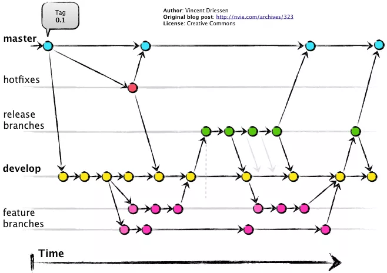
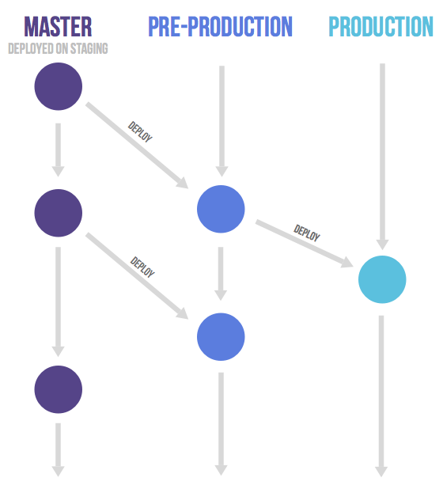

# 전략

여러 개발자들과 하나의 프로젝트를 진행하는 것은 쉬운 일이 아닙니다. 서로 각자의 스타일로 개발할 경우, 협업에 많은 혼동이 발생할 수 있습니다. 원활한 작업을 위해서 공동 작업 규칙을 설정하는 것이 중요합니다.

 

## 브랜치

깃은 공동의 작업을 협업하기 위한 도구입니다. 깃을 통하여 개발 코드의 이력을 관리합니다. 실무 현장에서 깃을 사용하는 목적은 단순한 코드의 커밋의 기록만이 아닙니다. 프로젝트를 좀 더 효율적으로 관리하기 위한 목적이 더 큽니다. 

깃은 여러 사람과의 협업 관계를 설정하고 복잡하게 얽혀 있는 작업의 규칙을 설정합니다. 또한, 추가되는 기능들을 충돌 없이 효과적으로 운영하는 것 또한 매우 중요합니다. 

깃은 프로젝트의 관리 능력 한단계 높여 줍니다. 많은 개발자는 버전 관리 시스템을 사용할 때 브랜치를 이용합니다. 브랜치는 효율적으로 프로젝트를 관리할 수 있게 하는 전략 중 하나입니다. 브랜치는 기존 코드의 상호 간섭이 없이 새로운 다른 작업을 시작할 수 있습니다. 또한, 개발이 완료된 브랜치를 원본에 병합할 수 있습니다.

브랜치는 여러 개발자들과 협업을 이루어낼 수 있는 좋은 전략 기능입니다. 많은 기업에서는 브랜치를 이용하여 다양한 전략들을 적용합니다. 그 중에서 인기 있는 브랜치 전략은 깃 플로우(git-flow)입니다.

깃 플로우 전략 이외에도 깃허브 플로우(github-flow)와 깃랩 플로우(gitlab-flow) 전략도 있습니다.

 

## 깃 플로우

모든 개발자마다 각자 고유의 개발 방식들이 존재합니다. 그중 깃 플로우는 네덜란드 빈센트 트라이센(Vincent Driessen) 블로그에서 유래된 브랜치 전략입니다. 

깃 플로우(git-flow)는 깃을 사용하는 개발자라면 한 번은 들어본 브랜치 전략일 것입니다. 깃의 대표적인 브랜치 전략이며, 현업에서 가장 많이 응용되는 전략입니다. 
깃 플로우 전략의 인기로 인하여 최신의 깃(Git) 버전에는 깃 플로우 전략이 내장되어 있습니다.

깃 플로우는 크게 5개의 브랜치를 만들어 상호 운영되는 전략입니다. 각 브랜치는 고유의 기능이 있습니다. 일부 브랜치는 병합을 통하여 지속적으로 유지되는 브랜치도 있습니다. 

* Master
* Develop
* Feature
* Release
* Hotfix

이 전략들은 깃과 조합하여 안정된 개발 프로세스를 진행하는 것을 목적으로합니다. 다음은 빈센트 트라이센 블로그에서 발표된 깃 플로우의 다이어그램입니다.

그림은 매우 복잡해보이지만, 이 동작들은 간단한 작업의 규칙들을 나타낸 것입니다. 깃 플로우의 탄생 배경은 전형적인 소프트웨어 프로젝트를 기반으로합니다. 일반 소프트웨어는 개발과 테스트, 배포 등의 단계를 가지고 있습니다. 이러한 내부 개발 과정의 관리 방법을 중점으로 탄생된 전략입니다.

 

## 깃허브 플로우

깃 플로우는 전략의 표준이라 할 정도로 인기가 많은 브랜치 사용 방법입니다. 깃 플로우는 5개의 전략 브랜치를 가지고 있습니다. 그렇지만, 소규모의 프로젝트에서 5개의 브랜치는 관리하기 에는 좀 많은 브랜치 개수입니다.

깃 플로우가 전형적인 소프트웨어 개발의 프로세스를 따르기 때문에 대형 프로젝트에는 매우 적합한 모델입니다. 하지만 모든 개발 프로세스 공정을 따라 가기에는 시간이 많이 걸리는 단점이 있습니다.

이런 점에서 깃허브의 운영자 스캇 샤콘(Scott Chacon)은 새로운 브랜치 전략을 발표합니다. 깃 플로우는 인기 있지만, 자신의 서비스인 깃허브에 응용하기에는 다소 복잡하다고 생각하였습니다. 깃 플로우를 전략을 좀 더 단순하게 하여 빠른 개발 프로세스를 확보하기를 원했습니다. 이를 위해 깃허브에서 고안된 깃허브 플로우(Github-Flow) 브랜치 전략이 있습니다.

깃허브 플로우는 2개의 브랜치만 이용합니다. 좀 더 단순한 브랜치 전략을 구성하여 빠른 개발과 배포 환경을 구축할 수 있습니다.

* Master 브랜치
* Feature 브랜치

①	기본적으로 마스터 브랜치는 배포를 유지하는 브랜치입니다. 
② 새로운 기능은 feature에 작업하여 master로 병합합니다. 

깃허브 플로우의 장점은 브랜치 수가 적기 때문에 빠르게 작업이 가능합니다. 원본 브랜치에 결합하여 쉽게 배포할 수 있는 장점이 있습니다.

 

## 깃랩 플로우

깃랩 플로우는 앞에서 소개한 두 가지 전략의 중간 모델입니다. 깃허브 플로우는깃 플로우보다 단순하여 편리합니다. 하지만 배포 과정에서는 완성된 코드를 테스트할 수 없는 것이 아쉬운 부분입니다.

깃랩 전략은 깃허브 전략에서 테스트를 위한 브랜치를 추가한 모델입니다.

① 전략 1
깃랩 플로우는 production이라는 브랜치가 추가되었습니다. Master 브랜치가 배포 준비 상태로 변경되면 production 브랜치로 병합합니다. 마치 Production 브랜치는 깃 플로우 전략의 release 브랜치와 유사합니다.

② 전략 2
기존의 전략 1을 좀 더 확장합니다. 확장된 깃랩의 브랜치 전략은 master와 production 브랜치 사이에 임시의 pre-production 브랜치를 하나 더 생성합니다. Pre-production 브랜치는 실제 배포를 전 단계로 production을 테스트하는 브랜치를 말합니다.

테스트 과정의 브랜치를 추가하여 안정적인 프로젝트 배포를 유지할 수 있는 전략 플로우입니다.

 

## 진입장벽

브랜치 플로우는 효율적으로 프로젝트를 유지하고 관리하기 위한 전략 중 하나입니다. 

전략은 하나의 규칙으로 개발 구성원들의 일관된 작업 방향을 유도할 수 있습니다. 그중 깃 플로우는 여러 개발 전략 중에서도 가장 인기 있는 전략입니다. 특히 제품을 만들고 소비자에게 배포하는 코드라면 더욱 유용합니다.

하지만 아무리 좋은 전략이라도 몸에 익혀야 사용할 수 있습니다. 이러한 브랜치 전략들을 구성원들이 이해하고 능숙하게 숙달되기까지는 다소 시간이 걸립니다. 즉, 브랜치 전략을 이용하여 개발 작업을 하기 위해서는 약간의 학습 진입 장벽이 생깁니다.

따라서 브랜치 전략을 도입을 할 때에는 충분한 학습이 이루어진 상태에서 실제프로젝트에 적용하는 것이 좋습니다.

  