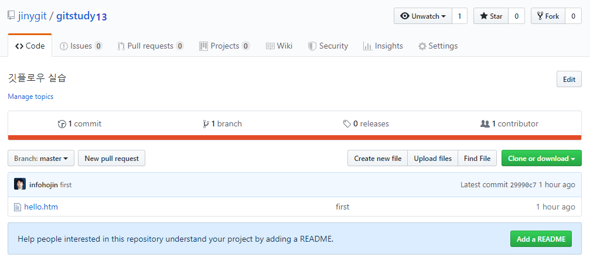
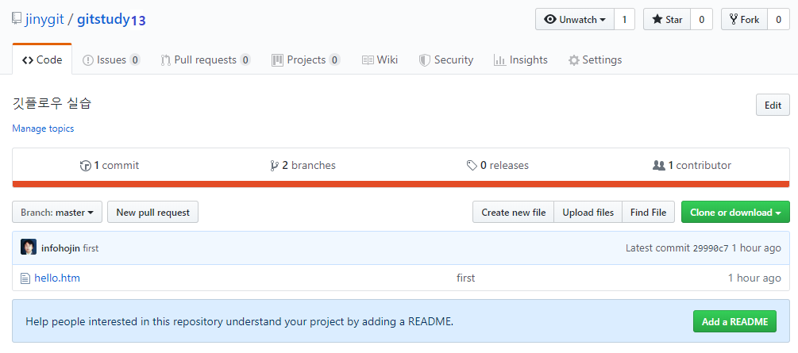

# 초기화
<hr>
실습 환경은 단순히 저장소를 생성하고 원격 저장소와 연동만 되어 있습니다. 깃 플로우를 실습하기 위해서는 추가로 플로우 초기화를 해주어야 합니다.

<br>

## 깃 플로우 명령어
<hr>
깃은 자체적인 깃 플로우 명령어를 제공합니다. 터미널에서 flow 명령어를 입력합니다.

```bash
$ git flow
usage: git flow <subcommand>

Available subcommands are:
   init      Initialize a new git repo with support for the branching model.
   feature   Manage your feature branches.
   bugfix    Manage your bugfix branches.
   release   Manage your release branches.
   hotfix    Manage your hotfix branches.
   support   Manage your support branches.
   version   Shows version information.
   config    Manage your git-flow configuration.
   log       Show log deviating from base branch.

Try 'git flow <subcommand> help' for details.
```

몇 개의 서브 명령어들이 출력됩니다. 각 명령어들은 깃 플로우의 브랜치 전략을 기준으로 나누어져 있습니다. 

<br>

## 초기화
<hr>
깃 플로우 브랜치 전략을 사용하기 위해서는 저장소를 추가로 초기화 작업이 필요합니다. 깃 플로우 초기화는 몇 개의 기본 전략 브랜치를 자동 생성합니다. 

플로우 초기화를 위해서는 먼저 폴더가 깃 초기화되어 있어야 합니다. 깃 저장소인지 확인합니다.

```bash
infoh@DESKTOP MINGW64 /e/gitstudy13 (master)
$ ls -all
total 13
drwxr-xr-x 1 infoh 197609  0 6월   1 14:58 .
drwxr-xr-x 1 infoh 197609  0 6월   1 14:54 ..
drwxr-xr-x 1 infoh 197609  0 6월   1 15:10 .git ☜ 깃 저장소
-rw-r--r-- 1 infoh 197609 28 6월   1 14:58 hello.htm
```

폴더 안에 깃의 숨겨진 저장소 `.git`이 있는지 확인합니다. 다음으로 깃 플로우 전략을 초기화합니다. 깃 플로우 초기화 `git flow init` 명령어를 실행합니다. 

```bash
infoh@DESKTOP MINGW64 /e/gitstudy13 (master)
$ git flow init ☜ 플로우 초기화
Which branch should be used for bringing forth production releases?
   - master
Branch name for production releases: [master] ☜ 기본 브랜치
Branch name for "next release" development: [develop] ☜ 기본 브랜치

How to name your supporting branch prefixes?
Feature branches? [feature/] ☜ 기본 브랜치
Bugfix branches? [bugfix/] ☜ 기본 브랜치
Release branches? [release/] ☜ 기본 브랜치
Hotfix branches? [hotfix/] ☜ 기본 브랜치
Support branches? [support/] ☜ 기본 브랜치
Version tag prefix? []
Hooks and filters directory? [E:/gitstudy13/.git/hooks]
```

깃 플로우 초기화 명령어는 깃 플로우 전략에 맞는 브랜치들을 자동으로 생성해줍니다. 각 단계에서 생성되는 브랜치의 이름을 확인하도록 요청합니다. 엔터키를 눌러 기본값으로 생성합니다.

전략 브랜치의 생성 확인을 클릭하기 귀찮다면 -d 옵션을 사용할 수 있습니다. 매번 확인 요청을 하지 않고 자동으로 기본 브랜치를 생성합니다.

[예시]
```
$ git flow init -d
```

> git flow init과 git init의 동작은 서로 다릅니다. git init은 깃의 저장소를 생성하고 초기화하는 명령어입니다. git flow init은 생성된 저장소의 브랜치 정보만 초기화합니다. 

<br>

## 브랜치 확인
<hr>
깃 플로우 도구로 생성된 전략 브랜치들을 확인해봅니다. 초기화한 후 branch 명령어를 입력합니다. 생성된 브랜치들을 확인합니다.

```bash
infoh@DESKTOP MINGW64 /e/gitstudy13 (master)
$ git branch -v
* develop 29990c7 first ☜ 체크아웃
  master  29990c7 first
```

현재 2개의 브랜치가 생성된 것을 확인할 수 있습니다. 기존 전략에 따라서 원본 소스를 유지하는 master 브랜치 이외에 개발 작업을 위한 develop 브랜치가 생성됩니다.

또한, develop로 자동 체크아웃된 것을 확인할 수 있습니다.


나머지 깃 플로우의 전략 브랜치는 필요 시 생성하여 작업합니다. 모든 전략에 대한 브랜치를 처음부터 자동 생성하지는 않습니다.

<br>

## 브랜치 동기화
<hr>
현재 로컬 저장소에는 원격 브랜치가 추가되어 있습니다. 원격 저장소는 기본이 되는 master 브랜치 하나만 존재합니다.

깃허브의 저장소 페이지로 이동합니다. 브랜치 탭을 확인합니다. 아직 한 개의 브랜치만 존재합니다.




로컬 저장소에서 초기화된 develop 브랜치는 아직 존재하지 않습니다. 원격 저장소에 develop 전략 브랜치를 생성하기 위해서는 원격 저장소를 동기화해주어야합니다. 

로컬 저장소의 develop 브랜치를 원격 저장소로 동기화합니다. 푸시(Push) 명령어를 입력합니다. 

```
infoh@DESKTOP MINGW64 /e/gitstudy13 (master)
$ git push -u origin develop
Total 0 (delta 0), reused 0 (delta 0)
remote:
remote: Create a pull request for 'develop' on GitHub by visiting:
remote:      https://github.com/jinygit/gitstudy13/pull/new/develop
remote:
To https://github.com/jinygit/gitstudy13.git
 * [new branch]      develop -> develop ☜ 원격 브랜치 생성
Branch 'develop' set up to track remote branch 'develop' from 'origin'.
```

원격 저장소에 현재의 develop 브랜치와 동일한 브랜치를 하나 생성합니다. 생성된 브랜치로 로컬 브랜치의 커밋을 동기화합니다.

깃허브 화면을 다시 확인해봅니다. 브랜치의 개수가 2 branches로 변경된 것을 확인할 수 있습니다. 




로컬 저장소에서 원격 저장소의 브랜치 목록을 확인합니다. 브랜치 명령어의 -r 옵션은 원격 저장소의 브랜치 목록을 출력합니다.

```bash
infoh@DESKTOP MINGW64 /e/gitstudy13 (master)
$ git branch -r
  origin/develop
  origin/master
```

또는 show 명령어를 통하여 원격 저장소의 정보를 확인할 수 있습니다.

```
infoh@DESKTOP MINGW64 /e/gitstudy13 (master)
$ git remote show origin
* remote origin
  Fetch URL: https://github.com/jinygit/gitstudy13.git
  Push  URL: https://github.com/jinygit/gitstudy13.git
  HEAD branch: master
  Remote branches:
    develop tracked
    master  tracked
  Local branches configured for 'git pull':
    develop merges with remote develop
    master  merges with remote master
  Local refs configured for 'git push':
    develop pushes to develop (up to date)
    master  pushes to master  (up to date)
```

로컬에서 생성된 브랜치를 원격 저장소에도 등록하기 위해서는 동기화해야 합니다. 동기화 작업을 하지 않으면, 원격 저장소는 로컬 저장소의 브랜치의 정보를 알 수 없습니다.

<br>

## 소스트리
<hr>
소스트리에서도 깃 플로우 전략을 사용할 수 있습니다. 

처음 깃은 master 한 개의 브랜치만 가지고 있습니다. 소스트리 상단의 깃 플로우 버튼을 클릭하세요. 깃 플로우와 관련된 브랜치들을 소스트리가 자동으로 생성합니다.


깃 플로우 버튼은 터미널에서 실행되는 깃 플로우 초기화 명령어와 같습니다. 실행 후 기본 master 브랜치 외에 새로운 develop 브랜치가 더 생성된 것을 볼 수 있습니다. 또한, 자동으로 develop 브랜치가 체크아웃됩니다.

<br><br>