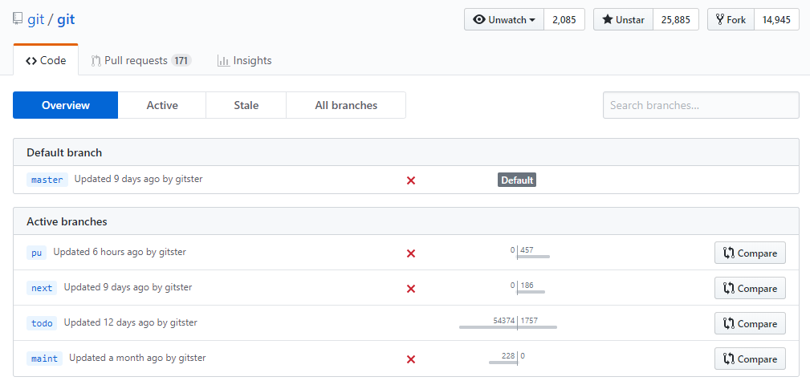
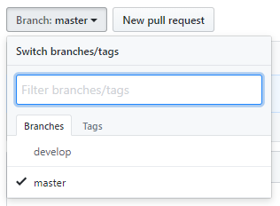

# 브랜치
코드의 두 번째 항목은 브랜치입니다. 브랜치를 선택하면 좀 더 상세한 브랜치 목록을 확인할 수 있습니다.

## 원격 브랜치
원격 저장소로 공개된 브랜치의 개수를 말합니다. 로컬 브랜치를 생성한 후에 서버로 새로운 브랜치의 푸시하지 않았다면 표시가 되지 않습니다.

다음은 오픈 소스 깃 저장소의 브랜치 정보입니다. 브랜치 항목을 클릭합니다.

 
 
브랜치 화면으로 이동하면 생성된 브랜치들의 목록을 출력합니다.

## 브랜치 탭
브랜치에는 4개의 서브 탭이 있습니다. All Branches를 선택하면 모든 브랜치를 볼 수 있습니다.

* Overview
Overview는 브랜치의 개요에 대해 표시합니다. 

* Active
Active는 최근 3개월간 활성된 브랜치를 출력합니다.

* Stale
stale은 3개월간 작업이 없는 브랜지를 출력합니다.

## 원격 브랜치 생성
깃허브 저장소에서 원격 브랜치를 생성할 수 있습니다. 메인 code 탭으로 이동합니다.

 
 
[Branch] 버튼을 클릭합니다. 새로운 브랜치 이름을 입력하면 생성됩니다. 또는 기존의 브랜치로 체크아웃할 수 있습니다.

브렌치를 체크아웃하면 선택된 브랜치의 파일 목록이 출력됩니다.

## 브랜치 비교
저장소의 URL을 이용하여 두 개의 브랜치를 비교할 수 있습니다.

### 브랜치 비교
두 개의 브랜치를 …를 이용하여 입력하면 차이점을 확인할 수 있습니다.

```
https://github.com/사용자아이디/저장소이름/브랜치1...브랜치2
```

### 기간 비교
기간을 정하여 저장소의 변경을 비교할 수 있습니다. 
만일 최근 7일간의 내역을 확인하고 싶다면 /master@{7.day.ago}...master와 같이 사용합니다. 

* Day
* Week
* Month
* year

기간을 표시하는 키워드를 같이 사용할 수 있습니다.

### 날짜 지정 비교
직접 날짜를 지정할 수도 있습니다.

```
/master@{2018-01-01}...master
```

이처럼 깃허브 주소는 직접 코드를 찾아보고 리뷰할 수도 있습니다. 
코드 뷰어로서의 기능도 충실히 하고 있습니다.