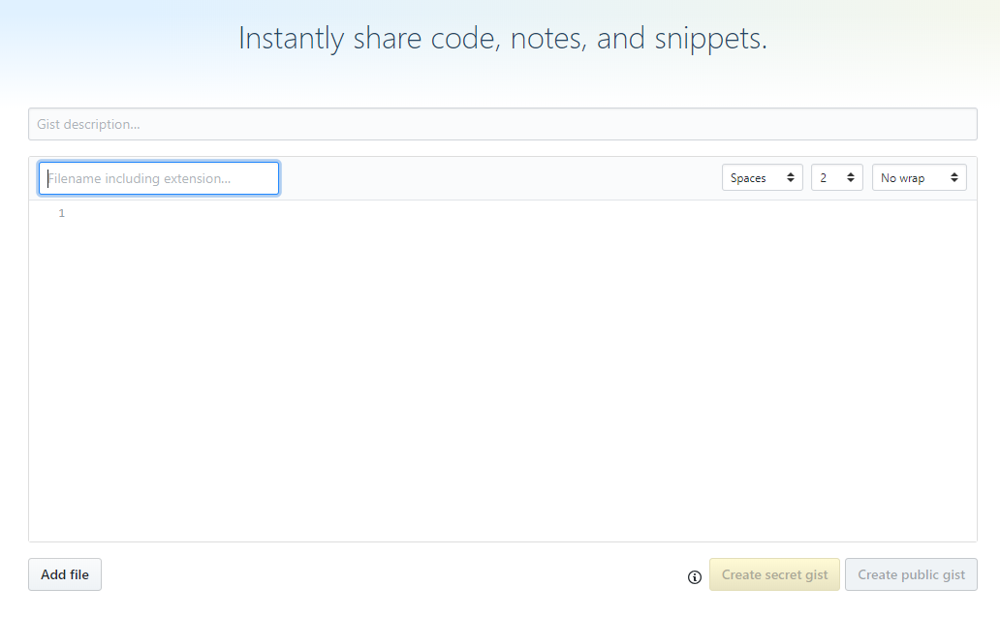

# Gist
Gist는 간단하게 코드를 공유할 수 있는 기능입니다. 코드는 일발 텍스트와 달리 가독성이 중요합니다. 
Gist를 이용하면 이러한 가독성을 유지하면서 다른 사람들과 간단하게 몇 줄의 코드를 공유할 수 있습니다.

Gist 또한 일반적인 저장소처럼 이력을 관리할 수 있으며 `clone`을 통하여 복제도 가능합니다.

## gist 실행
깃허브 우측 상단 + 버튼을 클릭합니다. `New gist`를 선택하여 실행합니다.

 

새로운 gist 페이지로 이동합니다.

 

gist에서 먼저 파일 이름을 작성합니다. 파일 이름을 작성할 때는 확장자도 같이 사용합니다. 
만일 다수의 코드 파일을 작성하고자 한다면 하단의 `Add file`을 눌러 추가합니다.

작성한 코드를 저장합니다. 저장은 secret와 public 둘 중 하나를 선택할 수 있습니다.

## gist 목록
Gist 코드를 작성하면 목록으로 관리됩니다.

 
작성한 gist 코드를 선택합니다.

 

생성한 gist를 수정/삭제할 수 있습니다. 또한, star를 추가할 수도 있습니다.

Gist의 코드를 다른 블로그와 같은 계시물에 삽입할 수도 있습니다. Embed URL을 복사하여 넣으면 됩니다. 
Gist 코드를 다운로드받거나 코멘트를 추가할 수도 있습니다.

