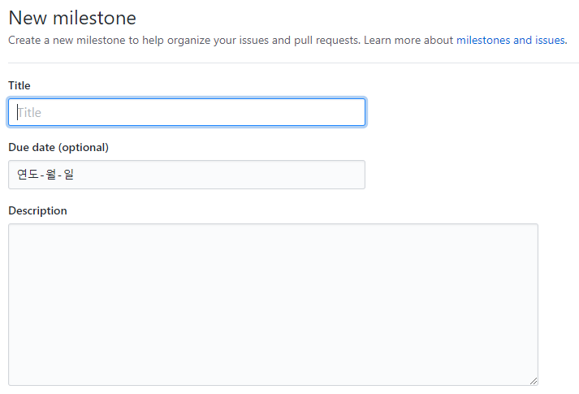

# 마일스톤(milestones)
깃허브에서는 이슈 기능과 유사한 마일스톤 기능을 추가로 제공합니다. 마일스톤은 이슈 기능을 좀 더 프로젝트 관리 차원에서 한층 더 강화한 기능으로 보면 됩니다.

## 프로젝트 관리
마일스톤을 이용하여 이슈의 그룹화 작업을 할 수 있습니다. 이를 통하여 프로젝트의 진행 사항을 체크합니다.

### 마감기한
모든 일에는 일정과 기간이 존재하기 마련입니다. 공동 작업 수행 시 일정의 진행 사항, 마감기한을 참고하여 프로젝트를 관리할 수 있습니다.
마일스톤은 특수한 라벨과 같습니다. 타이틀과 설명, 마감기한을 가지고 있습니다.

### 진행율
마일스톤은 진행율을 표기하기 위해서 체크리스트를 이용합니다. 체크 항목에 따라서 진행 사항을 확인할 수 있습니다.
진행율을 통하여 프로젝트 및 이슈들이 어느 정도 진척되어 있는지 한눈에 확인할 수 있습니다.

## 마일스톤 생성
마일스톤은 이슈 목록에서 생성합니다. 이슈목록으로 이동하면 좌측 상단쪽에 Milestones 버튼을 선택할 수 있습니다.

  

`New mailestone`을 선택하여 새로운 마일스톤을 추가합니다.

  

마일스톤은 이슈와 유사한 입력창을 제공합니다. 
추가로 기한을 정할 수 있는 Due date가 추가된 것을 볼 수 있습니다. 하지만 마일스톤은 제목만 있어도 생성됩니다.

## 마일스톤 이슈 연결
마일스톤에는 이슈를 연결할 수 있습니다. 이슈 추가는 크게 2가지 방식입니다. 
각각의 이슈에서 마일스톤을 선택하여 추가할 수 있습니다. 이슈를 선택합니다. 오른쪽에서 `Milestone`을 선택합니다.

  

생성된 마일스톤을 추가할 수 있습니다.

이번에는 여러 이슈를 목록에서 한 번에 선택하여 마일스톤을 추가하는 방법입니다. 

  

목록에서 이슈들을 체크합니다. 이슈 메뉴에서 마일스톤을 선택하여 추가합니다.