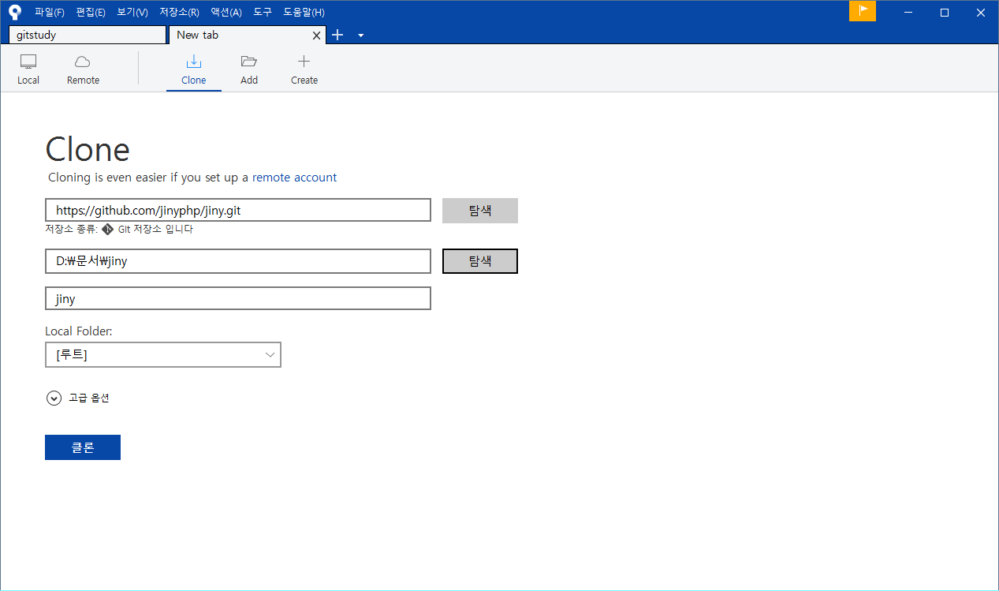

# 복제
---
이번에는 좀 더 세련된 방법으로 깃의 데이터를 가지고 오는 방법을 알아봅니다.  
압축 파일 내려받기는 소스 코드의 파일만 가지고 올 수 있습니다. 깃으로 관리된 이력은 내려받을 수 없습니다.

<br>

## 이력을 포함한 전체 코드 받기
---
깃의 명령어 중에는 저장소를 통채로 `복제`할 수 있는 훌륭한 기능이 있습니다.  
바로 `clone` 명령어입니다. 원격 저장소를 clone 복제 명령어를 통하여 복사할 수 있습니다.

저장소 오른쪽에 초록색의 [clone or download] 버튼을 클릭합니다.

  

확장자가 `.git`으로 되어 있는 URL 주소를 확인할 수 있습니다.  
직접 주소를 복사하거나 클립보드 버튼을 이용합니다. 클립보드에 저장된 임시값은 `Ctl+V`로 붙여넣을 수 있습니다.

<br>

## clone 명령 실행하기
---
간단하게 터미널에서 명령을 입력하면 저장소가 복제됩니다.  

```
$ git clone URL주소 저장소이름
```

<br>

## 소스트리로 복제
---
소스트리를 이용하여 간단하게 복제할 수 있습니다.

   

`[클론]` 버튼을 클릭하면 깃허브의 저장소를 자신의 지정 폴더로 복제합니다.  
`[목적지 경로]`란에 저장될 자신의 컴퓨터 폴더를 지정하면 됩니다.

<br>