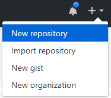
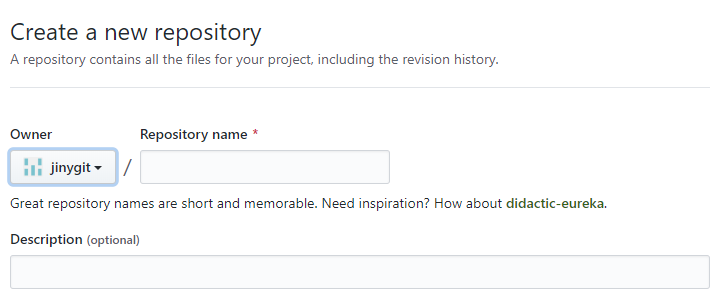
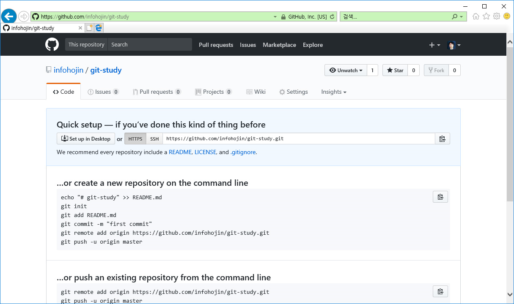

# 저장소 생성
---
깃허브는 수많은 저장소를 보유하고 있는 최대의 깃 저장소입니다.  
깃허브에 새로운 저장소를 `만드는 방법`을 알아보겠습니다.  

<br>

## 생성 버튼
---
새로운 저장소를 생성합니다.  
대시보드에서 `create a new repository`를 선택하거나 우측 상단의 `+` 표시를 선택합니다.

 

[new repository]를 선택하면 새로운 저장소를 만들 수 있습니다.

 

새로운 저장소 생성 화면으로 전환됩니다.  

<br>

## 소유자 정보
---
먼저 저장소를 생성할 `소유자(owner)`를 선택할 수 있습니다.  
소유자(owner)는 `개인` 개정 또는 생성한 `조직`을 선택할 수 있습니다.  

<br>

## 저장소 이름
---
다음은 저장소의 `이름`을 입력합니다. 이름은 `대소문자`, `숫자`, `하이픈`, `밑줄`을 조합하여 사용이 가능합니다.  
깃은 입력된 정보를 가지고 새로운 저장소를 생성합니다. 저장소의 구성은 url을 이용하여 표기합니다.

```
https://github.com/소유자/저장소
```

저장소의 이름은 선택한 소유자(owner) 안에서는 `중복`하여 생성할 수 없습니다.  
하지만 생성한 프로젝트는 추후에 이동도 가능합니다.  

<br>

## 저장소 설명
---
저장소의 설명(description)을 작성합니다. 설명은 반드시 입력해야 되는 필수 항목은 아닙니다.  
하지만 저장소 공개 시 설명은 프로젝트를 직관적으로 쉽게 알아볼 수 있는 내용을 적으면 됩니다.

 

<br> 

## 저장소 타입
---
깃허브의 저장소는 크게 `공개용` 저장소와 `개인용` 저장소로 구분할 수 있습니다.  
저장소를 생성할때 공개형(public) 타입과 개인용(private) 타입을  선택할 수 있습니다.  

공개용과 개인용의 관리 방법은 차이가 있지만, 처음에는 공개용 저장소로 만들어 실습을 합니다.  
 

공개형으로 선택하면 자신의 원격 저장소는 불특정 다수의 사람들에게 공개가 됩니다.  
공개된 저장소는 제한 없이 `무제한` 만들어 사용할 수 있습니다.  
중요한 소스의 경우 개인용으로 선택합니다. 

<br>

## README
---
README 파일을 자동으로 생성할지를 선택합니다. `README` 파일은 마크다운 문법을 사용하여 작성할 수 있습니다.

README는 저장소 프로젝트의 포괄적인 정보를 담고 있습니다.  
또한, 깃 저장소의 메인 페이지로 출력됩니다.

 

대부분의 많은 개발자는 README를 선택하지 않고 직접 작성한 후에 서버로 푸시합니다.

README 파일은 보통 마크다운 형식의 .md 확장자를 가집니다.  
이 이외의 방식으로 작성할 수도 있는데, ASCIIDoc 형식의 .adoc로도 가능합니다.  
만일 확장자를 지정하지 않았다면 일반 텍스트 파일로 인식합니다.

README 파일에는 배지 표시도 같이 출력할 수 있습니다. 배지는 자동화된 테스트 등을 표시하는 데 이용합니다.

<br>

## .gitignore
---
깃은 저장소에 등록된 모든 파일을 추적하고 관리합니다.  
하지만 일부 소스와 파일들은 추적 관리하지 않도록 예외를 설정할 수 있습니다.  
이러한 깃의 예외 파일은 특별한 `.gitignore` 파일에 목록을 추가하여 관리합니다.

프로젝트를 생성할 때마다 .gitignore 파일을 제작하는 것은 피곤할 수 있습니다.  
또한, 프로젝트 유형 및 언어에 따라서 알려져 있는 불필요한 파일들을 미리 알 수 있습니다.  
깃허브는 이러한 미리 알려진 프로그램 언어들에 대해 자동으로 .gitignore 파일을 생성하여 줍니다.

리스트를 클릭하면 다양한 언어별 `.gitignore`를 확인할 수 있습니다. 프로젝트 유형에 따라서 자동으로 `.gitignore` 파일을 생성합니다.

<br>

## 라이선스
---
대부분의 깃허브의 저장소는 공개되는 프로젝트입니다.  
자신의 프로젝트를 오픈 소스 형태로 공개할 때 라이선스 유형을 설정합니다.  

오픈 소스 라이선스는 다양한 종류가 있습니다. 또한, 라이선스 정보를 자신의 프로젝트에 표기하기 위한 파일을 생성하는 것은 힘듭니다.  
깃허브는 간단하게 자신의 소스 라이선스를 선택하여 적용할 수 있습니다.  

프로젝트 공 개시 적용할 라이선스의 유형을 선택할 수 있습니다.  

<br>

## 생성
---
위의 필수 항목들을 입력한 후에 생성을 선택합니다. 
깃허브는 신청한 저장소를 즉시 생성하여 결과를 화면에 출력해줍니다.

<br>

## 저장소 생성 결과
---
저장소 생성 결과 화면입니다. 생성 화면은 README 체크 여부에 따라서 달라 집니다. 
README를 체크하지 않은 경우에는 설정을 위한 안내 방법을 출력합니다.

방법은 크게 2가지입니다.
① 새로운 로컬 저장소를 생성하고 원격 저장소를 연결하는 방법

② 기존의 저장소를 연결하는 방법

 

깃허브는 친절하게 저장소를 초기화 및 클론을 할 수 있는 안내 설명이 표시됩니다. 
깃 명령어가 아직 익숙하지 않은 사용자에게는 좀 더 유용한 정보일 것입니다.
