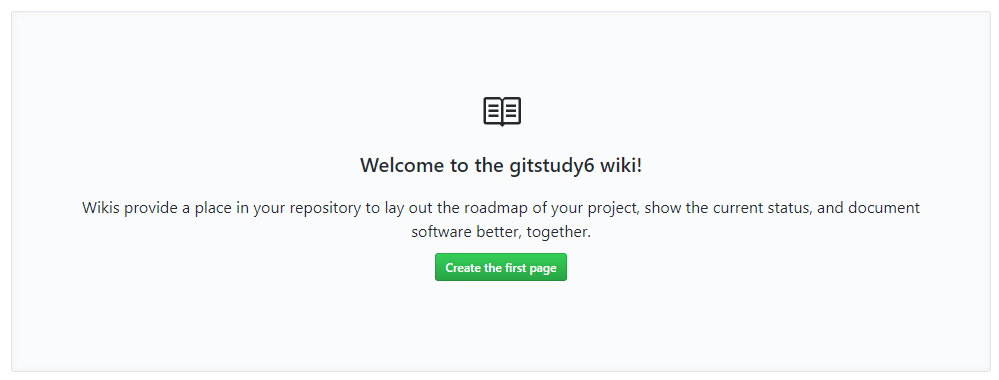
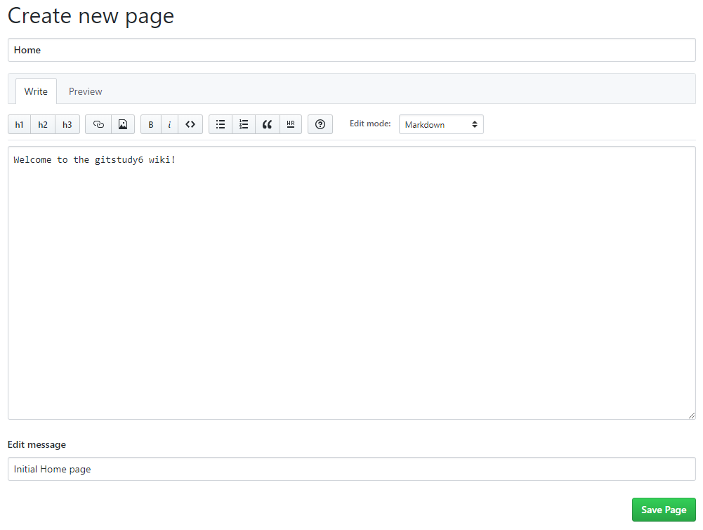
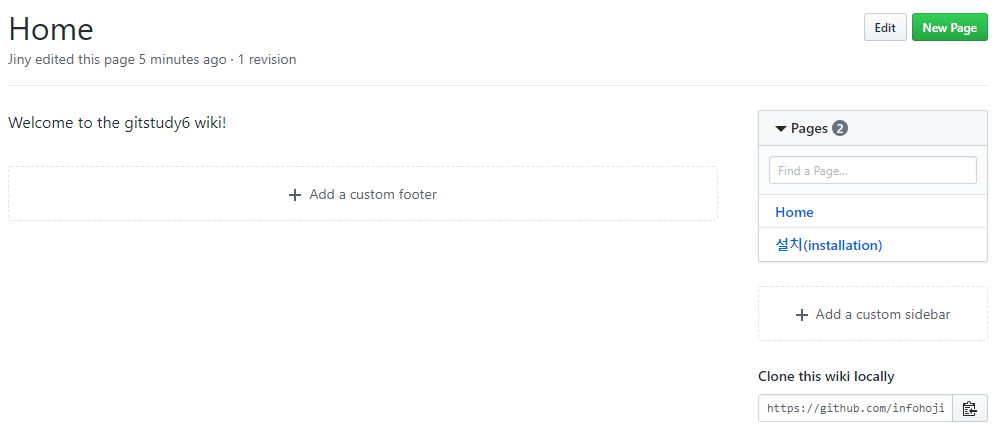

## wiki
---
위키 기능을 이용하면 문서를 쉽게 작성할 수 있습니다. 깃허브는 프로젝트 저장소의 문서를 쉽게 작성할 수 있도록 `wiki` 기능을 제공합니다.  

<br>

### 문서
---
아무리 개발자가 소스 코드를 잘 만들었다고 하더라도 많은 사람이 소스 코드를 이해하고 활용하기 위해서는 일정 부분들은 개발 문서들이 필요합니다. 오픈 소스를 활성화하고 사용자층을 유지하기 위해서는 잘 정비된 문서들이 필요합니다.  

깃허브는 문서의 관리를 위해 위키를 제공합니다. 위키(wiki)는 프로젝트의 문서 관리를 도와줍니다.  

<br>

### 문서 생성
---
wiki를 사용하기 위해서는 저장소의 쓰기 권한이 같이 있어야 합니다. 처음 저장소를 생성한 후에는 아직 문서가 없습니다. [Create the first page]를 선택합니다.  

  

제목은 필수 항목입니다. 본문의 내용은 마크다운 방식으로 작성 가능합니다. 간단한 문서 서식은 단축 도구들을 이용하여 편집할 수 있습니다. 마크다운 변환 결과를 확인할 수 있도록 preview 화면도 제공합니다.  

 
 
작성한 문서의 내용을 출력합니다. 생성한 문서가 여러 개일 경우 우측의 메뉴 형태로 출력됩니다. 우측 상단에 [New page]를 클릭하여 새로운 wiki 문서를 추가할 수 있습니다.  

  

생성된 문서를 수정할 때는 edit를 선택합니다.  

<br>

### 독립 저장소
---
위키(wiki) 문서를 하나 생성 후 몇 개의 구성 요소들이 더 만들어졌습니다. 우측 하단에 clone this wiki locally 항목을 확인할 수 있습니다.  

위키(wiki) 문서는 이력을 관리할 수 있습니다. 이를 위해서 깃허브는 기존 저장소와 분리된 별도의 위키만의 저장소를 제공합니다. 저장소별로 독립된 하나의 wiki를 지원합니다. 위키 저장소도 깃으로 구성되어 있습니다.  

새로운 깃허브 저장소를 생성하면 위키도 같이 생성됩니다. 저장소의 위키 지원 여부는 설정에서 변경할 수 있습니다. 위키 저장소는 깃의 clone 명령을 통하여 로컬 컴퓨터로 복제할 수 있습니다.  

```bash
infoh@DESKTOP-VAKLOFQ MINGW64 /e
$ git clone https://github.com/infohojin/gitstudy6.wiki.git gitstudy6_wiki
Cloning into 'gitstudy6_wiki'...
remote: Enumerating objects: 15, done.
remote: Counting objects: 100% (15/15), done.
remote: Compressing objects: 100% (11/11), done.
remote: Total 15 (delta 3), reused 0 (delta 0), pack-reused 0
Unpacking objects: 100% (15/15), done.
```

복제한 wiki 폴더로 이동합니다.  

```
infoh@DESKTOP-VAKLOFQ MINGW64 /e
$ cd gitstudy6_wiki/
```

wiki 폴더의 목록을 확인합니다.  

```
infoh@DESKTOP-VAKLOFQ MINGW64 /e/gitstudy6_wiki (master)
$ ls
 _Footer.md   _Sidebar.md   Home.md  '설치(installation).md'
```

위키 문서를 수정한 후에 다시 푸시할 수 있습니다. 
생성된 wiki 문서 또한 `git`으로 관리됩니다.  

<br>

### Edit Message
---
위키 문서도 깃으로 관리되기 때문에 커밋 작업이 이루어집니다. 문서를 작성하여 수정할 때 Edit message 부분을 확인할 수 있습니다.  

 

여기에 간략한 메시지를 작성하면 위키 문서의 커밋 메시지로 저장됩니다.  

<br>

### 삭제
---
작성한 위키 문서를 삭제할 수 있습니다. 삭제하면 문서 목록에서 제외됩니다. 하지만 실제로 위키 문서가 삭제되는 것은 아닙니다.  

위키 저장소 또한 깃으로 구성되어 삭제된 것처럼 보이는 것입니다. 삭제된 문서는 위키 history에서 복구할 수 있습니다.  

전체 목록은 위키 주소에서 _history를 호출합니다. 복구할 항목을 선택한 후에 compare revisions를 선택합니다.  

예) https://github.com/infohojin/gitstudy6/wiki/_history

<br>

### 링크
---
문서를 작성하다 보면 다른 문서를 참고해야 하는 경우가 있습니다. 이때에는 링크를 만들어 삽입 가능합니다. 링크는 크게 두 가지로 구분할 수 있습니다.  

* 내부 링크  
저장소의 다른 위키 문서를 링크로 삽입하는 방법입니다. 링크는 `[[링크]]`와 같이 이중 대괄호를 작성합니다.  

* 전체 링크  
문서의 전체 URL을 기반으로 링크를 생성하는 것입니다. 저장소 외부의 문서도 링크로 추가할 수 있습니다.  

<br>

### 변경 내역
---
위키 문서는 깃의 원리를 이용하여 관리됩니다. 또한 문서를 삭제해도, 실제 삭제되지 않고 깃의 이력으로 가지고 있습니다.  

이러한 깃의 원리를 이용하여 위키의 문서 변화를 추적할 수 있습니다. 기존의 문서를 수정하여 저장해봅니다. 수정한 문서는 [Page History] 버튼이 추가됩니다.  

 

버튼을 클릭해봅니다. 위키 문서의 변경 커밋 내역을 확인할 수 있습니다.  

 

또는 위키 문서의 제목 하단에 Revisions 글자가 붙은 태그를 확인할 수 있습니다. 2 revisions는 2개의 수정 이력이 있다는 것을 말합니다. 이를 클릭하면 똑같이 위키 문서의 History로 이동할 수 있습니다.  

 

Hisory 문서는 위키 주소에 /_history를 추가하면 변경된 커밋 기록으로 이동할 수 있습니다.  

예) https://github.com/infohojin/gitstudy6/wiki/setup/_history

이전의 위키 문서를 되돌리는 방법은 revert를 사용합니다. History 목록에서 두 개 이상의 항목을 선택한 후에 [Compare revisions]를 클릭합니다.  

 

두 문서의 차이점을 diff 명령어로 출력하면서 [Revert changes] 버튼이 활성화됩니다.  

<br>

### 사이드바
---
위키 문서에 사이드바를 추가할 수 있습니다. 
오른쪽 메뉴 목록 밑에 `Add a custome sidebar` 버튼이 생성된 것을 확인할 수 있습니다. 이 버튼은 위키에 쓰기 권한이 있는 경우 표시됩니다.  

 

새로운 사이드바 작성창이 실행됩니다. 사이드는 위키 문서의 제목을 _Sidebar로적어주면 됩니다. 
`Add a custom sidebar`를 클릭한 것과 동일합니다.  


생성한 사이드 바는 모든 위키 문서의 오른쪽에 배치됩니다.  

<br>

### 푸터
---
사이드 바와 유사하게 하단도 생성이 가능합니다. 위키 문서의 `Add a custom footer`를 선택하거나 위키 제목을 _footer로 저장하면 됩니다. 
푸터 또한 모든 위키 문서의 하단에 출력됩니다.  

<br>