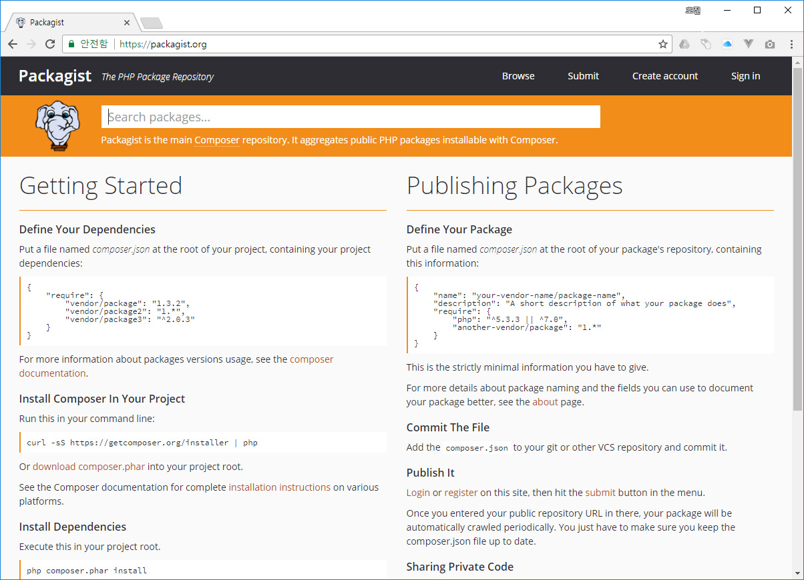

## 컴포저
페키지스트(packagist)는 PHP 라이브러리 저장소 입니다. 최근들어 모던 PHP 응용 프로그램들은 컴포저 패키지 형태로 배포되고 있습니다.  

<br>
<hr>

### 컴포저
컴포저는 PHP에서 가장 인기 있는 패키지 메니저 도구 입니다. 컴포저는 PSR 기반의 오토로드 기능을 제공하고, 복잡한 페키지들의 의존성을 해소해 줍니다.
https://getcomposer.org/ 에서 무료로 다운로드 받아 사용을 할 수 있습니다.  

### packagist 사이트
페키지스트 공식 사이트는 https://packagist.org 입니다.  

 

패키지스트에는 수많은 PHP 라이브러리가 배포되고 있습니다. PHP 패키지들은 컴포저 도구를 이용하여 관리 됩니다.  

### 패키지 생성
PHP 컴포저는 PSR 및 네임스페이스를 이용하여 패키지를 생성합니다. 또한 페키지의 정보를 composer.json 파일에 저장을 합니다.  

컴포저는 페키지 정보를 패키지스트 서비스에 접속하여 정보와 깃 원격 저장소 주소를 가지고 옵니다. 찾은 원격 저장소를 통하여 코드를 복제하여 설치를 하게 됩니다.  


### 깃허브 연동
패키지스트는 자체적인 소스 저장소를 가지고 있지 않습니다. 대신에 깃허브, 빗버켓과 같은 외부 저장소를 참고하여 페키지를 등록합니다.  

페키지스트 사이트를 직접 이용하기 위해서는 로그인이 필요로 합니다. 깃허브의 계정과 연동하여 회원로그인을 할 수 있습니다.  

 

페키지스트를 이용하여 자신의 PHP 라이브러리를 등록하는 것은 간단합니다. 상단의 메뉴 등록(submit)을 선택합니다. 자신의 깃허브의 저장소의 URL을 입력만 해주면 됩니다. 페키지스트는 깃허브에 있는 composer.json 파일의 정보를 읽어와서 새로운 패키지를 추가합니다.  

페키지의 버전은 깃의 tag 정보를 이용합니다. 페키지의 버전을 변경하기 위해서는 깃의 새로운 태그 버전을 추가한 후에 update를 클릭하면 됩니다. 또는 깃의 훅 기능을 이용하여 이를 자동 처리 할 수 있습니다.  

### 실습
오픈소스 jinyphp를 예로 들어 페키지 설치를 해봅니다. 새로운 폴더를 하나 생성해 봅니다.  

```
$ mkdir jinyphp
$ cd jinyphp
infoh@DESKTOP-VAKLOFQ MINGW64 /e/jinygit/jinyphp
$ composer create-project jiny/jiny
Installing jiny/jiny (0.2.1)
  - Installing jiny/jiny (0.2.1): Loading from cache
Created project in E:\jinygit\jinyphp\jiny
Loading composer repositories with package information
Updating dependencies (including require-dev)
Package operations: 20 installs, 0 updates, 0 removals
  - Installing nadirhamid/docx-to-html (v0.0.1): Loading from cache
  - Installing nikic/fast-route (v1.3.0): Loading from cache
  - Installing jiny/lamp (0.1.0): Loading from cache
  - Installing jiny/config (0.1.0): Loading from cache
  - Installing symfony/polyfill-ctype (v1.10.0): Loading from cache
  - Installing symfony/yaml (v4.2.3): Downloading (100%)
  - Installing webuni/front-matter (1.1.0): Loading from cache
  - Installing jiny/frontmatter (0.1.0): Loading from cache
  - Installing jiny/menu (0.1.0): Loading from cache
  - Installing jiny/pages (0.1.0): Loading from cache
  - Installing jiny/router (0.1.0): Loading from cache
  - Installing jiny/theme (0.1.0): Loading from cache
  - Installing erusev/parsedown (1.7.1): Loading from cache
  - Installing sunra/php-simple-html-dom-parser (v1.5.2): Loading from cache
  - Installing symfony/filesystem (v4.2.3): Downloading (100%)
  - Installing jiny/locale (0.1.1): Loading from cache
  - Installing liquid/liquid (1.4.11): Downloading (100%)
  - Installing jiny/template (0.1.1): Loading from cache
  - Installing jiny/view (0.1.1): Loading from cache
  - Installing jiny/core (0.1.1): Loading from cache
symfony/yaml suggests installing symfony/console (For validating YAML files using the lint command)
webuni/front-matter suggests installing nette/neon (If you want to use NEON as front matter)
webuni/front-matter suggests installing yosymfony/toml (If you want to use TOML as front matter)
Writing lock file
Generating autoload files
```

컴포저를 통하여 패키지를 설치하는 방법은 2가지가 있습니다. 하나는 clone 개념의 페키지를 복사하는 create-project와 모듈형태로 설치하는 require 입니다.  

설치 파일을 한번 확인해 봅니다.  

```
infoh@DESKTOP-VAKLOFQ MINGW64 /e/jinygit/jinyphp/jiny
$ ls
app/           composer.lock  index.php  public/    resource/  vendor/
composer.json  conf/          lamp*      README.md  theme/     web.config
```

`Require` 명령을 통하여 설치를 하면 `/vendor` 디렉토리가 생성되고, 해당 디렉토리 안에 페키지를 설치 하게 됩니다.  

PHP의 응용 라이브러리를 깃허브에서 직접 검색하여 설치를 할 수도 있겠지만, 페키지스트를 이용하면 PHP 라이브러리만 골라서 자동으로 설치하여 사용할 수 있는 장점이 있습니다.  

<br><br><br>