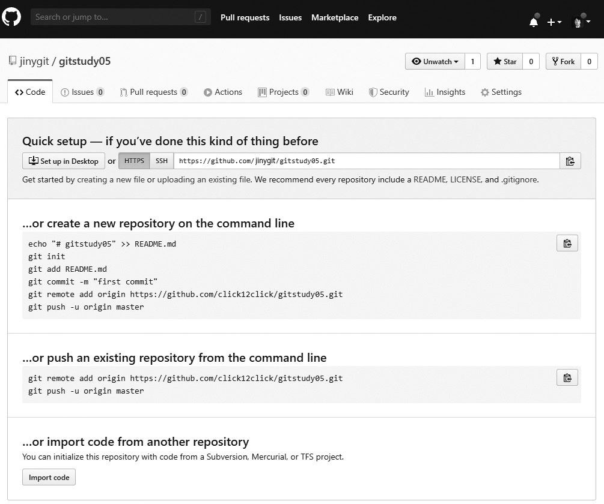

# 로컬 저장소
---
깃허브에 새 저장소를 생성하면 다음과 같은 화면이 나옵니다.  

<br>

## 깃허브 저장소 페이지
---
이 화면은 저장소를 생성할 때 README 체크 여부에 따라 달라집니다.  
README를 체크하지 않으면 다음과 같이 초기화 및 복제 방법을 안내합니다.  

깃허브에서 새 저장소 생성  


<br>

## 원격 저장소를 연결하는 방법
---
원격 저장소에 `연결`하려면 먼저 로컬 저장소가 있어야 합니다.  
로컬 저장소를 원격 저장소에 연결하는 방법은 크게 두 가지입니다.  

* 1) 새로운 로컬 저장소를 생성하고 원격 저장소를 연결하는 방법  
* 2) 기존 저장소를 연결하는 방법

책에서는 1 방법으로 원격 저장소에 연결해 보겠습니다.  

<br>

## 실습 저장소 생성
---
먼저 새 로컬 저장소를 생성하고 초기화합니다.  

* 새로운 실습 폴더를 생성합니다.
```
$ mdkir gitstudy05
```

* 저장소를 깃으로 초기화합니다.
```
$ git init 
Initialized empty Git repository in E:/gitstudy05/.git/
```

<br>

## readmd 파일 생성
---
생성된 저장소에 소개 페이지 파일을 하나 생성합니다.  

`echo` 명령어로 문자열을 파일로 리다이렉션하여 소개 페이지를 만듭니다.  
또는 직접 편집기를 이용하여 만들어도 됩니다.  

```
$ echo "# gitstudy05" >> README.md ☜ 파일 생성
```

만든 README.md 파일을 추적 `등록`하고 `커밋`합니다.

* 스테이지 등록
```
$ git add README.md 
```

* 커밋
```
$ git commit -m "first commit" 
```

안내에 따라 새 로컬 저장소를 생성한 후 README.md 파일을 만들어 추적 등록, 커밋했습니다.  
몇 가지 개념을 좀 더 알아본 후 로컬 저장소와 원격 저장소를 연결해 보겠습니다.  

<br>