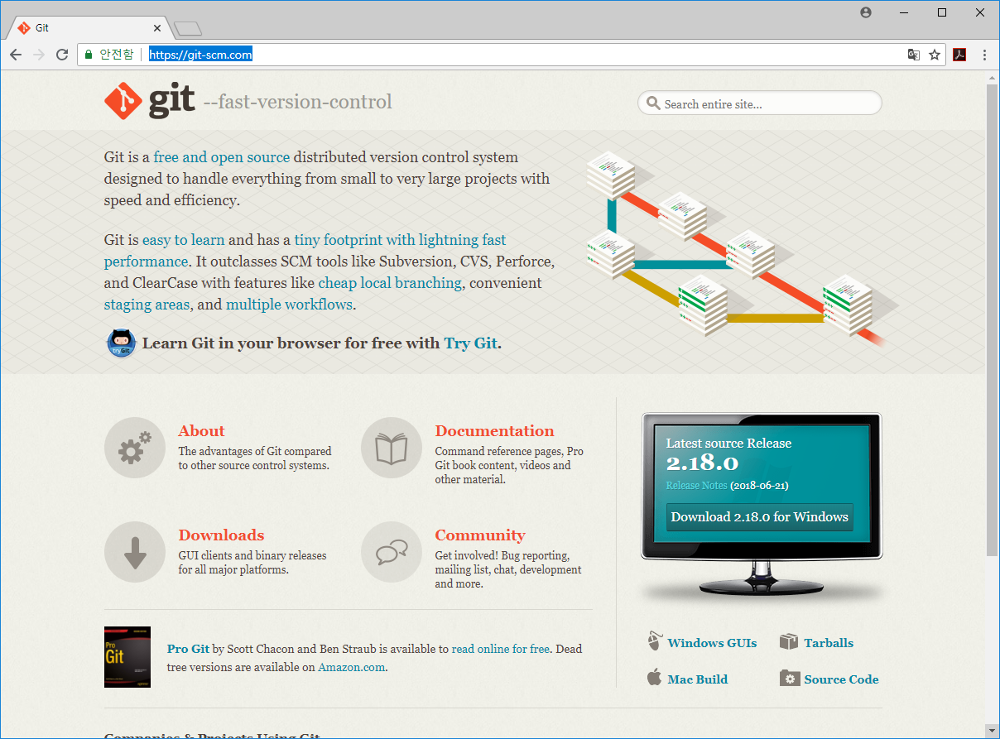

# 준비작업
---
깃은 별도의 응용 프로그램입니다. 이 장에서는 깃 프로그램을 설치하고 환경을 설정해 보겠습니다.

 

## 깃설치
---
깃을 사용하려면 먼저 깃 프로그램을 설치해야 합니다.  
`윈도`, `리눅스`, `macOS` 등 여러 운영 체제에서 깃을 설치하고 사용할 수 있습니다.  

깃은 오픈 소스이기 때문에 공개된 소스를 직접 내려받아 설치할 수 있지만, 컴파일 작업과 설치가 쉽지 않습니다.  
따라서 깃의 개발을 이끄는 단체에서는 일반 개발자도 쉽게 사용할 수 있도록 운영 체제별 설치 프로그램을 만들어 제공합니다.  

깃 공식 사이트(`https://git-scm.com`)에서 운영 체제별로 만든 배포판을 내려받아 설치할 수 있습니다.  

> Note: 깃의 소스 코드는 https://github.com/git/git에 모두 공개되어 있습니다. 여기에 공개된 버전은 깃 공식
사이트에 공개된 버전보다 좀 더 최신이므로, 최신 버전을 사용하고 싶다면 깃의 소스 코드를 직접 내려받아 컴파일한
후 설치해야 합니다. 책에서는 깃 공식 사이트에서 내려받아 사용하는 것을 추천하니 참고만 하세요. 또 오픈 소스에도 직접 참여할 수 있습니다.  

 

## Windows OS환경
---
윈도우 환경에서 설치할 수 있는 설치파일을 다운로드 받습니다.  

* [윈도우](windows)

 

## Mac OS환경
---
* [맥](#)

 

## Linux OS환경
---
* [리눅스](linux)

 

## 도구설치
---
기본적인 깃의 동작환경은 `터미널` 입니다.  
보다 쉽게 깃을 사용하기 위해서 몇가지 GUI 도구들이 개발되어 제공되고 있습니다.  

* [소스트리](sourcetree)
* [깃 크라켄](kraken)

#### 터미널 도구
* 맥 : iTerm2
* 윈도우 : cmdr, 깃이 기본탑제로 같이 설치됨

 

## 설정
---

* [CRLF](CRLF)

  