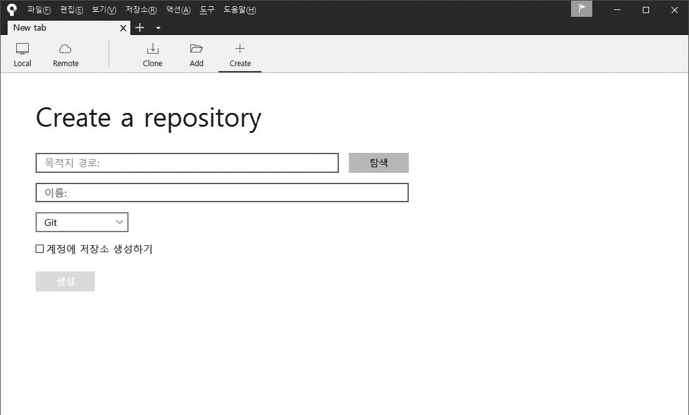
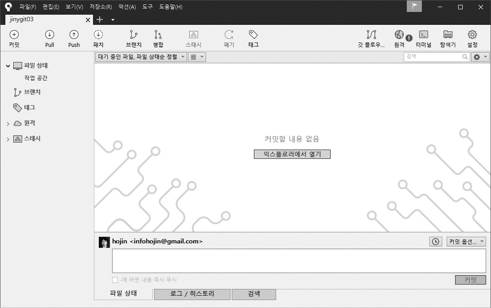

## 3.1 깃 저장소 생성
깃은 작성된 소스 코드 파일의 모든 변경 사항을 관리합니다. 그렇다면 깃은 파일의 변경 내역을 어떻게 저장하고 관리할 수 있을까요? 깃은 이러한 변경 사항을 전용 저장소(repository)(리포지터리)에 저장합니다. 이 저장소는 일반적으로 사용하는 폴더와 유사하지만, 조금 차이가 있습니다. 깃의 동작 방식을 이해하려면 저장소 동작 원리를 확실히 알아야 합니다. 이제부터 하나씩 알아봅시다.

### 3.1.1 폴더와 깃 저장소
컴퓨터의 파일과 폴더는 운영 체제의 파일 시스템에 의존하여 동작합니다. 파일 시스템은 하드디스크 같은 장치에 데이터를 저장하고 관리합니다. 그중 폴더는 파일 여러 개를 하나로 관리할 수 있는 논리적 개념입니다. 마치 파일을 그룹으로 묶어 놓은 것과 같습니다.  

그렇다면 깃은 파일의 변경 내역을 어떻게 저장하고 관리할 수 있을까요? 깃 저장소는 외형적으로 폴더와 유사합니다. 사용자 입장에서는 일반 폴더와 깃 저장소를 구별 없이 모두 동일하게 사용할 수 있습니다. 하지만 깃 저장소는 내부적으로 구조가 다릅니다. 깃 저장소에는 별도의 숨겨진 영역(숨겨진 폴더)이 있는데, 여기에 버전 관리 시스템(VCS, Version Control System)에 필요한 파일 변경 이력을 기록합니다. 저장소는 프로젝트의 모든 리비전(revision)(개정)과 히스토리를 가진 데이터베이스와 같습니다.  

즉, 일반적인 폴더와 깃 저장소 차이점은 숨겨진 영역이 있는지 여부입니다.  

### 3.1.2 초기화
그럼 깃 저장소의 숨겨진 영역을 살펴보면서 저장소를 좀 더 알아봅시다. 저장소를 생성하려면 먼저 초기화 작업이 필요합니다. 깃에서 초기화란 이미 존재하는 폴더에 초기화 명령어로 VCS 관리를 위한 숨겨진 영역을 생성하는 작업을 의미합니다.  

깃 초기화를 해 봅시다. 먼저 터미널(깃 배시)을 실행합니다.  


>Nodte: 터미널은 텍스트로 명령어를 입력할 수 있는 대화창입니다. 깃 배시 터미널 프로그램 외에도 윈도에 기본 내장된 CMD, powerShell 등을 사용해도 됩니다. 책에서는 깃 배시를 기준으로 합니다. 윈도 메뉴 말고 바탕화면의 깃 배시 아이콘으로 실행해도 됩니다.

실습에 필요한 새 폴더를 하나 만들겠습니다. 또는 기존에 있던 폴더에서 시작해도 괜찮습니다. 먼저 실습 폴더를 만들고 해당 폴더로 이동합니다. 책에서는 `jinygit03` 폴더를 만들고 해당 폴더로 이동했습니다.  

```
$ mkdir jinygit03  ☜ 폴더를 만듭니다.
$ cd jinygit03     ☜ 만든 폴더로 이동합니다.
```

>Note: mkdir 명령어와 cd 명령어  
mkdir 명령어는 make directory의 약어로 셸(터미널)에서 폴더를 만드는 명령입니다. cd 명령어는 change directory의 약어로 디렉터리를 이동하는 명령입니다. 명령 프롬프트를 사용하는 것이 익숙하지 않다면, 윈도 탐색기에서 마우스 오른쪽 버튼을 누른 후 새로 만들기  폴더 메뉴를 선택하여 만들어도 좋습니다.  

>Note:지정된 폴더에서 깃 배시 열기  
명령 프롬프트에서 원하는 경로로 이동하기 불편하다면, 윈도 탐색기를 사용하여 원하는 폴더로 이동한 후 해당 폴더에서 터미널을 열 수 있습니다. 원하는 폴더에서 마우스 오른쪽 버튼을 누른 후 Git Bash Here 메뉴를 선택합니다.  


이제 터미널에서 다음 초기화 명령어를 입력합니다. 깃 명령어는 보통 git 키워드와 명령어를 함께 입력합니다. 옵션을 추가할 수도 있습니다.  

```bash
$ git init 경로명
```

앞에서 설명했듯이 git init 명령어는 기존 폴더에 숨겨진 영역(숨겨진 폴더)을 추가합니다. 숨겨진 영역을 추가함으로써 깃 저장소로 변경되는 것입니다.  

초기화 명령어를 입력할 때 경로명을 입력하지 않으면, 현재 폴더에서 초기화됩니다. 우리는 원하는 폴더로 이동한 상태이므로 경로명을 입력하지 않고 실행할 것입니다. 정상적으로 초기화되었다면 `Initialized empty~` 같은 메시지를 출력합니다.  

```
$ git init ☜ 저장소 초기화 명령
Initialized empty Git repository in E:/jinygit03/.git/

```

현재 폴더를 의미하는 `.`을 사용할 수도 있습니다.
```
$ git init .
```


깃 초기화는 완전히 비어 있는 폴더나 기존에 사용하던 폴더에서 모두 가능합니다.  

앞에서 언급했듯이 깃 저장소는 영어로 ‘리포지터리’라고 하니, 두 용어를 혼동하지 말고 동일한 것으로 이해하면 됩니다.  

초기화된 저장소에서 ‘숨긴 항목’을 볼 수 있게 허용하면, 숨겨진 영역을 확인할 수 있습니다.  

>Note: 윈도 탐색기에서 숨겨진 파일을 표시하려면 설정을 변경해야 합니다. 탐색기  보기 메뉴를 선택한 후 숨긴 항목을 체크합니다.  


`git init` 명령어는 기본적으로 로컬 저장소를 생성하며, 다양한 옵션을 추가로 제공합니다. 추가 옵션을 사용하여 원격 저장소도 초기화할 수 있습니다. 원격 저장소는 5장에서 설명합니다.  

#### 3.1.3 숨겨진 폴더 = .git 폴더
`git init` 명령어를 사용하여 일반적인 폴더를 깃이 관리할 수 있는 저장소로 변경했습니다. 깃 저장소를 초기화한다는 것은 별도의 숨겨진 폴더를 하나 추가하고 환경 설정 파일을 생성하는 것입니다. 생성된 숨겨진 폴더를 확인해 봅시다.  

먼저 깃 배시 터미널이 실행된 상태에서 ls 명령어로 파일 목록을 출력합시다.  

```
$ ls
```

ls 명령어는 파일 목록을 출력하는 리눅스 명령어입니다. 초기화된 폴더에서 ls 명령어를 입력하면 아무 내용도 출력되지 않습니다.  

일반적인 ls 명령어는 숨겨진 폴더까지 확인할 수 없습니다. 이번에는 -a 옵션을 추가하여 입력합니다. -a 옵션은 폴더 안의 숨겨진 파일을 같이 출력하라는 의미입니다.  

```
$ ls -a
./ 
../ 
.git/
```

이전 결과와 달리 목록이 화면에 출력되었습니다. 목록을 보니 .git이라는 숨겨진 폴더가 하나 있습니다. 보통 폴더 이름 앞에 점(.)이 있으면 숨겨진 폴더를 의미합니다. 숨겨진 폴더인 .git 폴더에는 깃 저장소에 필요한 모든 뼈대 파일이 담겨 있습니다. 이러한 뼈대 파일들은 깃 초기화를 통하여 자동 생성됩니다.  

깃의 숨겨진 폴더(.git)는 매우 중요합니다. 이 폴더에는 깃으로 관리되는 모든 파일 및 브랜치 등 이력을 기록합니다. 따라서 컴퓨터에서 깃 저장소를 통째로 복사하고자 할 때는 숨겨진 .git 폴더까지 같이 복사해야 합니다. 로컬 컴퓨터에서 .git 폴더를 삭제하거나 함께 복제하지 않으면 깃의 모든 이력은 없어집니다. 즉, 일반적인 폴더 파일과 동일합니다.  

>Note: 숨겨진 폴더까지 같이 복사하려면 일반적인 cp 명령어로는 할 수 없습니다. -r 옵션을 사용해야 숨겨진 폴더도 함께 복사됩니다.  
```
$ cp -r 원본폴더 복사폴더
```

### 3.1.4 소스트리와 연결

로컬 컴퓨터에 생성된 깃 저장소를 소스트리와 연동하여 이력을 쉽게 관리할 수 있습니다. 저장소를 소스트리와 연결해 보겠습니다. 먼저 소스트리를 실행합니다.  

* 새 저장소를 생성하여 연결  
소스트리에 새 저장소를 생성하여 로컬 저장소와 연결해 보겠습니다. 위쪽 + Create 버튼을 클릭하여 새 저장소를 생성합니다. 새 저장소 생성은 폴더 생성 및 초기화 명령어인 git init를 동시에 실행하는 것과 같습니다.  

그럼 새 저장소를 생성해 봅시다. 소스트리 첫 화면에서 + `Create` 버튼을 클릭합니다.  

  

 
그러면 다음 화면이 나옵니다. 목적지 경로와 이름 항목이 보입니다.  

    

새 폴더를 만들 것이므로 첫 번째 입력란(목적지 경로)에 경로와 원하는 폴더 이름을 입력합니다. 필자는 D:\문서\ 경로에 gitstudy 폴더를 만든다고 입력했습니다(예: D:\문서\ gitstudy). 목적지 경로를 입력하면 `이름`은 자동으로 gitstudy로 지정됩니다. 모두 입력했다면 `생성`을 누릅니다.  

 


깃 저장소가 생성되면 깃 상태를 확인할 수 있는 화면으로 전환됩니다.  

  


새로운 폴더를 만든 후 자동으로 깃 초기화 작업까지 처리했습니다.  

* 기존 저장소와 연결

기존에 사용하던 로컬 저장소를 소스트리와 연결할 수 있습니다. 먼저 위쪽 Add 버튼을 클릭합니다.  

 

다음 화면이 나오면 탐색을 누릅니다.  

 

원하는 폴더를 선택한 후 폴더 선택을 누릅니다.  

 


그러면 다음과 같이 ‘작업 경로’에 경로를 입력하고, `이름` 항목은 자동으로 채웁니다. 추가를 누릅니다.  

그림 3-12] 로컬 저장소를 선택한 상태  
 


기존에 만든 저장소 폴더를 선택하면 다음 메시지가 출력될 수 있습니다. 예를 눌러 다음으로 넘어갑니다.  

그림 3-13] 기존 깃 저장소 폴더를 선택할 때 알림 화면  
 

깃 저장소가 추가되면 깃 상태를 확인할 수 있는 화면으로 전환됩니다.  

그림 3-14] 깃 상태 확인  
 

이제 깃 저장소를 터미널과 소스트리를 모두 사용하여 동시에 관리할 수 있습니다. 깃 명령어가 익숙하지 않다면 처음에는 소스트리를 사용하는 것이 편리합니다. 깃 명령어에 익숙하다면 터미널이 좀 더 빠릅니다. 깃 터미널로 작업한 모든 결과 역시 소스트리로 확인할 수 있습니다.  

지금까지는 자신의 컴퓨터에 있는 로컬 저장소를 알아보았습니다. 깃 저장소는 크게 로컬(local) 저장소와 원격(remote) 저장소로 구분할 수 있습니다. 로컬 컴퓨터에서는 다수의 로컬 저장소를 생성 및 관리할 수 있으며, 하나의 저장소는 다수의 원격 저장소(또는 서버 저장소)와 연결하여 사용할 수 있습니다. 이렇게 수많은 저장소가 있는 것이 분산형 버전 관리 시스템의 특징입니다. 이 개념은 나중에 좀 더 알아보겠습니다.  

<br><br>