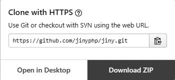

## 깃 저장소 복제
초기화 명령(git init 명령어)은 새 저장소를 생성하는 방법 중 하나입니다.1 처음 프로젝트를 시작할 때는 직접 로컬 컴퓨터에 명령어를 실행하여 저장소를 생성합니다.

외부에 있는 기존 프로젝트(깃허브, 비트버킷)를 기반으로 저장소를 생성하고 싶다면 어떻게 해야 할까요? 외부 저장소를 복제해서 생성할 수 있습니다. 이처럼 외부 저장소를 이용하여 로컬 저장소를 생성하는 것을 ‘깃 저장소 복제’라고 합니다.

그림 3-20] 외부의 깃 저장소 복제  
  

<br>
<hr>

### 공개 저장소
깃은 다수의 사람과 코드를 공유하고 협업하여 개발하는 도구입니다. 이미 깃을 기반으로 하는 공개 저장소가 여럿 있습니다. 대표적으로 깃허브, 비트버킷 같은 깃 호스팅 사이트가 있습니다(외부 저장소, 서버 관련 내용은 5장에서 설명합니다).  

깃 호스팅 서비스는 공개된 저장소와 비공개된 저장소를 모두 지원합니다. 공개된 저장소는 누구나 복제하여 코드를 내려받을 수 있습니다. 요즘은 오픈 소스가 활성화되어 저장소를 공개하고 있습니다. 이미 수많은 오픈 소스를 깃으로 관리하고, 공개 저장소를 이용하여 배포합니다.  

<br>
<hr>

### 다운로드 vs 복제
일반적으로 공개된 소스 코드를 얻으려면 웹 사이트에서 압축 파일을 내려받습니다. 소스 코드를 내려받는다는 것은 해당 코드의 최종 복사본을 내 컴퓨터로 가져오는 것입니다. 하지만 이러한 내려받기는 깃의 이력을 포함한 저장 영역까지 내려받는 것은 아닙니다.  

그림 3-21] 공개된 소스 코드의 최종 복사본 내려받기  
 

이와 달리 깃을 이용하여 저장소를 복제하면, 최종 코드뿐만 아니라 중간에 커밋 같은 변화의 모든 이력도 같이 내려받을 수 있습니다. 또 일부 코드를 변경하여 기여하는 것도 가능할 것입니다.  

<br>
<hr>

### 복제 명령어
깃의 저장소를 복제하는 명령어는 clone입니다. 복제하려면 공개된 저장소의 URL이 필요합니다. 복제할 때 폴더 이름을 지정하지 않으면 공개 저장소에서 사용된 폴더와 동일한 이름으로 새 폴더를 만듭니다. 다른 이름으로 복제하길 원한다면 새 폴더 이름을 추가 인자로 적어 줍니다.  

```
$ git clone 원격저장소URL 새폴더이름
```
 
다음은 필자가 운영하는 jinyphp 오픈 소스 사이트의 주소를 이용하여 저장소를 복제하는 예입니다. 새 폴더 이름을 적지 않아 공개 저장소에서 사용된 폴더와 동일한 이름으로 새 폴더를 만들 것입니다.  

```
$ git clone https://github.com/jinyphp/jiny
Cloning into 'jiny'...
remote: Enumerating objects: 975, done.
remote: Total 975 (delta 0), reused 0 (delta 0), pack-reused 975
Receiving objects: 100% (975/975), 4.98 MiB | 3.67 MiB/s, done.
Resolving deltas: 100% (307/307), done.
```

git clone 명령어를 사용하면 깃은 자동으로 깃 서버에 접속합니다. 그리고 저장소의 모든 소스 코드를 자동으로 내려받습니다.  

깃은 저장소 안에 있는 파일들과 .git 리포지터리를 기반으로 이력을 관리합니다. 따라서 복제한 후에는 복제된 폴더 이름을 그대로 사용하지 않아도 됩니다. 필요에 따라 깃의 폴더 이름을 변경해도 괜찮습니다.  

<br><br>