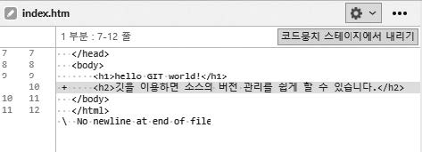

## 4.10 diff 명령어
diff 명령어는 커밋 간 차이를 확인합니다. 보통 리눅스나 macOS 같은 유닉스 계열의 운영 체제에는 유용한 diff 명령어가 있습니다. 깃 또한 초기 시작은 리눅스 커널을 개발하려는 것이었기 때문에 유사한 기능을 하는 diff 명령어를 제공합니다.  

### 4.10.1 파일 간 차이
깃의 장점은 파일들의 수정 이력을 커밋이라는 형태로 구분할 수 있다는 것입니다. 앞에서 살펴보았듯이, 깃은 커밋으로 파일들의 수정 내역을 추적합니다. 파일 수정이란 파일 내용 일부가 수정, 추가, 삭제되는 것을 의미합니다. 개발하면서 수많은 소스 코드가 수정, 추가, 삭제되곤 합니다.  

깃은 커밋을 기준으로 이러한 파일들의 수정 이력을 비교해 볼 수 있는 diff 기능을 제공합니다. diff 기능으로 파일의 수정 및 변경 내역을 쉽게 파악할 수 있습니다.  

### 4.10.2 워킹 디렉터리 vs 스테이지 영역
아직 add 명령어로 파일을 추가하지 않은 경우, 워킹 디렉터리와 스테이지 영역 간 변경 사항을 비교할 수 있습니다.  

index.htm 파일을 열어 <h1> 태그 밑에 <h2> 태그와 내용을 추가합니다.  

```
infoh@hojin MINGW64 /e/gitstudy04 (master)
$ code index.htm
```
 

```html
<!DOCTYPE html>

<html>

<head>

<meta charset="utf-8" />

<meta name="viewport" content="width=device-width, initial-scale=1">

<title>JINYGIT</title>

</head>

<body>

<h1>hello GIT world!</h1>

<h2>깃을 이용하면 소스의 버전 관리를 쉽게 할 수 있습니다.</h2>

</body>

</html>
```
 

그리고 diff 명령어를 실행해 봅시다.  
```
infoh@hojin MINGW64 /e/gitstudy04 (master)
$ git diff ☜ 스테이지 vs 워킹 디렉터리 비교.
diff --git a/index.htm b/index.htm
index f5097d9..56af0de 100644
--- a/index.htm
+++ b/index.htm
@@ -7,5 +7,6 @@
 </head>
 <body>
     <h1>hello GIT world!</h1>
+    <h2>깃을 이용하면 소스의 버전 관리를 쉽게 할 수 있습니다.</h2> ☜ 추가
 </body>
 </html>
\ No newline at end of file

```

이처럼 워킹 디렉터리 내용과 스테이지 내용의 차이점을 출력합니다.  

이번에는 변경한 파일을 add 명령어로 추가하여 스테이지 영역에 등록합시다.  

```
infoh@hojin MINGW64 /e/gitstudy04 (master)
$ git add index.htm
```

그런 다음 다시 diff 명령어를 수행합니다. 아무 내용도 출력되지 않습니다.  

```
infoh@hojin MINGW64 /e/gitstudy04 (master)
$ git diff
```

이것은 등록 과정을 거쳐 워킹 디렉터리의 수정 내역을 스테이지 영역에 반영했기 때문입니다. 따라서 아무 내용도 출력되지 않습니다.  

### 4.10.3 커밋 간 차이
스테이지 영역에 있는 수정된 파일을 아직 커밋하지 않았다면, 최신 커밋과 변경 내용을 비교하여 볼 수 있습니다. `HEAD`는 마지막 커밋을 가지고 있는 포인터입니다.  

워킹 디렉터리와 마지막 커밋을 비교해 봅시다.  

```
infoh@hojin MINGW64 /e/gitstudy04 (master)
$ git diff head ☜ head 포인터를 입력
diff --git a/index.htm b/index.htm
index f5097d9..56af0de 100644
--- a/index.htm
+++ b/index.htm
@@ -7,5 +7,6 @@
 </head>
 <body>
     <h1>hello GIT world!</h1>
+    <h2>깃을 이용하면 소스의 버전 관리를 쉽게 할 수 있습니다.</h2>
 </body>
 </html>
\ No newline at end of file
```

HEAD는 최근의 커밋 중 가장 마지막 커밋의 위치를 가리키는 값입니다. HEAD를 이용하면 최신 커밋과 이전 커밋을 비교하여 출력할 수 있습니다.  

### 4.10.4 소스트리에서 간단하게 변경 이력 확인
소스트리를 이용하면 이를 좀 더 직관적으로 알아볼 수 있게 표현할 수 있습니다. 예를 들어 소스트리에서 수정한 파일 이름을 클릭하면 오른쪽 창에 파일 변경 내역들이 출력됩니다. 다음은 지금까지 실습한 index.htm의 변경 내역입니다.  

그림 4-26] 소스트리에서 변경 이력 확인
 

예를 들어 index.htm에서 `<h1>hello GIT world!</h1>`을 삭제한 후 다시 확인해 보면 삭제된 항목은 붉은색으로 표시합니다.  

그림 4-27] 소스트리에서 변경 이력 확인
 

* + 표시는 새롭게 추가된 내용을 의미합니다. 색상은 녹색으로 표시됩니다.  
* - 표시는 삭제된 내용을 의미합니다. 색상은 붉은색으로 표시됩니다.  

이러한 diff 기능은 나중에 자신이 수정한 부분들을 쉽게 찾을 수 있도록 도와줍니다. 또 다른 사람들과 협업하여 개발하는 과정에서 코드를 리뷰할 때 전체를 파악하는 것보다 수정된 부분만 확인하면 되므로 좀 더 쉽게 검토할 수 있습니다.  

### 4.10.5 diff 내용을 추가하여 커밋
커밋 메시지를 작성할 때 -v 옵션을 같이 사용하면 vi 에디터에서 diff 내용을 추가할 수 있습니다.  

```
infoh@hojin MINGW64 /e/gitstudy04 (master)
$ git commit -v ☜ diff 내용 추가
```

다음과 같이 커밋 메시지를 작성하면 diff 내용이 추가됩니다.  

그림 4-28] 커밋 메시지를 작성할 때 diff 내용 추가
 

<br><br>