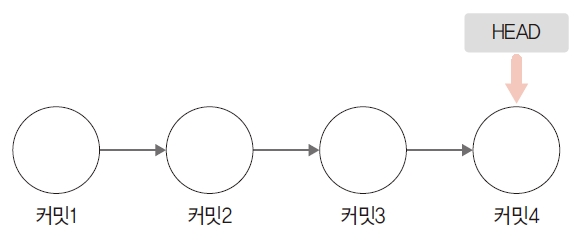
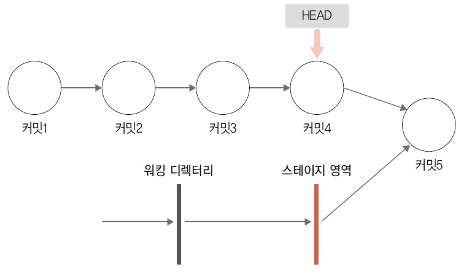
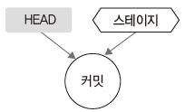

## 첫 번째 커밋
워킹 디렉터리에 생성된 파일을 스테이지 영역으로 등록하는 과정을 알아보았습니다. 지금까지 한 작업은 커밋의 준비 작업들입니다. 이번에는 스테이지 영역에 등록된 파일들을 커밋해서 기록하는 과정을 알아보겠습니다.  

<br>
<hr>

### 4.4.1 HEAD
커밋을 학습하기 전에 HEAD 개념을 하나 더 알아봅시다. 깃에는 HEAD라는 포인터 개념이 있습니다. HEAD는 커밋을 가리키는 묵시적 참조 포인터입니다.  

그림 4-11] HEAD  
 

HEAD는 최종적인 커밋 작업의 위치를 가리킵니다. 앞에서 새로운 커밋은 이전 부모 커밋을 기반으로 새로운 커밋을 만든다고 했습니다. HEAD는 바로 부모 커밋을 가리킵니다. 단 깃을 설치하고 처음 커밋할 때는 HEAD의 포인터가 없습니다. 최소한 한 번 이상 커밋을 해야만 HEAD가 존재합니다.  

HEAD는 커밋될 때마다 한 단계씩 이동합니다. 그리고 마지막 커밋 위치를 가리킵니다. HEAD는 커밋이 변화한 최종 시점을 의미합니다.  

<br>
<hr>

### 스냅샷
커밋은 파일 변화를 깃 저장소에 영구적으로 기록합니다. 이러한 커밋은 이전에 파일을 복사하여 관리하던 방식과는 큰 차이가 있습니다.  

깃이 다른 버전 관리 도구와 다른 점은 스냅샷(snapshot) 방식을 이용한다는 것입니다. 파일을 복사하는 방식으로 수정본을 관리하면 같은 내용을 반복해서 저장하기에 많은 용량을 차지합니다. 또 수정된 부분들을 일일이 찾아야 하기 때문에 검색할 때도 매우 불편합니다.  

깃은 이러한 시스템적인 단점을 해결하려고 변경된 파일 전체를 저장하지 않고, 파일에서 변경된 부분을 찾아 수정된 내용만 저장합니다. 마치 변화된 부분만 찾아 사진을 찍는 것과 같다고 하여 스냅샷 방식이라고 합니다.  

그림 4-12] 파일에서 변경된 부분을 찾아 사진을 찍듯이 저장  
 

깃의 스냅샷은 HEAD가 가리키는 커밋을 기반으로 사진을 찍습니다. 그리고 이를 스테이지 영역과 비교하여 새로운 커밋으로 기록합니다. 이처럼 깃은 스냅샷 방식을 이용하여 빠르게 버전의 차이점을 처리하고, 용량을 적게 사용합니다.  

<br>
<hr>

### 파일 상태와 커밋
커밋은 변화된 내용을 영구적으로 깃 저장소에 기록합니다. 새롭게 생성된 파일을 커밋하려면 반드시 tracked 상태로 변경해 주어야 합니다. tracked 상태로 파일이 변경됨과 동시에 스테이지 영역에 등록합니다.  

tracked 상태인 파일을 수정하면 다시 modified 상태로 변경됩니다. modified는 untracked 상태입니다. untracked 상태의 파일은 반드시 등록 명령으로 다시 스테이지 상태로 재등록해야 합니다. 재등록하면 다시 tracked 상태로 변경됩니다.  

커밋하기 전에는 status 명령어로 항상 상태를 확인하는 습관이 필요합니다. 워킹 디렉터리가 깨끗하게 정리되어 있지 않으면 커밋 명령어를 수행할 수 없습니다.  

커밋을 하려면 스테이지 영역에 새로운 변경 내용이 있어야 합니다. 수정된 내용이 스테이지 영역으로 등록되지 않으면 커밋을 할 수 없습니다. 커밋은 수정된 내용을 한 번만 등록합니다. 스테이지 영역의 파일이 변경되지 않았다면 커밋을 두 번 실행할 수 없습니다. 깃은 스테이지 영역의 변경된 내용을 기준으로 스냅샷을 만들어 커밋하기 때문입니다.  

* 명령어로 커밋: commit 명령어
이제 실제적인 커밋 작업을 해 봅시다. 수정된 파일 이력을 커밋하려면 commit 명령어를 사용합니다.  

```
$ git commit
```
 
commit 명령어는 독립적으로 사용할 수 있습니다. 또는 옵션을 추가하여 여러 동작을 같이 수행할 수도 있습니다. 커밋 옵션은 -help 명령어를 입력하면 볼 수 있습니다.  

```
infoh@hojin MINGW64 /e/gitstudy04 (master)
$ git commit -help
usage: git commit [<options>] [--] <pathspec>...
-q, --quiet suppress summary after successful commit
-v, --verbose show diff in commit message template

Commit message options
-F, --file <file> read message from file
--author <author> override author for commit
--date <date> override date for commit
-m, --message <message>
commit message
-c, --reedit-message <commit>
reuse and edit message from specified commit
이하 생략
```

깃의 커밋은 HEAD와 스테이지 영역 간 차이를 비교하여 새로운 객체를 생성합니다. 생성된 객체를 깃 저장소에 기록합니다.  

그림 4-13] 객체 생성  
 

>Note: 커밋은 스냅샷을 이용하여 새로 수정된 파일과 디렉터리를 묶는 트리 객체입니다. 커밋을 하면 새로운 트리 객체로 변환하는 것과 유사합니다.  

* 커밋 메시지  
커밋은 변경된 파일 차이를 깃 저장소에 기록합니다. 따라서 커밋을 할 때 생성된 객체를 기록하는 것과 동시에 이를 구별할 수 있는 메시지를 같이 작성해야 합니다. 변화된 각 커밋 객체에 꼬리표처럼 설명을 달아 놓는다고 생각하면 됩니다. 이 설명들을 커밋 메시지라고 합니다.  

복사하는 형태로 백업할 때는 일일이 파일 이름을 수정하여 구분했습니다. index.htm 파일을 수정했다면 index_레이아웃수정.htm처럼 파일 이름을 변경해서 저장했지요. 하지만 커밋은 파일 이름을 여러 개 사용하지 않고 하나만 가집니다. 기존처럼 파일 이름으로 변화된 객체를 구별할 수 없습니다.  

그 대신 깃은 변화된 객체를 구별하고자 메시지 시스템을 도입했습니다. 파일 이름을 사용하지 않고, 별도로 작성한 메시지 문자열로 각 변경 객체들을 쉽게 구분할 수 있습니다. 따라서 모든 커밋은 반드시 커밋 메시지를 작성해야 합니다.  

커밋할 때는 commit 명령어만 사용합니다. 단독으로 명령어를 입력하면 커밋 메시지 작성을 요구하며, 메시지를 작성할 수 있는 화면이 나옵니다. 지정된 에디터가 열립니다.  

```
$ git commit
```
 

기본적으로 커밋 메시지는 vi 에디터를 사용합니다. 여기에 수정 내역을 요약하여 작성합니다. 메시지를 저장하면 커밋이 완료됩니다.  

>Note: vi 에디터 이외의 에디터를 사용하고 싶다면 깃의 환경 설정을 변경합니다.  

```
infoh@hojin MINGW64 /e/gitstudy04 (master)
$ git config --global core.editor "에디터경로"
``` 

초보자에게 vi 에디터는 익숙하지 않습니다. 그래도 커밋 메시지를 작성하려면 기본 사용법 정도는 알고 있는 것이 좋습니다. 깃 배시에서 git commit 명령어를 입력하면 다음과 같이 커밋 메시지를 입력할 수 있는 창이 뜹니다.  

그림 4-14] vi 에디터를 사용한 커밋 메시지  
 

원하는 메시지를 입력한 후 저장합니다. vi 에디터에서 새로운 내용을 입력할 때는 Esc 를 누른 후 i 를 누릅니다. 작성한 후 저장과 종료는 Esc 를 누른 후 :+w , q 를 입력합니다.  

가끔씩 커밋 메시지를 작성하다 vi 에디터를 중지하고 싶을 때도 있을 것입니다. 이때는 아무것도 작성하지 않고 에디터를 종료합니다.  

Esc 를 누른 후 : + q 를 누르세요. 그러면 다음 메시지가 나옵니다. 에디터에서 # 기호는 주석입니다. 커밋할 때 꼭 주석을 삭제할 필요는 없습니다.  

```
infoh@hojin MINGW64 /e/gitstudy04 (master)
$ git commit
Aborting commit due to empty commit message.
```

커밋 메시지를 작성하지 않아 커밋이 거부되었다는 메시지입니다. 이처럼 vi 에디터에 아무 내용도 넣지 않고 종료하면 커밋 명령은 취소됩니다.  

그리고 vi 에디터에서 커밋 메시지를 작성할 때는 요약 내용과 상세 내용을 분리하여 기록하면 좋습니다. 보통 첫째 줄에는 ‘제목’을 적고, 다음 줄에는 상세 내용을 작성하곤 합니다. 중간에 빈 줄로 구분해 주는 것도 좋습니다. 첫째 줄을 분리하여 작성하는 것은 로그 출력을 간단하게 하기 위해서입니다. 소스트리나 일부 간략한 로그들은 커밋 메시지의 첫째 줄만 표시하기 때문입니다.  

* 파일 등록과 커밋을 동시에 하는 방법
앞에서 이야기했듯이, 커밋을 하려면 반드시 워킹 디렉터리를 정리해야 합니다. 즉, add 명령어로 추가되거나 수정된 파일들을 스테이지 영역에 등록해야 합니다. 하지만 가끔씩 add 명령어를 미리 수행하는 것을 깜빡 잊을 때가 있는데, commit 명령어를 바로 수행하면 오류가 발생합니다.  

이때 유용한 옵션이 있습니다. -a 옵션을 commit 명령어와 같이 사용하면 이를 한 번에 해결할 수 있습니다.  

```
$ git commit -a
```

`-a` 옵션은 커밋을 하기 전에 자동으로 모든 파일을 등록하는 과정을 미리 수행합니다. 따라서 파일 등록과 커밋을 동시에 실행하는 것입니다.  

* 소스트리에서 커밋 메시지 작성
소스트리를 이용하면 좀 더 쉽게 커밋할 수 있습니다. 소스트리에서 왼쪽의 파일 상태 탭을 선택하면 아래쪽에 그림 4-15와 같이 커밋 메시지를 입력할 수 있는 창이 열립니다.  

그림 4-15] 소스트리에서 커밋 메시지 입력  
 

커밋 메시지를 입력하고 커밋을 누릅니다.  

바로 앞에서 제대로 커밋되지 않은 내용을 소스트리에서 커밋해 보겠습니다. 원하는 내용을 입력한 후 커밋을 누르세요. 필자는 ‘인덱스 페이지 레이아웃’이라고 입력했습니다. 소스트리를 이용하면 한글 커밋 메시지도 쉽게 작성할 수 있습니다.  

<br><br>