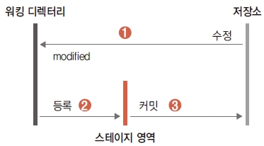
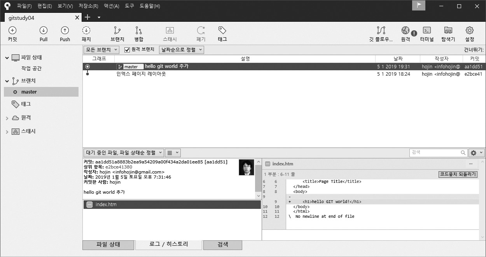
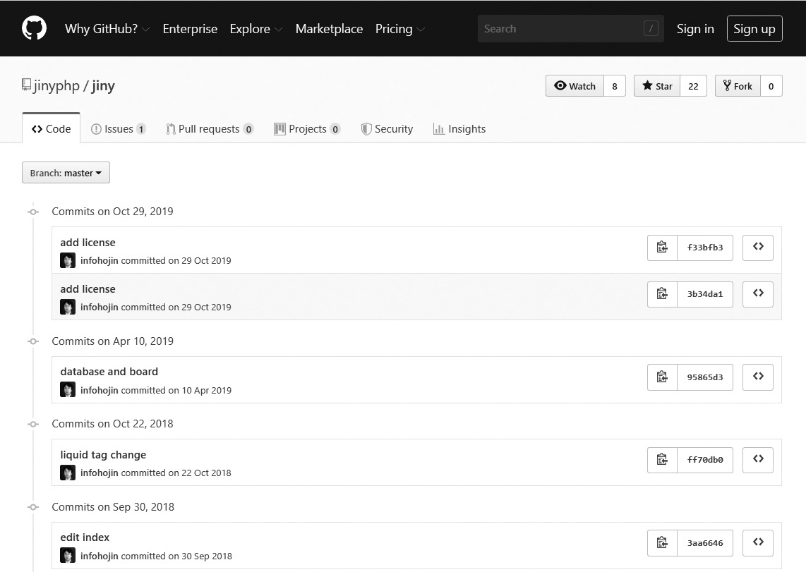

## 두 번째 커밋
앞에서 처음으로 새 파일을 생성하고 커밋 작업을 수행했습니다. 앞에서 만들었던 예제(index.htm) 파일은 단순한 HTML 골격이라 화면에 아무 내용도 출력하지 않습니다. 이번에는 내용을 수정하고 수정된 내역을 두 번 커밋하는 실습을 하겠습니다.  

<br>
<hr>

### 파일 수정
index.htm 파일의 `<body></body>` 태그 안에 `<h1>` 태그를 추가하여 간단한 인사말을 넣습니다.  

VS Code 실행
```
infoh@hojin MINGW64 /e/gitstudy04 (master)
$ code index.htm
```

```html
<!DOCTYPE html>
<html>
<head>
    <meta charset="utf-8" />    
    <meta name="viewport" content="width=device-width, initial-scale=1">
    <title>Page Title</title>
</head>
<body>
    <h1>hello GIT world!</h1>
</body>
</html>

```
 
간단히 `<h1>hello GIT world!</h1>` 한 줄만 추가했습니다. 그 외 내용은 기존과 동일합니다. 수정했다면 저장해 주세요.  

<br>
<hr>

### 파일 변경 사항 확인
변경된 파일을 깃이 어떻게 감지하는지 알아봅시다. 터미널에서 status 명령어를 다시 한 번 실행합니다.  

```
infoh@hojin MINGW64 /e/gitstudy04 (master)
$ git status ☜ 상태 확인 명령.
On branch master
Changes not staged for commit:
  (use "git add <file>..." to update what will be committed)
  (use "git checkout -- <file>..." to discard changes in working directory)
        modified:   index.htm ☜ 파일 수정
no changes added to commit (use "git add" and/or "git commit -a")

```

이전과 다른 새로운 메시지를 확인할 수 있습니다. 처음 우리가 파일을 생성했을 때는 new file: index.htm 메시지를 보았습니다. 파일을 수정한 후에는 modified: index.htm 메시지가 출력됩니다. 이처럼 깃은 파일을 새롭게 생성했는지, 수정했는지를 알고 있습니다. 정말 똑똑합니다.  

소스트리는 좀 더 직관적으로 화면에 출력합니다. 왼쪽의 파일 상태 탭을 선택하면 스테이지에 올라가지 않은 파일 목록에 방금 수정된 파일이 다시 등록된 것을 확인할 수 있습니다.  

그림 4-19] 소스트리에서 수정된 파일 감지  
  

수정된 파일은 노란색 아이콘 4-e.jpg으로 표시합니다. 소스트리는 각 파일의 생성, 변경 등 상태에 따라서 여러 가지 색의 아이콘으로 표현하므로 상태를 확인하기 편리합니다.  

<br>
<hr>

### 수정된 파일 되돌리기
앞에서 살펴보았듯이, 파일을 수정하면 modified 상태로 변경됩니다. 하지만 수정하는 과정에서 파일을 잘못 수정할 수도 있습니다. 파일을 수정 전 상태로 되돌리려면 어떻게 해야 할까요?  

깃을 이용하면 수정한 파일을 커밋 전 마지막 내용으로 쉽게 되돌릴 수 있습니다. 바로 이전 커밋으로 되돌리는 명령어는 다음과 같습니다.  

```
$ git checkout -- 수정파일이름
``` 

수정 파일을 되돌리면 이전 커밋 이후에 작업한 수정 내역은 모두 삭제합니다.  

<br>
<hr>

### 스테이지에 등록
변경된 소스 코드를 커밋하는 것은 처음 파일을 생성하고 등록하는 과정과 매우 유사합니다.  

그림 4-20] 스테이지에 등록  
 

1) 기존 파일을 수정하면 해당 파일은 modified 상태로 변경됩니다. 그리고 다시 워킹 디렉터리로 이동합니다.  
2) 파일이 수정되면 반드시 add 명령어로 스테이지 영역에 재등록해야 합니다. 즉, 파일을 수정할 때마다 등록 작업을 반복해야 한다는 것을 잊지 마세요. 또는 소스트리에서 모두 스테이지에 올리기를 사용합니다.  

```
$ git add 수정파일이름
```

앞 실습에 이어 수정한 파일을 스테이지에 재등록합니다. 그리고 다시 한 번 status 명령어를 실행합니다.  

```
infoh@hojin MINGW64 /e/gitstudy04 (master)
$ git add index.htm ☜ 스테이지 추가 명령을 입력합니다.
$ git status ☜ 상태 확인
On branch master
Changes to be committed:
  (use "git reset HEAD <file>..." to unstage)
        modified:   index.htm ☜ 파일 수정
```

수정된 파일 이름이 빨간색에서 녹색으로 변경된 것을 확인할 수 있습니다.  

<br>
<hr>

### 두 번째 커밋
수정된 파일을 커밋할 수 있는 사전 준비 작업을 마쳤습니다. 이번에는 두 번째 커밋을 해 보겠습니다.  

그 전에 먼저 커밋 메시지를 좀 더 쉽게 작성하는 방법을 알아봅시다. vi 에디터나 소스트리에서는 커밋 메시지를 여러 줄 작성할 수 있습니다. 이와 달리 커밋과 동시에 간단하게 한 줄짜리 커밋 메시지도 작성할 수 있습니다. 커밋할 때는 -m 옵션을 사용합니다.  

```
$ git commit -m "커밋메시지"
```

이렇게 커밋 메시지를 작성하면 별도로 vi 에디터를 실행하지 않습니다. -m 옵션 옆에 간단히 입력한 내용을 바로 커밋 메시지로 처리합니다. 다음과 같이 커밋과 동시에 “hello git world 추가”라고 커밋 메시지도 함께 작성해 봅시다.  

```
infoh@hojin MINGW64 /e/gitstudy04 (master)
$ git commit -m "hello git world 추가" ☜ 커밋 메시지를 같이 입력
[master aa1dd51] hello git world 추가
 1 file changed, 1 insertion(+), 1 deletion(-)

```

실제 작업할 때는 에디터를 여는 대신 간편한 -m 옵션을 많이 사용합니다.  

* -m 옵션, -a 옵션
앞에서 -a 옵션을 학습했습니다. -a 옵션은 commit 명령어를 실행하기 전에 워킹 디렉터리에 있는 파일을 스테이지 영역으로 등록합니다. -m 옵션은 간단한 커밋 메시지를 함께 등록합니다. 이러한 커밋 옵션 -a와 -m을 같이 사용할 수도 있습니다.  

```
$ git commit -am "커밋메시지"
```
 

`-am` 옵션을 사용하면 파일 등록과 한 줄짜리 커밋 메시지 등록을 동시에 처리합니다. 빠르고 간단하게 여러 작업을 묶어서 할 수 있어 편리합니다. 이 조합은 실제 개발 현장에서 많이 사용합니다.  

>Note: `-a` 옵션은 이미 추적된 파일 상태가 변경되었을 때만 함께 사용이 가능합니다. 저장소를 새롭게 생성하고, 새 파일을 작성한 후라면 -am 옵션을 사용하여 커밋할 수 없습니다.  

```
infoh@hojin MINGW64 /e/gitstudy04
$ git init

infoh@hojin MINGW64 /e/gitstudy04 (master)
$ git commit -am "first"
On branch master
Initial commit
Untracked files:
        menu.htm
nothing added to commit but untracked files present

```

저장소를 초기화한 후에 바로 -am 명령어를 입력하면 이처럼 오류가 발생합니다. -am 명령어를 사용하려면 먼저 add 명령어를 수행해야 합니다.  

```
$ git add 파일이름
$ git commit -am "메시지"
```
<br>
<hr>

### 두 번째 커밋 확인
두 번째 커밋 작업을 했습니다. 다시 한 번 로그 기록을 확인해 보겠습니다. 터미널에서 log 명령어를 실행합니다.  

```
infoh@hojin MINGW64 /e/gitstudy04 (master)
$ git log ☜ 로그 확인
commit aa1dd51a8883b2ea9a54209a00f434a2da01ee85 (HEAD -> master)
Author: hojin <infohojin@gmail.com>
Date:   Sat Jan 5 19:31:46 2019 +0900
    hello git world 추가 ☜ 추가된 커밋 확인

commit e2bce41380691b0a34aeab7db889a6c30fed8287
Date:   Sat Jan 5 18:24:50 2019 +0900
    인덱스 페이지 레이아웃

```

로그 메시지가 좀 더 길어졌습니다. 이전 커밋 로그와 현재 커밋 로그, 이렇게 2개가 출력되었습니다.  

소스트리로 확인해 봅시다. 왼쪽의 브랜치  master를 선택합니다. 로그 그래프 목록에 한 줄이 더 추가된 것을 확인할 수 있습니다.  

그림 4-21] 브랜치에서 추가된 로그 기록 확인  
  

소스트리 목록에는 커밋 메시지의 첫 번째 요약줄만 표시됩니다. 커밋 메시지의 상세 내용은 아래 왼쪽 화면에 표시되어 있습니다.  

<br>
<hr>

### 깃허브에서 확인
깃은 자신의 컴퓨터뿐만 아니라 원격 저장소를 같이 연동할 수 있습니다. 대표적인 원격 저장소로는 깃허브가 있습니다. 원격 저장소인 깃허브는 커밋된 횟수를 다음과 같이 표시합니다.  

그림 4-22] 커밋 횟수 표시  
 

커밋 항목을 클릭하면 다음과 같이 커밋의 상세 목록을 확인할 수 있습니다.  

그림 4-23] 깃허브에서 커밋 상세 목록 확인  
 

깃허브와 관련된 내용은 5장에서 자세히 설명하므로, 여기서는 깃허브에서 커밋 횟수와 목록을 확인할 수 있다는 점만 상기하세요.  

<br><br>