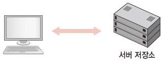

## 서버 저장소
서버 저장소는 다른 말로 원격(remote) 저장소라고도 합니다. 서버 저장소는 로컬 저장소의 코드를 복제한 복사본이라고 할 수 있습니다. 서버를 이용하면 코드를 안전하게 보관할 수 있습니다. 또 서버에 있는 소스 코드는 다른 사람들과 공유하고 협업하여 개발을 진행할 수도 있습니다.  

 

### 협업 저장소
고객이 요구하는 소프트웨어 품질이 높아지면서 최근 프로젝트 개발 규모가 점점 커지고 있습니다. 규모가 큰 프로젝트는 혼자서 모두 개발하기 어렵고, 시간과 노력이 많이 필요합니다. 여러 명이 같이 협업하여 개발한다면 적은 시간으로 좀 더 좋은 품질의 소프트웨어를 만들 수 있습니다. 깃은 여러 개발자와 협업하려고 탄생한 도구입니다.  

과거와 달리 요즘 컴퓨터는 항상 인터넷에 접속되어 있습니다. 하지만 아직도 365일 24시간 인터넷에 연결하여 작업할 수 없는 개발 환경도 많이 있습니다. 깃은 이 두 가지 환경을 고려하여 분산형 모델을 선택했습니다.  

 

### 연속된 작업
원격 저장소가 있다면 언제 어디에서든지 개발을 이어서 할 수 있습니다. 사무실에서 개발 중인 코드를 서버에 저장하고, 집에 와서는 사무실에서 작업하고 서버에 올린 코드를 자신의 컴퓨터에 동기화할 수 있습니다. 이처럼 사무실, 집, 다른 여러 컴퓨터에 코드를 동기화하고 연속된 작업을 이어 갈 수 있습니다.  

그림 5-1] 원격 저장소에 연결  
  

깃은 분산된 저장소 여러 개를 하나로 통합하고, 최신 코드를 배포할 수 있습니다. 서버 저장소는 여러 컴퓨터에 동일한 깃 저장소를 복제하고, 작업한 결과물을 다시 서버로 통합합니다.  

 

### 새 멤버
깃의 분산형 관리 체계는 다수의 사람과 협업하는 데 매력적입니다. 기존 프로젝트에 새로운 멤버가 참여할 때, 지금까지 작업한 소스 코드의 마지막 버전을 공유해야 합니다.  

기존에는 코드를 공유하려고 이메일, 외부 저장 장치 등을 이용했지만, 이제는 깃의 원격 저장소 주소만 알려 주면 모두 해결됩니다. 원격 저장소로 모든 구성원에게 코드의 최종 결과물을 동기화합니다.  

  