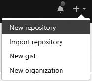
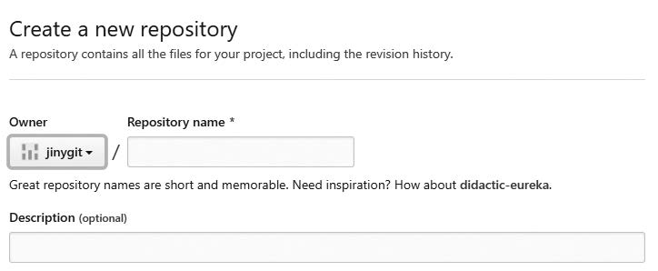

## 5.2 깃허브 서버 준비
독립적인 깃 서버를 직접 운영하여 사용할 수 있습니다. 하지만 365일 안정적인 서버를 운영하는 것은 쉽지 않습니다. 직접 서버를 운영하지 않아도 전문적인 깃 호스팅으로 서버를 대체할 수 있습니다. 호스팅을 받으면 직접 서버를 관리하지 않아도 쉽게 원격 저장소를 운영할 수 있습니다.  

### 5.2.1 깃허브
‘깃’은 잘 모르지만 ‘깃허브’는 한 번쯤 들어 보았을 것입니다. 깃허브는 대표적인 깃호스팅 서비스입니다. 깃허브의 모든 서비스는 무료로 사용할 수 있습니다. 서비스를 사용하려면 먼저 회원 가입이 필요합니다. 깃허브 공식 사이트는 https://github.com입니다. 공식 사이트에 접속하면 다음 화면이 나옵니다.  

그림 5-2] 깃허브 공식 사이트  


회원 가입을 하려면 이메일 주소가 필요합니다. 사용자 이름은 영문으로 작성하며, 저장소를 구별하는 주소 값으로 사용합니다. 일반적으로 개별 깃허브 주소는 다음과 같이 표현합니다.  

```
https://github.com/사용자이름
```

회원 가입을 완료했다면 이메일로 본인 인증 과정을 거쳐야 합니다. 회원 가입 후 입력했던 이메일 저장소에서 새 이메일을 확인해 주세요. 이메일 목록에서 [GitHub] Please verify your email address.로 표시된 이메일을 클릭합니다. 이메일 안에 있는 Verify email address를 클릭합니다. 등록한 이메일 계정의 소유자인지 확인하는 절차입니다.  

### 5.2.2 저장소 생성
깃허브에 새로운 저장소를 생성하는 방법을 알아보겠습니다. 공개용 저장소로 생성하여 실습할 것입니다. 공개된 저장소는 무제한으로 생성해서 사용할 수 있습니다. 비공개용은 제약이 조금 있고, 일부는 유료 서비스입니다.  

로그인한 상태에서 새로운 저장소를 생성합시다. 대시보드에서 New 버튼을 클릭하거나 +  New repository를 선택합니다.

그림 5-3] 저장소 생성 메뉴  
 

새 저장소 생성 화면으로 전환합니다. 먼저 저장소를 생성할 소유자(owner)를 선택합니다. Owner는 개인 계정 또는 생성한 조직을 선택하면 됩니다.

그림 5-4] 소유자 선택  


Repository name에는 저장소 이름을 입력합니다. 이름은 대·소문자, 숫자, 하이픈, 밑줄을 조합하여 원하는 이름을 입력합니다. 책에서는 gitstudy05로 입력했습니다. 입력한 이름으로 새 저장소가 생성됩니다. 저장소 구성은 다음과 같이 URL을 이용하여 표기합니다.  

```
https://github.com/소유자/저장소
```

한 소유자 안에서 같은 저장소 이름은 중복하여 생성할 수 없습니다.  

<br><br>