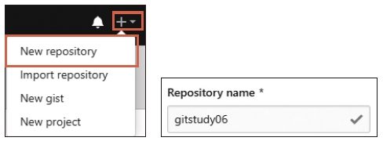
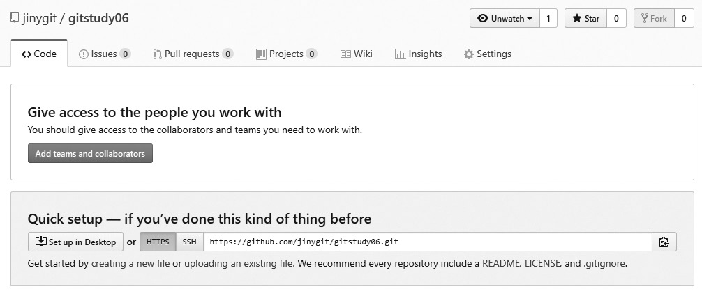
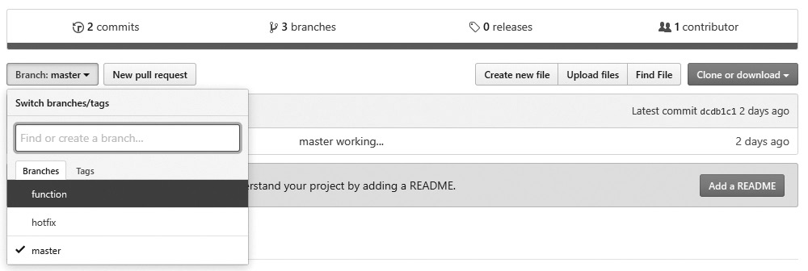
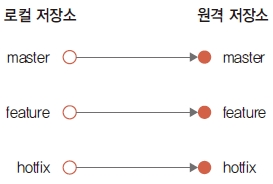
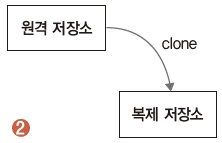
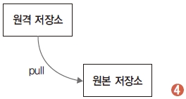
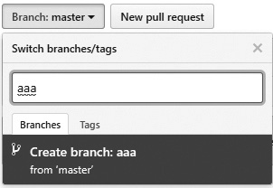
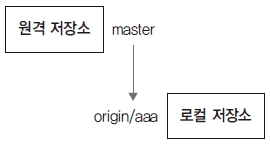
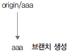

## 원격 브랜치
깃은 다수의 개발자와 협업으로 코드를 유지할 수 있습니다. 주요 개발 작업들은 로컬 저장소에서 하지만 협업은 원격 저장소도 공유합니다.  

로컬 저장소도 하나의 저장소고, 원격 저장소도 하나의 저장소입니다. 깃은 분산형 버전 관리로서 다수의 저장소를 만들어 연결할 수 있기 때문입니다. 이번에는 브랜치를 이용하여 협업하는 방법을 알아봅니다.  

>Note: 원격 브랜치 실습을 하려면 원격 저장소가 필요합니다. 원격 저장소는 5장에서 설명한 깃허브를 이용합니다.   

<br>
<hr>

### 리모트 브랜치
저장소는 각자의 고유한 브랜치를 생성하고 관리합니다. 원격 저장소에 생성한 브랜치를 리모트 브랜치라고 합니다.  

로컬 저장소에 생성한 브랜치는 서버로 공유할 수 있습니다. 원격 저장소와 연결된 로컬 저장소에서 새로운 브랜치를 생성한다고 해서 자동으로 원격 저장소에도 브랜치가 생성되는 것은 아닙니다. 또 원격 저장소에 등록된 브랜치가 자동으로 로컬 저장소를 만들지도 않습니다. 별도 명령을 실행하여 저장소를 동기화해야 합니다.  

원격 저장소와 로컬 저장소의 브랜치 이름은 보통 같지만, 반드시 일치하지 않아도 괜찮습니다. 서로 다른 이름으로 브랜치를 연결할 수도 있습니다. 두 저장소는 서로 다른 브랜치로 운영·관리할 수 있습니다.  

리모트 브랜치는 보통 `별칭/브랜치 이름` 형태입니다.  

<br>
<hr>

### 실습 준비
실습을 위해 깃허브에 새로운 실습 저장소를 하나 생성합시다. 저장소는 5장에서 설명했듯이, 반드시 자신의 계정으로 로그인합니다. New 버튼 또는 +  New repository를 클릭합니다. Repository name에 깃허브의 저장소 이름을 입력합니다. 필자는 이름을 gitstudy06으로 했습니다.  

그림 6-15] 깃허브에서 새 저장소 생성  


모두 입력한 후 Create repository를 누르면 다음 화면이 나오고 저장소 주소를 확인할 수 있습니다.  

그림 6-16] 새 저장소의 주소  

 

새 저장소를 생성했다면 다음과 같이 실행해 보세요.  

```
infoh@DESKTOP MINGW64 /e/gitstudy06 (hotfix)
$ git remote add origin https://github.com/jinygit/gitstudy06.git☜ 자기계정 

infoh@DESKTOP MINGW64 /e/gitstudy06 (hotfix)
$ git remote -v
origin  https://github.com/jinygit/gitstudy06.git (fetch)
origin  https://github.com/jinygit/gitstudy06.git (push)

```

>Note: 실습할 때 원격 저장소의 주소는 깃허브에서 생성한 자신의 저장소 주소를 입력해야 합니다. 책의 주소를 그대로 입력하거나 다른 사람의 저장소를 등록하면 권한이 없어 접속이 거부됩니다.  

<br>
<hr>

### 브랜치 추적
깃의 브랜치는 특정 커밋 해시 값을 가리키는 포인터입니다. 리모트 브랜치 또한 원격 저장소의 브랜치를 가리키는 포인터입니다. 원격 저장소의 브랜치를 가리키는 것을 브랜치 추적이라고 합니다.  

다른 용어로 추적 브랜치를 트래킹 브랜치라고 합니다. 트래킹 브랜치는 원격 브랜치를 가리키는 북마크와 같습니다. 추적 브랜치는 원격 브랜치의 마지막 커밋 해시 값을 가리킵니다. 이 포인터 정보는 .git/refs 폴더 안에 저장되어 있습니다.  

[예시]
```
infoh@DESKTOP MINGW64 /e/gitstudy06 (hotfix)
$ ls .git/refs/
heads  tags
```

로컬 저장소가 원격 저장소와 연결될 때 원격 브랜치의 트래킹 정보는 자동으로 갱신됩니다. 로컬 저장소는 마지막으로 연결된 리모트 브랜치의 커밋 해시 값을 항상 가지고 있습니다.  

### 브랜치 업로드
지금까지 로컬 저장소에서만 브랜치를 생성했습니다. 로컬 저장소의 브랜치 정보는 원격 저장소에 자동으로 등록되지 않습니다.  

등록된 원격 저장소의 리모트 `브랜치는 remote show` 명령어로 확인할 수 있습니다.  

```
infoh@DESKTOP MINGW64 /e/gitstudy06 (hotfix)
$ git remote show origin
* remote origin
  Fetch URL: https://github.com/jinygit/gitstudy06.git
  Push  URL: https://github.com/jinygit/gitstudy06.git
  HEAD branch: (unknown)

```

현재는 원격 저장소를 등록만 했기 때문에 아직 리모트 브랜치는 없습니다. 리모트 브랜치는 서버 간에 통신을 하고 나서 생성됩니다.  

로컬 저장소의 브랜치를 원격 저장소에 동기화하려면 푸시 작업을 해야 합니다.  

```
$ git push 원격저장소별칭 브랜치이름
```

로컬 브랜치를 푸시하면 원격 저장소는 로컬 저장소와 동일한 브랜치를 생성합니다. 로컬 저장소에서 master 브랜치를 전송해 보겠습니다.  

```
infoh@DESKTOP MINGW64 /e/gitstudy06 (hotfix)
$ git push -u origin master
Enumerating objects: 6, done.
Counting objects: 100% (6/6), done.
Delta compression using up to 8 threads
Compressing objects: 100% (3/3), done.
Writing objects: 100% (6/6), 546 bytes | 109.00 KiB/s, done.
Total 6 (delta 0), reused 0 (delta 0)
To https://github.com/jinygit/gitstudy06.git
 * [new branch]      master -> master ☜ 리모트 브랜치 생성
Branch 'master' set up to track remote branch 'master' from 'origin'.

```

그림 6-17] 원격 저장소 전송  


git push -u origin master 명령어는 ‘선택한 브랜치(master)를 원격 서버(origin)로 전달한다’는 의미입니다.  

>Note: 깃허브 원격 저장소를 생성하면 원격 저장소는 초기화만 된 상태입니다. 기본적으로 생성되는 master 브랜치도 아직 없습니다.  
 

깃허브 저장소로 이동해서 확인해 봅시다. 이전과 달리 새로운 master 브랜치가 생성되고, 관련된 커밋이 등록되었습니다.  

그림 6-18] 깃허브에서 브랜치 확인  
 

그럼 다시 현재 로컬 저장소의 브랜치를 확인합니다.  

```
infoh@DESKTOP MINGW64 /e/gitstudy06 (hotfix)
$ git branch -v
  feature d84766c first
  footer  d84766c first
* hotfix  dcdb1c1 master working...
  master  dcdb1c1 master working...
```

로컬 저장소에는 브랜치가 4개 있습니다. 하지만 깃허브에는 master 브랜치만 하나 있습니다. 원격 저장소에 리모트 브랜치를 생성하려면 로컬 저장소에서 브랜치 전송 명령을 실행해 주어야 합니다.  

그럼 hotfix 브랜치도 원격 저장소로 등록해 보겠습니다.  

```
infoh@DESKTOP MINGW64 /e/gitstudy06 (hotfix)
$ git push -u origin hotfix
Total 0 (delta 0), reused 0 (delta 0)
remote:
remote: Create a pull request for 'hotfix' on GitHub by visiting:
remote:      https://github.com/jinygit/gitstudy06/pull/new/hotfix
remote:
To https://github.com/jinygit/gitstudy06.git
 * [new branch]      hotfix -> hotfix ☜ 리모트 브랜치 생성
Branch 'hotfix' set up to track remote branch 'hotfix' from 'origin'.
```

정상적으로 hotfix 브랜치가 푸시되었습니다. 깃허브를 보면 새로운 hotfix 리모트 브랜치가 추가된 것을 확인할 수 있습니다.  

그림 6-19] 푸시된 hotfix 브랜치 확인  


<br>
<hr>

### 이름이 다른 브랜치
일반적으로 로컬 저장소의 브랜치 이름과 원격 저장소의 브랜치 이름은 동일하게 사용합니다. 하지만 반드시 이름이 동일할 필요는 없습니다. 가끔은 동일한 브랜치 이름을 사용하기 어려울 때가 있습니다. 예를 들어 다른 개발자가 만든 원격 서버의 브랜치를 테스트하려고 할 때 자신의 브랜치 이름과 동일하면 충돌이 생깁니다. 이때는 어떻게 해야 할까요?  

깃은 서로 다른 로컬 브랜치와 리모트 브랜치를 수동으로 지정하여 연결할 수 있습니다. 브랜치를 직접 수동으로 지정할 때는 콜론(:)으로 구분합니다.  

```
$ git push origin 브랜치이름:새로운브랜치
```
 

현재 브랜치를 서버(origin)의 새로운 브랜치 이름으로 전송하라는 의미입니다. 이번에는 로컬 저장소의 feature 브랜치를 원격 저장소의 function 브랜치로 푸시해 보겠습니다.  

```
infoh@DESKTOP MINGW64 /e/gitstudy06 (hotfix)
$ git push -u origin feature:function
Total 0 (delta 0), reused 0 (delta 0)
remote:
remote: Create a pull request for 'function' on GitHub by visiting:
remote:      https://github.com/jinygit/gitstudy06/pull/new/function
remote:
To https://github.com/jinygit/gitstudy06.git
 * [new branch]      feature -> function ☜ 리모트 브랜치 생성
Branch 'feature' set up to track remote branch 'function' from 'origin'.

```

깃허브에서 새로 추가한 리모트 브랜치를 확인합니다.  

그림 6-20] 깃허브에서 생성한 브랜치 확인  



로컬 저장소의 feature 브랜치가 깃허브에는 새로운 function 브랜치로 등록된 것을 확인할 수 있습니다.  

<br>
<hr>

### 업스트림 트래킹
업스트림(upstream)은 브랜치 추적을 다르게 표현한 것입니다. 앞에서 원격 저장소에 새로운 리모트 브랜치를 생성하는 방법을 알아보았습니다.  

리모트 브랜치는 브랜치 이름을 동일하게 생성할 수도 있고, 다른 이름으로 생성할 수도 있습니다. 이처럼 로컬 저장소의 브랜치와 원격 저장소의 브랜치는 업로드할 수 있도록 매칭되어 있습니다. 이러한 매칭을 업스트림 트래킹이라고 합니다.  

그림 6-21] 업스트림 트래킹  


트래킹 브랜치(업스트림)는 리모트 브랜치와 로컬 브랜치를 연결해 주는 중간 다리 역할을 합니다. clone 명령어로 저장소를 복제할 때 원격 저장소에 등록된 트래킹 브랜치들을 자동으로 함께 설정합니다.  

새롭게 저장소를 복제해 보겠습니다. 상위 메인 폴더로 이동하여 새로운 깃 저장소를 복제합니다.  

```
$ cd 메인폴더
$ git clone https://github.com/jinygit/gitstudy06.git gitstudy06_clone
☜ 원격 저장소를 복제합니다. 복제 폴더 이름은 gitstudy06_clone입니다.
Cloning into 'gitstudy06_clone'...
remote: Enumerating objects: 6, done.
remote: Counting objects: 100% (6/6), done.
remote: Compressing objects: 100% (3/3), done.
remote: Total 6 (delta 0), reused 6 (delta 0), pack-reused 0
Unpacking objects: 100% (6/6), done.
$ cd gitstudy06_clone ☜ 복제된 폴더로 이동합니다.

```

그림 6-22] 복제 저장소  


>Note: clone을 복제할 때는 생성 폴더의 이름을 지정하지 않으면, 깃허브의 저장소 이름과 동일한 폴더로 로컬 저장소가 생성됩니다. 다른 이름으로 복제할 때는 이름을 지정합니다.  

clone 명령어는 원격 저장소의 모든 브랜치 정보를 한 번에 다 가지고 오지 않습니다. 다음과 같이 복제된 저장소의 브랜치를 확인해 보면 master 브랜치 하나만 표시됩니다.  

```
infoh@DESKTOP MINGW64 /e/gitstudy06_clone (master)
$ git branch -v
* master dcdb1c1 master working...

```

하지만 원격 저장소에는 다수의 리모트 브랜치가 있습니다. -r 옵션을 사용하면 원격 저장소의 리모트 브랜치 목록을 확인할 수 있습니다.  

```
$ git branch -r
```

예를 들어 gitstudy06_clone 저장소와 연결된 원격 저장소의 리모트 브랜치 목록은 다음과 같이 확인할 수 있습니다.  

```
infoh@DESKTOP MINGW64 /e/gitstudy06_clone (master)
$ git branch -r ☜ 리모트 브랜치 목록
  origin/HEAD -> origin/master
  origin/function
  origin/hotfix
  origin/master

```

모든 브랜치 정보를 확인하고 싶다면 `-a` 옵션을 사용합니다.  

```
$ git branch -a
```
 
이처럼 저장소를 복제하면 원본과 동일한 트래킹 브랜치가 자동으로 설정됩니다. 이번에는 복제 저장소의 트래킹 브랜치를 확인해 보겠습니다. 트래킹 브랜치는 -vv 옵션을 사용합니다.  

```
$ git branch -vv
```
 
다음 명령을 실행하면 복제한 저장소의 트래킹 브랜치 목록을 확인할 수 있습니다.  

```
infoh@DESKTOP MINGW64 /e/gitstudy06_clone (master)
$ git branch -vv ☜ 트래킹 브랜치 목록
* master dcdb1c1 [origin/master] master working...

```

현재는 트래킹 브랜치만 하나 표시됩니다. 현재 master 브랜치가 원격 저장소의 origin/master로 업스트림 트래킹된 것을 확인할 수 있습니다. 트래킹 브랜치가 하나만 표시된 것은 clone 명령어로 복제할 때 모든 브랜치를 한 번에 복제하지 않았기 때문입니다. 불필요한 브랜치를 한 번에 다 가져오는 것은 현명하지 않습니다. 이는 깃의 효율성과 연관됩니다.  

다른 브랜치를 풀 작업으로 받아 트래킹 브랜치를 활성화하거나 직접 트래킹 브랜치를 지정할 수 있습니다. 또는 업스트림 동작을 위한 트래킹 브랜치는 직접 명령어를 실행하여 생성할 수 있습니다.  

우리는 원본 로컬 저장소에서 feature 브랜치를 function 리모트 브랜치로 등록했습니다. 다음 명령어를 사용하면 새로운 업스트림을 만들 수 있습니다.  

```
$ git checkout --track origin/브랜치이름
```
 

복제된 저장소에서 새로운 업스트림을 만들어 보겠습니다.  

```
infoh@DESKTOP MINGW64 /e/gitstudy06_clone (master)
$ git checkout --track origin/function
Switched to a new branch 'function'
Branch 'function' set up to track remote branch 'function' from 'origin'.

infoh@DESKTOP MINGW64 /e/gitstudy06_clone (function)
$ git branch -vv
* function d84766c [origin/function] first ☜ 트래킹 브랜치
master   dcdb1c1 [origin/master] master working...

```

트래킹을 위해 새로운 function 브랜치를 생성한 후 원격 저장소는 origin/function으로 업스트림을 설정합니다. 이 방식은 복제된 로컬 저장소와 원격 저장소의 브랜치 이름을 동일하게 생성한 예입니다.  

function 브랜치에서 코드를 수정하여 좀 더 실습해 보겠습니다.  

```
infoh@DESKTOP MINGW64 /e/gitstudy06_clone (function)
$ code branch.htm ☜ VS Code 실행
```

branch.htm
```html
<h1>브랜치 실습을 합니다.</h1>
복제된 gitstudy06_clone의 function 브랜치를 수정합니다.
```
 
커밋한 후 브랜치 정보를 다시 확인해 보겠습니다.  

```
infoh@DESKTOP MINGW64 /e/gitstudy06_clone (function)
$ git commit -am "function working"
[function 85f1dfa] functionmaster2 working
 1 file changed, 2 insertions(+), 1 deletion(-)

infoh@DESKTOP MINGW64 /e/gitstudy06_clone (function)
$ git branch -vv
* function 85f1dfa [origin/function: ahead 1] functionmaster2 working ☜ AHEAD 표시
master   dcdb1c1 [origin/master] master working...
```

function 브랜치 정보에 AHEAD 1이 표시됩니다. 원격 저장소로 전송되지 않은 커밋이 하나 있다는 의미입니다. push 명령어를 사용하여 원격 저장소로 새롭게 추가된 커밋을 전송합시다.  

```
infoh@DESKTOP MINGW64 /e/gitstudy06_clone (function)
$ git push
Enumerating objects: 5, done.
Counting objects: 100% (5/5), done.
Delta compression using up to 8 threads
Compressing objects: 100% (2/2), done.
Writing objects: 100% (3/3), 346 bytes | 115.00 KiB/s, done.
Total 3 (delta 0), reused 0 (delta 0)
To https://github.com/jinygit/gitstudy06.git
   d84766c..85f1dfa  function -> function ☜ 원격 저장소로 전송
```

그림 6-23] 변경 내용 전송  


복제된 저장소에서 수정된 커밋이 원격 저장소로 전송되었습니다.  

다시 원본 저장소( gitstudy06)에서 git pull 명령어를 실행하면 feature 브랜치 정보로 자동 병합됩니다. 먼저 원본 로컬 저장소로 이동한 후 feature 브랜치로 체크아웃합니다.  

```
$ cd ../gitstudy06 ☜ 원본 로컬 저장소로 이동

infoh@DESKTOP MINGW64 /e/gitstudy06 (hotfix)
$ git checkout feature ☜ feature 브랜치로 체크아웃
Switched to branch 'feature'
Your branch is behind 'origin/function' by 1 commit, and can be fast-forwarded.
  (use "git pull" to update your local branch)
```

원격 저장소의 function 브랜치를 로컬 저장소의 feature 브랜치로 내려받습니다.  

```
infoh@DESKTOP MINGW64 /e/gitstudy06 (feature)
$ git pull ☜ 원격 저장소의 function 브랜치를 feature 브랜치로 다운로드
Updating d84766c..85f1dfa
Fast-forward
 branch.htm | 3 ++-
 1 file changed, 2 insertions(+), 1 deletion(-)
```

그림 6-24] 변경 내용 받기  


로컬 저장소의 feature 브랜치에 수정한 내용이 반영되었는지 확인해 볼까요? cat 명령어를 사용하여 잘 반영된 것을 확인합니다.  

```
infoh@DESKTOP MINGW64 /e/gitstudy06 (feature)
$ cat branch.htm
<h1>브랜치 실습을 합니다.</h1>
복제된 gitstudy06_clone의 function 브랜치를 수정합니다.
```

<br>
<hr>

### 6.9.7 원격 브랜치 복사
원격 저장소와 로컬 저장소의 브랜치 목록은 서로 다를 수 있습니다. 다른 개발자가 원격 저장소에 새로운 리모트 브랜치를 생성할 수 있기 때문입니다. 이렇게 생성된 원격 저장소의 리모트 브랜치를 이용해서 로컬 저장소에도 새로운 브랜치를 생성하여 동기화할 수 있습니다.  

```
$ git checkout -b 새이름 origin/브랜치이름
```
 
실습을 위해 깃허브 원격 저장소에서 새로운 브랜치를 하나 생성하겠습니다. 깃허브 저장소에서 브랜치 항목(Branch: master)을 선택합니다. 입력란에 원하는 새 이름을 입력합니다. 책에서는 aaa로 만들겠습니다. 입력란에 aaa를 입력한 후 Create branch: aaa를 클릭합니다.  

그림 6-25] aaa 브랜치 생성  


aaa 브랜치가 생성되었습니다. 이처럼 깃허브는 자체적으로 새로운 리모트 브랜치를 생성할 수 있습니다.  

그림 6-26] aaa 브랜치 생성  

 
이제 원격 저장소의 브랜치 정보를 로컬 저장소로 가져오겠습니다.  

```
infoh@DESKTOP MINGW64 /e/gitstudy06 (feature)
$ git fetch

infoh@DESKTOP MINGW64 /e/gitstudy06 (feature)
$ git branch -r
  origin/aaa ☜ 깃허브에서 추가된 원격브랜치
  origin/function
  origin/hotfix
  origin/master

```

그림 6-27] 원격 브랜치 가져오기  



페치된 리모트 브랜치 목록을 이용하여 새로운 로컬 브랜치를 만들어 봅시다. 원격 저장소의 브랜치 목록에서 origin/aaa가 추가된 것을 확인할 수 있습니다. origin/aaa 리모트 브랜치를 기반으로 로컬 저장소에 aaa 브랜치를 새롭게 생성합니다.  

```
infoh@DESKTOP MINGW64 /e/gitstudy06 (feature)
$ git checkout -b aaa origin/aaa
Switched to a new branch 'aaa'
Branch 'aaa' set up to track remote branch 'aaa' from 'origin'.

infoh@DESKTOP MINGW64 /e/gitstudy06 (aaa)

```

그림 6-28] 로컬 브랜치 생성  



잘 만들어졌는지 트래킹 브랜치 목록을 확인합니다.  

```
infoh@DESKTOP MINGW64 /e/gitstudy06 (aaa)
$ git branch -vv
* aaa     dcdb1c1 [origin/aaa] master working...
  feature 85f1dfa [origin/function] functionmaster2 working
  footer  d84766c first
  hotfix  dcdb1c1 [origin/hotfix] master working...
master  dcdb1c1 [origin/master] master working...

```

실습을 위해 aaa 브랜치에서 코드를 수정한 후 커밋합니다.  

```
infoh@DESKTOP MINGW64 /e/gitstudy06 (aaa)
$ code branch.htm
```

branch.htm
```html
<h1>브랜치 실습을 합니다.</h1>
<h2>마스터 워킹 디렉터리 작업 중</h2>
```

새로운 원격 브랜치 `aaa`에서 수정 작업을 합니다.

 
```
infoh@DESKTOP MINGW64 /e/gitstudy06 (aaa)
$ git commit -am "testing aaa"
[aaa c162b67] testing aaa
 1 file changed, 2 insertions(+), 1 deletion(-)

```

트래킹 브랜치 목록을 다시 한 번 확인합니다.
```
infoh@DESKTOP-VAKLOFQ MINGW64 /e/gitstudy06 (aaa)
$ git branch -vv
* aaa     c162b67 [origin/aaa: ahead 1] testing aaa ☜ AHEAD
  feature 85f1dfa [origin/function] functionmaster2 working
  footer  d84766c first
  hotfix  dcdb1c1 [origin/hotfix] master working...
  master  dcdb1c1 [origin/master] master working...

```

`aaa` 브랜치에 서버로 전송하지 않은 커밋이 하나 있어 AHEAD 1로 표시됩니다. push 명령어로 추가한 커밋을 다시 원격 저장소의 aaa 브랜치로 저장하겠습니다.  

```
infoh@DESKTOP MINGW64 /e/gitstudy06 (aaa)
$ git push 
Enumerating objects: 5, done.
Counting objects: 100% (5/5), done.
Delta compression using up to 8 threads
Compressing objects: 100% (2/2), done.
Writing objects: 100% (3/3), 366 bytes | 183.00 KiB/s, done.
Total 3 (delta 0), reused 0 (delta 0)
To https://github.com/jinygit/gitstudy06.git
   dcdb1c1..c162b67  aaa -> aaa

```

깃허브의 원격 저장소 브랜치에서 수정된 내용을 확인합니다. 깃허브에서 aaa 브랜치를 선택하고, 파일 목록에서 branch.htm 파일을 클릭합니다. 수정된 내용과 커밋을 확인할 수 있습니다.  

그림 6-29] aaa 브랜치 수정 내용과 커밋 확인  


<br>
<hr>

### 6.9.8 업스트림 연결
기존에 있는 브랜치를 업스트림으로 직접 설정할 수도 있습니다. 브랜치를 생성한 후 직접 트래킹 브랜치를 지정했습니다. 업스트림을 직접 설정하면 원격 저장소로 트래킹 브랜치가 설정됩니다.  

```
$ git branch -u origin/브랜치이름
```
 

-u 옵션은 --set-upstream-to의 약자입니다. 기존 브랜치를 특정 원격 브랜치로 추적합니다. 한 번만 실행하면 이후로는 계속 업스트림으로 설정되어 작업할 수 있습니다.  

실습을 위해 깃허브에 새로운 브랜치를 추가해 봅시다. 깃허브 페이지에서 Branch: master를 클릭하고 bbb를 입력합니다. Create branch: bbb를 클릭하여 bbb 브랜치를 생성합니다.  

그림 6-30] bbb 브랜치 생성  


깃허브에 생성한 bbb 브랜치는 아직 로컬 저장소에 없습니다. 깃 배시에서 깃허브 원격 저장소의 리모트 브랜치 목록을 확인합니다.  

```
infoh@DESKTOP MINGW64 /e/gitstudy06 (aaa)
$ git branch -r
  origin/aaa
  origin/bbb
  origin/function
  origin/hotfix
  origin/master

```

원격 저장소에는 브랜치가 총 5개 있습니다. 원격 저장소의 bbb 브랜치와 연결할 수 있는 bug라는 새 브랜치를 로컬 저장소에 하나 만들겠습니다.  

```
infoh@DESKTOP MINGW64 /e/gitstudy06 (aaa)
$ git checkout -b bug
Switched to a new branch 'bug'

infoh@DESKTOP MINGW64 /e/gitstudy06 (bugaaa)
$ git branch -vv
  aaa     c162b67 [origin/aaa] testing aaa
* bug     c162b67 testing aaa
  feature 85f1dfa [origin/function] functionmaster2 working
  footer  d84766c first
  hotfix  dcdb1c1 [origin/hotfix] master working...
  master  dcdb1c1 [origin/master] master working...

```

bug 브랜치는 로컬 저장소에만 있는 브랜치입니다. bug 브랜치를 원격 저장소의 bbb 리모트 브랜치로 업스트림 설정하겠습니다.  

```
infoh@DESKTOP MINGW64 /e/gitstudy06 (bug)
$ git branch -u origin/bbb
Branch 'bug' set up to track remote branch 'bbb' from 'origin'.

infoh@DESKTOP MINGW64 /e/gitstudy06 (bug)
$ git branch -vv
  aaa     c162b67 [origin/aaa] testing aaa
* bug     c162b67 [origin/bbb: ahead 1] testing aaa
  feature 85f1dfa [origin/function] functionmaster2 working
  footer  d84766c first
  hotfix  dcdb1c1 [origin/hotfix] master working...
  master  dcdb1c1 [origin/master] master working...

```

로컬 저장소의 bug 브랜치가 원격 저장소에 있는 aaa 리모트 브랜치의 트래킹 브랜치로 업스트림되었습니다.  

<br><br>