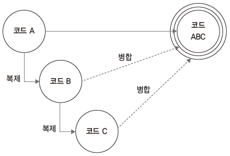

## 병합
브랜치를 생성하는 목적은 원본 코드에 영향을 주지 않고 분리하여 개발하기 위해서입니다. 독립된 브랜치에서 개발 작업이 끝나면 다시 원본 브랜치에 작업한 결과를 반영해야 합니다. 분리된 브랜치를 한 브랜치로 합치는 작업을 병합(합치기)이라고 합니다. 두 코드를 하나씩 직접 비교해 가며 수동으로 병합하거나 깃 같은 도구를 사용하여 자동으로 병합할 수 있습니다.  

<br>
<hr>

### 하나씩 직접 비교하는 수동 병합
소스 코드가 2개 있다고 합시다. 하나는 원본 소스 코드고, 또 하나는 수정된 소스 코드입니다. 수정된 코드는 버그를 고치고, 새로운 기능을 적용하여 테스트한 코드입니다. 개발을 끝내고 테스트를 완료했다면 수정 내역을 원본 소스 코드에 모두 반영해 주어야 합니다. 또는 수정된 코드 자체로 원본 코드를 대체할 수도 있습니다.  

수동으로 병합하려면 양쪽 파일을 일일이 비교하며 바뀐 점을 찾아서 적용해야 합니다. 하지만 오류 없이 코드를 병합하는 것은 간단하지 않습니다. 몇 줄 안 되는 코드라면 몰라도 실제 개발할 때는 수천 줄 이상이기 때문에 두 코드를 하나로 합치는 것은 매우 힘든 작업입니다. 또 사람의 기억력은 한계가 있기 때문에 며칠 동안 작업한 내용을 일일이 옮겨 적는 것도 힘듭니다.  

소스 코드가 2개보다 많다면 어떻게 될까요? 예를 들어 원본 소스 A를 복제하여 B를 수정하고, B를 복제하여 C도 수정하고 있습니다. 요즘은 협업 때문에 다수 개발자가 각각 새로운 기능들을 만듭니다. 또 365일 24시간 분업화된 상태에서 생긴 버그는 여러 개발자가 수정합니다. 이처럼 여러 개발자와 코드를 공유하면서 변경된 소스 코드를 병합하는 것은 매우 복잡합니다.  

그림 8-1] 코드 수동 병합  


수정이 완료되면 B는 원본 소스 A에 수정 내역을 반영하는 작업을 해야 하고, C 또한 B를 반영하여 수정된 원본 소스 A에 또다시 수정 작업을 반영해야 합니다. 병합하려면 코드의 변경된 시점을 기억해야 합니다. 변경된 시점을 기준으로 순차적으로 병합 처리를 하는 것이 좀 더 쉽습니다. 변경된 시간 순서를 따르지 않고 병합하면 코드가 엉켜 잘못 동작할 확률이 높습니다.  

<br>
<hr>

### 깃으로 자동 병합
숙련된 개발자라고 해도 복잡한 수정 내역을 순차적인 시간에 따라 병합하는 것은 쉬운 일이 아닙니다. 깃을 사용하면 복잡한 파일을 좀 더 간편하게 병합할 수 있습니다.  

>Note: 물론 깃이 모든 코드를 완벽하게 병합하는 것은 아닙니다. 아무리 좋은 도구라고 해도 자동으로 반영하지 못하는 것들이 있습니다. 이를 충돌이라고 합니다. 충돌은 8.5절에서 자세히 알아볼 것입니다.  


깃의 자동 병합은 원본을 기준으로 두 파일의 변경 이력을 비교합니다. 변경된 파일 내용이 발견되면 자동으로 수정된 코드 내용을 병합합니다.  

깃의 병합은 브랜치를 기준으로 합니다. 브랜치는 같은 저장소 내에서 서로 독립적으로 작업을 분리한 영역입니다. 분리된 각각의 브랜치에서 수정된 사항을 하나의 브랜치로 병합합니다. 병합하고자 하는 브랜치는 같은 로컬 저장소에 있어야 합니다.  

과거에는 모든 병합 작업을 수동으로 해서 어려웠지만, 이제는 이러한 수동 병합 작업을 깃이 대신 처리합니다. 하지만 깃이 모든 코드의 병합을 완벽하게 처리할 수는 없습니다. 아무리 좋은 도구라고 해도 자동으로 반영하지 못하는 것들이 있습니다. 이를 충돌이라고 합니다.  

<br>
<hr>

### 병합 방식
깃의 병합은 브랜치를 기반으로 실행합니다. 각 브랜치를 비교하여 자동 병합하는 형태입니다. 따라서 병합하려면 브랜치를 만들어 브랜치 안에서 수정 작업을 해야 합니다. 사실 파일을 병합하는 것은 그렇게 간단한 일이 아닙니다. 어떤 내용을 수정했고, 새로 추가했는지 판별하기가 어렵기 때문입니다. 병합할 때는 상대적인 기준을 판별하는 알고리즘들이 존재합니다. 이 알고리즘들은 기준점과 수정 사항을 병합하는 처리 로직에 따라 다릅니다.  

깃은 병합을 위해 두 가지 기본적인 알고리즘 방식을 제공합니다. 깃에서 충돌 없이 병합하려면 이 두 가지 병합 방식의 차이를 알아야 합니다.  

* Fast-Forward 병합  
* 3-way 병합  

두 방식으로 실습하기 전에 미리 별도의 저장소를 생성해 두겠습니다.  

```
$ cd 실습폴더
$ mkdir gitstudy08 ☜ 새로운 실습 폴더를 생성합니다.

infoh@DESKTOP MINGW64 /e/gitstudy08
$ cd gitstudy08 ☜ 실습 폴더로 이동

infoh@DESKTOP MINGW64 /e/gitstudy08
$ git init ☜ 저장소 초기화
Initialized empty Git repository in E:/ gitstudy08/.git/

```

그리고 index.htm 파일을 만들어 코드를 입력하고 저장합니다.  

```
infoh@DESKTOP MINGW64 /e/gitstudy08 (master)
$ code index.htm ☜ VS Code 실행

```

index.htm
```html
<!DOCTYPE html>
<html>
<head>
    <meta charset="utf-8" />    
    <meta name="viewport" content="width=device-width, initial-scale=1">
    <title>Page Title</title>
</head>
<body>
    <h1>hello GIT world!</h1>
</body>
</html>

```

파일을 등록하고 첫 번째 커밋을 합니다.

```
infoh@DESKTOP MINGW64 /e/gitstudy08 (master)
$ git add . ☜ 전체 파일을 등록합니다. 추적 상태

infoh@DESKTOP MINGW64 /e/gitstudy08 (master)
$ git commit -m "first"
[[master (root-commit) f123d5c] first
 1 file changed, 11 insertions(+)
 create mode 100644 index.htm

```

이 과정을 그림으로 표현하면 다음과 같습니다.  

그림 8-2] 파일 등록 및 첫 번째 커밋  


앞에서 병합하려면 모든 브랜치가 단일 저장소에 있어야 한다고 했습니다. 같은 저장소의 브랜치를 병합할 수 있다는 점을 잊지 마세요!  

