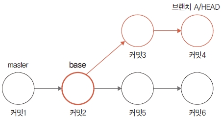
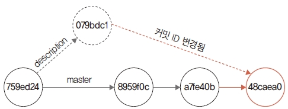
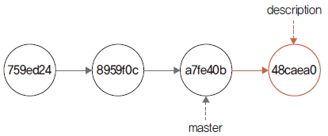
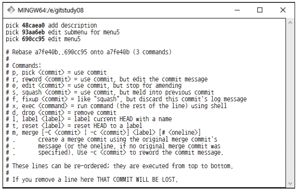

## 8.7 리베이스
브랜치를 합치는 방법은 두 가지입니다. 앞에서 배운 병합(merge)과 이 절에서 학습할 리베이스(rebase)입니다. 이번에는 커밋 순서를 재배열하는 리베이스 병합을 알아보겠습니다.  

리베이스는 커밋의 트리 구조를 재배열합니다. 커밋을 재배열하는 변경 결과가 병합과 유사합니다. 사실 실무에서는 merge 명령어보다는 커밋을 재배열하는 리베이스를 더 선호하는 편입니다.  

### 8.7.1 베이스
다시 브랜치 개념을 떠올려 봅시다. 모든 브랜치는 뿌리가 있습니다(master 브랜치는 예외입니다). 브랜치는 특정 커밋을 가리키는 포인터입니다. 그리고 가리키는 특정 커밋은 브랜치가 파생된 기준이 됩니다. 즉, 브랜치는 커밋 하나를 기준으로 새로운 작업을 진행할 수 있는 분리된 작업 경로를 의미합니다.  

그림 8-33] 브랜치의 기준 커밋


그림에서 새로운 브랜치가 커밋2에서 파생됩니다. 새로운 브랜치가 파생되는 커밋2를 베이스(base)라고 합니다. 병합에서는 이를 공통 조상 커밋이라고 합니다.  

### 8.7.2 베이스 변경
리베이스(rebase)는 베이스 앞에 ‘다시’를 의미하는 re가 붙은 단어입니다. 파생된 브랜치의 기준이 되는 베이스 커밋을 변경하는 것입니다.  

그럼 브랜치의 베이스는 왜 변경할까요? 커밋의 진행 모습을 단순화하기 위해서입니다. 브랜치가 많아지면 커밋을 관리하고 파악하기 어렵습니다. 마치 꼬여 있는 기찻길처럼 단계별로 커밋을 따라가면서 코드를 확인해야 합니다. 복잡한 브랜치의 수많은 경로는 코드의 진행 상황을 한눈에 파악하기 어렵게 합니다.  

리베이스는 코드의 베이스 분기점을 변경하여 마치 하나의 기찻길처럼 만듭니다. 여러 갈래로 갈라지지 않아 커밋의 진행 사항을 좀 더 쉽게 파악할 수 있습니다.  

그림 8-34] 베이스 이동


그림처럼 리베이스는 브랜치 A의 공통된 조상인 커밋2를 master 브랜치의 마지막 커밋6으로 변경합니다. 그리고 모든 브랜치의 커밋들을 리베이스된 커밋6 이후로 재정렬합니다.  

### 8.7.3 리베이스 vs 병합
병합은 파생된 두 브랜치를 하나로 합치는 과정입니다. 병합하려면 두 브랜치의 공통 조상 커밋을 먼저 찾아야 합니다. 공통 조상 커밋을 찾으면 서로 다르게 커밋이 진행된 두 브랜치를 3-way 방식으로 병합할 수 있습니다. 공통 조상 커밋은 두 브랜치를 병합하는 베이스 커밋입니다. 병합하는 두 브랜치는 순차적으로 커밋을 비교하면서 마지막 최종 커밋을 생성합니다.  

그림 8-35] 3-way 병합


반면에 리베이스는 두 브랜치를 서로 비교하지 않고 순차적으로 커밋 병합을 시도합니다. 리베이스에서 브랜치의 커밋을 결합하는 순서를 살펴봅시다.  

리베이스를 하면 먼저 공통 조상 커밋을 찾습니다. 리베이스는 베이스 커밋을 변경하여 두 브랜치의 커밋 위치를 바꿉니다. 그리고 파생된 브랜치의 diff를 임시 공간에 잠시 보관합니다. master 브랜치의 커밋1 → 커밋2 → 커밋5 → 커밋6까지 진행합니다. 기존 베이스 커밋2에서 커밋6으로 베이스 기준점을 변경합니다. 변경하는 기준 브랜치의 마지막 커밋에서 차례로 임시 공간에 저장한 diff를 하나씩 적용합니다. 새로운 베이스 기준점을 기반으로 한 브랜치에서 커밋3 → 커밋4를 커밋6에서 연장하여 수정 재배치합니다.  

그림 8-36] 커밋 재배치


결과적으로 브랜치의 커밋4는 최종 코드로 모든 코드 내용이 반영되어 있습니다. 커밋4 입장에서는 두 브랜치를 병합한 결과물입니다.  

리베이스 결과물을 보면 기존 병합과 두 가지 차이점이 있습니다. 첫째, 3-way 병합은 병합 커밋이 있지만, 리베이스를 하면 병합 커밋은 없습니다. 둘째, 브랜치의 마지막을 가리키는 커밋 위치가 다릅니다. 브랜치 A는 커밋4를 가리키지만, master 브랜치는 아직 커밋6을 가리킵니다.  

### 8.7.4 리베이스 명령어
리베이스 작업은 rebase 명령어를 사용합니다. 또는 다른 명령어의 옵션으로 리베이스 기능을 실행할 수 있습니다.  

```
$ git rebase 브랜치
```
 
실습을 위해 index.htm 파일을 수정하고 커밋하겠습니다. 먼저 리베이스 실습을 위한 새로운 description 브랜치를 생성합니다.  

 
```
infoh@DESKTOP MINGW64 /e/gitstudy08 (master)
$ git checkout -b description 

```

그리고 description 브랜치에서 index.htm 파일을 수정하고 커밋합니다.  

```
infoh@DESKTOP MINGW64 /e/gitstudy08 (description)
$ code index.htm

```

index.htm
```
…
<h1>hello GIT world!</h1>
<h2>깃은 소스의 변경 이력을 관리할 수 있습니다.</h2>
…
```
 
```
infoh@DESKTOP MINGW64 /e/gitstudy08 (description)
$ git commit -am "add description"
[description 079bdc1] add description
 1 file changed, 1 insertion(+)

```

다시 master 브랜치로 체크아웃합니다. master 브랜치에서도 index.htm을 수정한 후 두 번 커밋합니다.  

```
infoh@DESKTOP MINGW64 /e/gitstudy08 (description)
$ git checkout master

infoh@DESKTOP MINGW64 /e/gitstudy08 (master)
$ code index.htm

```

index.htm
```
…
            <li>병합</li>
…
```
 

 
```
infoh@DESKTOP MINGW64 /e/gitstudy08 (master)
$ git commit -am "add menu5"
[master 8959f0c] add menu5
 1 file changed, 1 insertion(+)

infoh@DESKTOP MINGW64 /e/gitstudy08 (master)
$ code index.htm

```
 

index.htm
```
…
            <li>리베이스</li>
…

```
 

 
```
infoh@DESKTOP MINGW64 /e/gitstudy08 (master)
$ git commit -am "add menu6"
[master a7fe40b] add menu6
 1 file changed, 1 insertion(+)

```

베이스 커밋 하나를 기준으로 서로 다른 브랜치에 각각의 커밋이 추가되었습니다. 소스트리에서 그래프를 확인하면 다음과 같이 표시됩니다.  

그림 8-37] 소스트리에서 브랜치 확인


보통 브랜치별로 각각 커밋이 진행된 경우에는 3-way 병합을 합니다. 하지만 이번에는 리베이스를 이용하여 두 브랜치를 병합해 보겠습니다.  

### 8.7.5 리베이스 병합
리베이스는 병합 기준 브랜치가 merge 명령어와 반대입니다. merge 명령어를 사용한 병합은 현재의 기준 브랜치에서 다른 브랜치를 읽어 와서 결합합니다.  

그림 8-38] merge 명령어를 사용한 병합


하지만 리베이스는 병합되는 브랜치 방향이 반대입니다.  

그림 8-39] 리베이스 병합


대부분 처음에는 이러한 병합 기준을 종종 혼동하곤 합니다.  

지금까지 실습 과정을 그림으로 나타내면 다음과 같습니다.  

그림 8-40] description 브랜치의 작업 내역


리베이스를 할 수 있게 description 브랜치로 체크아웃하겠습니다.  

```
infoh@DESKTOP MINGW64 /e/gitstudy08 (master)
$ git checkout description ☜ 리베이스 브랜치

infoh@DESKTOP MINGW64 /e/gitstudy08 (description)
```

description 브랜치에서 원본 master 브랜치를 리베이스합니다.   

```
infoh@DESKTOP MINGW64 /e/gitstudy08 (description)
$ git rebase master ☜ master 브랜치를 리베이스
First, rewinding head to replay your work on top of it...
Applying: add description

```

리베이스 명령이 실행되면 파생 브랜치의 커밋들은 기준 브랜치의 마지막 커밋으로 재정렬됩니다. 소스트리에서 결과를 확인해 봅시다.  

그림 8-41] 리베이스 결과


master 브랜치의 마지막 커밋 ‘add menu6’ 뒤에 파생 브랜치의 커밋이 연결된 것을 볼 수 있습니다. 두 브랜치를 하나의 그래프 모양으로 합친 형태입니다.  

### 8.7.6 리베이스되었는지 확인
리베이스는 베이스 커밋을 변경하여 병합한다고 했습니다. 베이스 커밋을 변경하는 과정에서 커밋들은 재배치 작업을 합니다. 이 과정에서 커밋의 해시 값이 변경됩니다.  

리베이스한 후 로그를 확인해 봅시다. 커밋의 해시 값을 주의 깊게 살펴보세요.  

```
infoh@DESKTOP MINGW64 /e/gitstudy08 (description)
$ git log -3
commit 48caea016f0e330cfc1dfcd587996fa9a32042fd (HEAD -> description)
Author: hojin <infohojin@gmail.com>
Date:   Sat May 18 17:27:09 2019 +0900
    add description

commit a7fe40bb622f6c8af0b1f25b0d86ea96c7896c50 (master)
Author: hojin <infohojin@gmail.com>
Date:   Sat May 18 17:28:59 2019 +0900
    add menu6

commit 8959f0cca024504cfe321adf440c9c888f8e4693
Author: hojin <infohojin@gmail.com>
Date:   Sat May 18 17:28:29 2019 +0900
    add menu5
```

로그를 확인하니 변경된 곳이 있습니다. 리베이스 병합 이후에 커밋 ID를 변경했군요.  

그림 8-42] 커밋 해시 값 변경

 

리베이스는 커밋 위치를 변경합니다. 따라서 커밋 위치가 변경될 때 해시 값 중복을 방지하려고 새로운 커밋 해시를 생성합니다.  

### 8.7.7 리베이스 후 브랜치
소스트리에서 리베이스를 완료한 후 브랜치를 다시 살펴봅시다. 리베이스 병합 이후 커밋은 정리되었지만, 브랜치 모양이 약간 다릅니다.  

그림 8-43] 리베이스 후 브랜치의 마지막 커밋 위치


일반적으로 병합을 한 후 두 브랜치는 같은 커밋 ID를 가리킵니다. 하지만 소스트리에서 확인된 브랜치 위치는 서로 다릅니다.  

그림 8-44] 브랜치의 HEAD 포인터


리베이스는 커밋 위치를 재조정할 뿐 브랜치의 HEAD 포인터까지 옮겨 주지는 않습니다. 리베이스한 후에는 이러한 병합 브랜치의 HEAD를 맞추어야 합니다. 즉, 리베이스된 브랜치를 병합해야 합니다.  

병합을 위해 master 브랜치로 체크아웃합니다. 그리고 master 브랜치에서 merge 명령어를 실행합니다.  

```
infoh@DESKTOP MINGW64 /e/gitstudy08 (description)
$ git checkout master

infoh@DESKTOP MINGW64 /e/gitstudy08 (master)
$ git merge description ☜ HEAD 포인터 조정
Updating a7fe40b..48caea0
Fast-forward
 index.htm | 1 +
 1 file changed, 1 insertion(+)

```

병합한 후 소스트리에서 브랜치 상태를 다시 확인해 보세요.  

그림 8-45] 소스트리에서 HEAD 포인터 조정 확인


두 브랜치 HEAD가 동일한 커밋 위치를 가리키고 있습니다.  

리베이스한 후에 실행한 병합 메시지도 살펴볼까요? Fast-Forward 방식으로 병합했다는 것을 알 수 있습니다. HEAD 포인터의 위치만 생각해 보면 master 브랜치는 추가 커밋이 없는 상태입니다. 그리고 리베이스한 브랜치에만 커밋이 진행된 것처럼 보입니다. 즉, 리베이스한 후 HEAD 포인터의 위치 모양은 Fast-Forward 병합을 실습할 때와 같은 형태입니다.  

리베이스는 커밋을 재배치만 할 뿐 실제 병합과 같은 최종 상태는 가지지 않습니다. 즉, 리베이스한 후에도 HEAD 포인터를 일치하기 위해 Fast-Forward 병합을 실행해 주어야 합니다. 두 브랜치의 HEAD를 일치시키는 작업까지 해야 최종 병합을 완성할 수 있습니다.  

리베이스 및 병합 작업까지 했다면 필요 없는 브랜치는 삭제합시다.  

```
infoh@DESKTOP MINGW64 /e/gitstudy08 (master)
$ git branch -d description
Deleted branch description (was 48caea0).

```

이처럼 리베이스하게 되면 복잡한 트리 모양의 구조가 아니라 선형 구조로 브랜치를 변경할 수 있습니다.  

### 8.7.8 리베이스 충돌과 해결
리베이스는 기준점을 변경합니다. 리베이스 역시 병합 과정에서 충돌이 발생할 수 있습니다. 리베이스 충돌 또한 사용자가 직접 수동으로 해결해야 합니다.  
 
실습을 위해 리베이스 충돌 환경을 만들어 보겠습니다. 먼저 새로운 menu 브랜치를 생성한 후 체크아웃합니다.  

```
infoh@DESKTOP MINGW64 /e/gitstudy08 (master)
$ git checkout -b menu
```

index.htm에서 코드 메뉴를 일부 변경하고 두 번 커밋하겠습니다.

```
infoh@DESKTOP MINGW64 /e/gitstudy08 (menu)
$ code index.htm

```

index.htm
```
…
            <li><ul>병합</ul></li>
…

```
 
```
infoh@DESKTOP MINGW64 /e/gitstudy08 (menu)
$ git commit -am "edit menu5"
[menu 8381da6] edit menu5
 1 file changed, 1 insertion(+), 1 deletion(-)

infoh@DESKTOP MINGW64 /e/gitstudy08 (menu)
$ code index.htm
```

index.htm
```
…
            <li>병합
                <ul>
                    <li>리베이스</li>
                </ul>
            </li>
…

```
 
```
infoh@DESKTOP MINGW64 /e/gitstudy08 (menu)
$ git commit -am "edit menu6"
[menu 9f0bc0d] edit menu6
 1 file changed, 5 insertions(+), 2 deletions(-)

```

master 브랜치에서도 동일한 위치의 내용을 수정하여 충돌을 만들겠습니다. master 브랜치로 체크아웃합니다. 그리고 master 브랜치에서 index.htm 파일을 수정하고 커밋합니다.  

```
infoh@DESKTOP MINGW64 /e/gitstudy08 (menu)
$ git checkout master

infoh@DESKTOP MINGW64 /e/gitstudy08 (master)
$ code index.htm

```

index.htm
```
… 
            <li>병합<ul></ul></li>
…

```
 
```
infoh@DESKTOP MINGW64 /e/gitstudy08 (master)
$ git commit -am "edit submenu for menu5"
[master 93aa6eb] edit submenu for menu5
 1 file changed, 1 insertion(+), 1 deletion(-)

```

변경된 상태를 소스트리에서 확인해 보세요.  

그림 8-46] 소스트리에서 menu 브랜치 작업 확인


서로 다른 브랜치 모양으로 분기되었습니다. 리베이스를 사용해서 병합해 봅시다. menu 브랜치로 체크아웃합니다.  

```
infoh@DESKTOP MINGW64 /e/gitstudy08 (master)
$ git checkout menu ☜ 리베이스 브랜치
Switched to branch 'menu'

```

이제 리베이스 명령을 실행합니다. 두 브랜치는 충돌이 발생합니다.  

```
infoh@DESKTOP MINGW64 /e/gitstudy08 (menu)
$ git rebase master
First, rewinding head to replay your work on top of it...
Applying: edit menu5
Using index info to reconstruct a base tree...
M       index.htm
Falling back to patching base and 3-way merge...
Auto-merging index.htm
CONFLICT (content): Merge conflict in index.htm
error: Failed to merge in the changes.
hint: Use 'git am --show-current-patch' to see the failed patch
Patch failed at 0001 edit menu5

Resolve all conflicts manually, mark them as resolved with
"git add/rm <conflicted_files>", then run "git rebase --continue".
You can instead skip this commit: run "git rebase --skip".
To abort and get back to the state before "git rebase", run "git rebase --abort".

```

두 브랜치가 충돌했다는 메시지가 출력되었습니다. 충돌이 발생하면 문제를 직접 해결해야 합니다. 코드를 확인해 볼까요?  

```
infoh@DESKTOP MINGW64 /e/gitstudy08 (master)
$ code index.htm

```

그림 8-47] 충돌한 파일 내용


앞에서 배운 병합과 동일하게 충돌 기호가 표시됩니다. 다음과 같이 직접 수정합시다.  

index.htm
```
...

<ul>

<li>깃소개</li>

<li>깃설치</li>

<li>커밋</li>

<li>브랜치</li>

<li>병합

<ul><li>리베이스</li>

</ul>

</li>

</ul>

...
```
 

리베이스는 커밋을 하나씩 따라가면서 위치를 재조정합니다. 충돌을 수정한 후에는 rebase 명령어와 --continue 옵션을 사용합니다.  

```
$ git rebase --continue
```
 

수정한 파일을 다시 스테이지 상태로 변경합니다.  

```
infoh@DESKTOP MINGW64 /e/gitstudy08 (menu|REBASE 1/2)
$ git add index.htm

```

리베이스를 이용하여 병합할 때는 충돌된 부분들을 한 단계씩 해결해 나가면서 병합할 수 있습니다. --continue 옵션을 사용하여 병합을 더 진행합니다.  

```
infoh@DESKTOP MINGW64 /e/gitstudy08 (menu|REBASE 1/2)
$ git rebase --continue
Applying: edit menu5
Applying: edit menu6
Using index info to reconstruct a base tree...
M       index.htm
Falling back to patching base and 3-way merge...
No changes -- Patch already applied.

infoh@DESKTOP MINGW64 /e/gitstudy08 (menu)

```

모든 충돌을 해결하면 리베이스 작업이 종료됩니다.  

--skip 옵션을 사용하여 특정 커밋의 충돌을 제외할 수 있습니다. 하지만 추천하는 방법은 아닙니다. 대부분 코드는 이전 코드와 많이 연결되어 있기 때문에 직접 문제를 해결하고 --continue 옵션을 사용하여 다음 단계로 넘어가는 것이 좋습니다.  

>Note: 리베이스를 취소하고 싶다면 --abort 옵션을 사용합니다.  

```
$ git rebase --abort
```

리베이스 충돌을 해결했다면 이제 브랜치를 정리할 차례입니다. master 브랜치로 체크아웃한 후 menu 브랜치를 병합합니다. 그리고 병합된 menu 브랜치는 삭제합니다.  

```
infoh@DESKTOP MINGW64 /e/gitstudy08 (menu)
$ git checkout master
Switched to branch 'master'

infoh@DESKTOP MINGW64 /e/gitstudy08 (master)
$ git merge menu
Updating 93aa6eb..690cc95
Fast-forward
 index.htm | 7 +++++--
 1 file changed, 5 insertions(+), 2 deletions(-)

infoh@DESKTOP MINGW64 /e/gitstudy08 (master)
$ git branch -d menu
Deleted branch menu (was 690cc95).

```

### 8.7.9 rebase 명령어로 커밋 수정
마지막 커밋은 --amend 옵션으로 수정할 수 있습니다. 이 방법 외에 rebase 명령어로도 최종 커밋을 수정할 수 있습니다.  

실제 병합은 아니지만 리베이스는 커밋 위치를 재조정하여 병합과 유사한 효과를 보입니다. 그리고 Fast-Forward 병합을 이용하여 선형 구조 형태로 브랜치 모양을 정리하죠. 리베이스는 커밋을 재조정하는 것 외에도 여러 커밋을 한 커밋으로 묶을 수 있습니다. 이때는 -i 옵션을 사용합니다.  

실습하기 전에 현재 저장소 상태를 확인합시다.  

```
infoh@DESKTOP MINGW64 /e/gitstudy08 (master)
$ git log -3
commit 690cc959dd410aad516c17c3bd1b46e3e022b2b6 (HEAD -> master)
Author: hojin <infohojin@gmail.com>
Date:   Sat May 18 18:08:28 2019 +0900
    edit menu5

commit 93aa6eb8ad3cf50845dd04d9b4e92838279df2b4
Author: hojin <infohojin@gmail.com>
Date:   Sat May 18 18:12:56 2019 +0900
    edit submenu for menu5

commit 48caea016f0e330cfc1dfcd587996fa9a32042fd
Author: hojin <infohojin@gmail.com>
Date:   Sat May 18 17:27:09 2019 +0900
    add description

```

우리는 세 번 커밋해서 리베이스했습니다. 하지만 이 커밋들은 작업이 비슷합니다. 이 커밋들을 커밋 하나로 묶어 봅시다.  

```
infoh@DESKTOP MINGW64 /e/gitstudy08 (master)
$ git rebase -i HEAD~3

```

명령어를 입력하면 메시지를 입력할 수 있는 vi 에디터가 실행됩니다. 리베이스 병합할 커밋들의 정보도 자동으로 작성됩니다.  

그림 8-48] 메시지를 입력할 수 있는 vi 에디터


```
pick 48caea0 add description
pick 93aa6eb edit submenu for menu5
pick 690cc95 edit menu5

# Rebase a7fe40b..690cc95 onto a7fe40b (3 commands)
#
# Commands:
# p, pick <commit> = use commit
# r, reword <commit> = use commit, but edit the commit message
# e, edit <commit> = use commit, but stop for amending
# s, squash <commit> = use commit, but meld into previous commit
# f, fixup <commit> = like "squash", but discard this commit's log message
# x, exec <command> = run command (the rest of the line) using shell
# d, drop <commit> = remove commit
# l, label <label> = label current HEAD with a name
# t, reset <label> = reset HEAD to a label
# m, merge [-C <commit> | -c <commit>] <label> [# <oneline>]
# .       create a merge commit using the original merge commit's
# .       message (or the oneline, if no original merge commit was
# .       specified). Use -c <commit> to reword the commit message.
#
# These lines can be re-ordered; they are executed from top to bottom.
#
# If you remove a line here THAT COMMIT WILL BE LOST.

```
 

리베이스 메시지를 저장하면 다음 메시지를 출력한 후 커밋 3개가 커밋 하나로 변경됩니다.  

```
Successfully rebased and updated refs/heads/master.
```

이처럼 리베이스는 여러 커밋을 커밋 하나로 합칠 수 있습니다. 이때 합친 커밋에는 새 해시 값이 부여됩니다.  

### 8.7.10 리베이스할 때 주의할 점
리베이스는 커밋 위치와 해시 값을 변경합니다. 저장소를 외부에 공개했다면 공개된 순간부터 커밋은 리베이스를 사용하지 않는 것이 원칙입니다.  

리베이스는 외부로 코드를 푸시하거나 공개하기 전에 로컬에서만 실행하는 것이 좋습니다. 외부에 공개된 커밋을 리베이스하면 커밋 위치와 해시 값이 변경되어 너무 혼란스럽습니다. 공개된 커밋을 변경할 때는 다음 장에서 배울 revert 명령어를 사용합니다.  

<br><br>