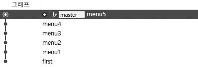

## 9.1 되돌리기
깃을 이용하여 버전을 관리하는 목적은 만일의 사태를 대비하기 위해서입니다. 프로그래밍은 수많은 코드를 작성하고 테스트하는 과정입니다. 개발자는 코드를 단계별로 발전시키면서 실수를 최소화하고자 노력합니다. 하지만 아무리 주의해서 프로그래밍해도 오류가 생깁니다. 개발 도중에 심각할 정도로 오작동해서 더 이상 개선하기 어려울 때도 생기곤 합니다. 이때는 문제를 억지로 해결하려고 노력하는 것보다 지금까지 한 작업을 포기하고 다시 시작하는 것이 좀 더 빠르게 해결할 수 있는 방법이 될 수도 있습니다.  

깃을 사용하면 언제든지 원하는 시점으로 전체 코드를 되돌릴 수 있습니다. 마치 코드 복구 시스템과 같습니다.  

### 9.1.1 다시 시작
코드가 한두 줄 변경되었을 때는 언제든지 다시 시작할 수 있습니다. 몇 줄만 암기하여 변경하면 됩니다. 하지만 몇 시간 혹은 며칠 동안 작업한 코드라면 이야기가 다릅니다. 모든 수정 내역을 일일이 기억하여 과거 상태로 되돌아가는 것은 쉽지 않습니다. 이때 깃을 사용하면 좀 더 손쉽게 되돌아갈 수 있습니다.  

깃은 기록된 커밋을 기준으로 이전 상태로 되돌릴 수 있습니다. 즉, 코드를 항상 안정적으로 유지하고 관리할 수 있게 해 주는 도구입니다. 수많은 개발자가 깃을 사랑하는 이유 중 하나이기도 합니다.  

깃에서 코드 작업을 되돌리는 방법은 크게 reset과 revert 두 가지입니다. 리셋(reset)과 리버트(revert) 동작을 좀 더 쉽게 이해할 수 있도록 실습으로 익혀 보겠습니다. 먼저 실습을 위해 새 깃 저장소 폴더를 만들고 초기화합니다.  

```
$ cd 실습폴더
$ mkdir gitstudy09 ☜ 새로운 실습 폴더를 생성합니다.
$ cd gitstudy09
$ git init .
Initialized empty Git repository in E:/gitstudy09/.git/
infoh@DESKTOP MINGW64 /e/gitstudy09 (master)

```

실습을 위해 menu.htm 파일을 생성합니다. 메뉴 내용을 계속 추가하면서 여러 번 커밋합니다. 먼저 menu.htm 파일을 생성하고 `<ul></ul>` 태그를 입력하여 저장합니다.  

```
infoh@DESKTOP MINGW64 /e/gitstudy09 (master)
$ code menu.htm
```

menu.htm
```html
<ul>
</ul>
```
 

파일을 저장했다면 add 명령어로 등록한 후 커밋합니다.

```
infoh@DESKTOP MINGW64 /e/gitstudy09 (master)
$ git add menu.htm

infoh@DESKTOP MINGW64 /e/gitstudy09 (master)
$ git commit -m "first"
[master (root-commit) 69bf712] first
 1 file changed, 2 insertions(+)
 create mode 100644 menu.htm

```

이제부터 menu.htm 파일에 menu1~menu5를 차례대로 추가하여 계속 커밋하겠습니다. 파일을 여는 데 사용하는 code menu.htm 명령어는 반복되므로 생략합니다.  

menu.htm 파일에 menu1을 추가하고 저장합니다.  

menu.htm
```html
<ul>
    <li>menu1</li>
</ul>
```
 

그리고 두 번째 커밋을 합니다.  
```
$ git commit -am "menu1"
[master b741eef] menu1
 1 file changed, 1 insertion(+)

infoh@DESKTOP MINGW64 /e/gitstudy09 (master)
$ code menu.htm

```

두 번째 메뉴를 추가하고 저장한 후 커밋합니다.  

menu.htm
```html
<ul>
    <li>menu1</li>
    <li>menu2</li>
</ul>

```
 

```
$ git commit -am "menu2"
[master f1c704f] menu2
 1 file changed, 1 insertion(+)

infoh@DESKTOP MINGW64 /e/gitstudy09 (master)
$ code menu.htm

```

세 번째 메뉴를 추가하고 저장한 후 커밋합니다.  

menu.htm
```html
<ul>
    <li>menu1</li>
    <li>menu2</li>
    <li>menu3</li>
</ul>

```
 
```
$ git commit -am "menu3"
[master b728366] menu3
 1 file changed, 1 insertion(+)

infoh@DESKTOP MINGW64 /e/gitstudy09 (master)
$ code menu.htm

```

네 번째 메뉴를 추가하고 저장한 후 커밋합니다.  

menu.htm
```html
<ul>
    <li>menu1</li>
    <li>menu2</li>
    <li>menu3</li>
    <li>menu4</li>
</ul>
```
 

 
```
$ git commit -am "menu4"
[master 6619c99] menu4
 1 file changed, 1 insertion(+)

infoh@DESKTOP MINGW64 /e/gitstudy09 (master)
$ code menu.htm

```

다섯 번째 메뉴를 추가하고 저장한 후 커밋합니다.  

menu.htm
```html
<ul>
    <li>menu1</li>
    <li>menu2</li>
    <li>menu3</li>
    <li>menu4</li>
    <li>menu5</li>
</ul>
```
 
```
$ git commit -am "menu5"
[master 7f068b6] menu5
 1 file changed, 1 insertion(+)

```

총 여섯 단계에 거쳐 커밋했습니다. 생성한 커밋들은 소스트리에서 확인할 수 있습니다.  

>Note: 소스트리와 gitstudy09 폴더가 연결되어 있어야 확인할 수 있습니다. 소스트리의 새 탭에서 Add 버튼을 클릭합니다. 탐색을 눌러 앞에서 만든 gitstudy09 폴더를 찾아 선택한 후 추가를 누릅니다. 그러면 gitstudy09 저장소와 연결됩니다.  


그림 9-1] 여섯 단계 커밋 확인


<br><br>