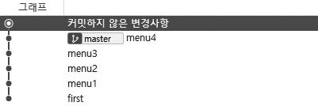
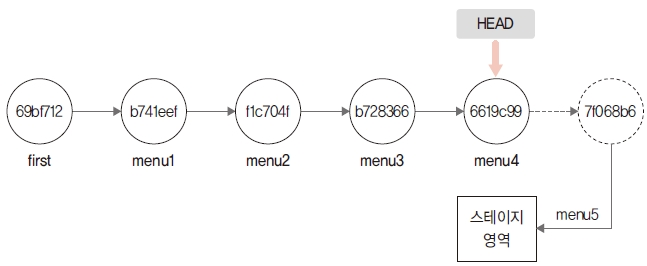
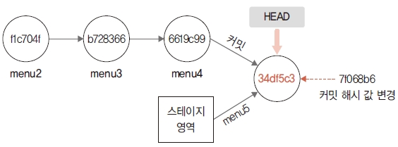
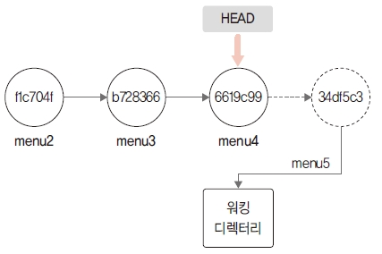
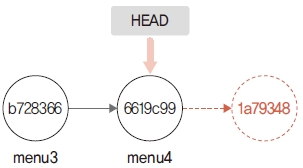
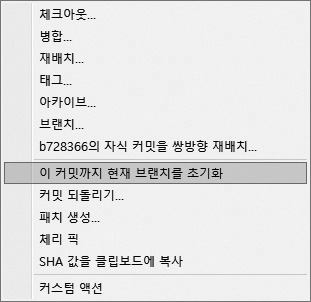
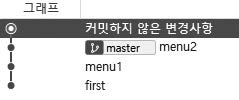
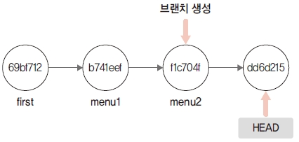
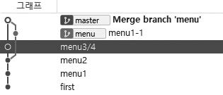
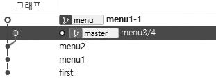

## 리셋
리셋(reset)은 커밋을 기준으로 이전 코드로 되돌리는 방법으로, 기록한 커밋을 취소합니다. 커밋을 취소하는 만큼 리셋할 때는 항상 신중하게 작업해야 합니다.  

그림 9-2] 리셋  


<br>
<hr>

### 복귀 시점
복귀는 어떤 시점으로 돌아가는 것을 의미합니다. 따라서 이전 코드로 복귀하려면 복귀 시점을 알려 주어야 합니다. 리셋은 이 시점을 커밋을 기준으로 정합니다. 커밋은 log 명령어로 조회할 수 있습니다. log 명령어를 실행하면 커밋의 해시 값과 메시지를 출력합니다. 따라서 복귀하고자 하는 특정 시점을 찾는 데 매우 유용합니다.  

앞에서 작업한 커밋들을 확인해 봅시다. --oneline 옵션을 같이 사용하여 로그 기록을 확인합니다. 간략한 커밋 해시 값과 메시지가 같이 출력됩니다.  

```
infoh@DESKTOP MINGW64 /e/gitstudy09 (master)
$ git log --oneline
7f068b6 (HEAD -> master) menu5
6619c99 menu4
b728366 menu3
f1c704f menu2
b741eef menu1
69bf712 first

```

로그 기록을 그림으로 표현하면 다음과 같습니다. 마지막 커밋 ID에는 HEAD 포인터가 있습니다.  

그림 9-3] 최신 커밋 ID에 HEAD 포인터가 존재  


>Note: 실습을 따라 하려면 커밋 해시 값이 중요합니다. 하지만 커밋의 해시 값은 실습 컴퓨터 환경마다 다릅니다. 책의 해시 값은 참고용입니다. 실제 실습에서는 자신의 컴퓨터에서 생성된 해시 값을 사용해야 합니다.  

커밋 메시지는 특정 시점을 파악하는 데 매우 좋습니다. 커밋 메시지는 여러 줄로 작성할 수 있으며, 로그 기록은 그중 첫 번째 줄 메시지만 출력합니다. 그래서 커밋 메시지를 작성할 때는 첫 번째 줄에 요약 정보를 입력합니다. 한 줄을 띄우고 좀 더 상세한 내용을 작성하면 좋습니다.  

고정된 커밋 해시 값을 사용하지 않고, HEAD 포인터를 이용하여 상대적 위치를 지정할 수도 있습니다. 다음과 같이 캐럿(^) 또는 물결(~) 기호를 사용하여 HEAD의 상대 커밋 위치를 지정합니다.  

```
$ git reset --hard HEAD^^^
```

<br>
<hr>

### reset 명령어
reset 명령어를 사용하면 지정된 커밋 코드로 되돌아갑니다. 즉, 특정 커밋의 해시 값 상태로 모든 코드를 복구합니다.

```
$ git reset 옵션 커밋ID
```
 

reset 명령어는 옵션을 함께 사용해야 하며, 세 가지 옵션이 있습니다.  

* soft: 스테이지 영역을 포함한 상태로 복원합니다.  
* mixed: 기본 옵션 값은 mixed입니다. reset 명령어를 사용할 때 옵션을 지정하지 않으면 기본값인 mixed로 선택됩니다.  
* hard: 실제 파일이 삭제된 이전 상태로 복원합니다.
soft 옵션과 mixed 옵션 차이는 크게 스테이지 영역과 관련이 있습니다. hard 옵션은 워킹 디렉터리와 관련이 있습니다. 각 옵션의 차이점과 동작은 실습하면서 알아보겠습니다.  

<br>
<hr>

### soft 옵션
soft 옵션은 가장 낮은 단계의 리셋 동작입니다. 먼저 soft 옵션의 동작은 reset --soft 명령어를 실행해서 이해해 봅시다. 코드에서 HEAD~는 이전 커밋을 의미합니다.  

```
infoh@DESKTOP MINGW64 /e/gitstudy09 (master)
$ git reset --soft HEAD~ ☜ 이전 커밋으로 소프트 리셋

```

최신 커밋(menu5)을 리셋했습니다. --soft 옵션을 사용하면 별도의 메시지가 출력되지 않습니다. 리셋한 후 소스트리에서 확인하면 다음 그래프를 볼 수 있습니다.  

그림 9-4] 소프트 리셋 확인  



마지막 menu5 커밋이 사라지고 커밋하지 않은 변경 사항이 보입니다.  

log 명령어로도 커밋 기록을 확인해 봅시다.  

```
infoh@DESKTOP MINGW64 /e/gitstudy09 (master)
$ git log --oneline
6619c99 (HEAD -> master) menu4 
b728366 menu3
f1c704f menu2
b741eef menu1
69bf712 first

```

마찬가지로 마지막의 menu5 커밋이 없어졌습니다. 리셋한 후 menu.htm 파일의 내용은 어떨까요?  

```
infoh@DESKTOP MINGW64 /e/gitstudy09 (master)
$ code menu.htm
```

menu.htm
```
<ul>
    <li>menu1</li>
    <li>menu2</li>
    <li>menu3</li>
    <li>menu4</li>
    <li>menu5</li>
</ul>
```
 

리셋한 후에 menu5 커밋이 없어졌는데, menu.htm 파일에는 `<li>menu5</li>`가 있습니다. 이전 파일에서 달라진 점이 없습니다.  

왜 이럴까요? 좀 더 확인해 보겠습니다. 먼저 diff 명령어로 비교합니다.  

```
infoh@DESKTOP MINGW64 /e/gitstudy09 (master)
$ git diff HEAD
diff --git a/menu.htm b/menu.htm
index f717854..9ae7cfc 100644
--- a/menu.htm
+++ b/menu.htm
@@ -3,4 +3,5 @@
     <li>menu2</li>
     <li>menu3</li>
     <li>menu4</li>
+    <li>menu5</li> ☜ 파일이 수정 추가됨
 </ul>
\ No newline at end of file

```

diff 명령어를 실행한 결과 menu.htm 파일에 새로운 menu5가 추가된 것으로 나옵니다. 이번에는 깃의 상태를 확인해 보겠습니다.  

```
infoh@DESKTOP MINGW64 /e/gitstudy09 (master)
$ git status
On branch master
Changes to be committed:
  (use "git reset HEAD <file>..." to unstage)
        modified:   menu.htm ☜ 파일이 변경된 상태

```

메뉴 파일은 수정된 상태입니다. 그리고 수정된 파일은 스테이지 영역에 등록되어 있습니다.  

그림 9-5] soft 옵션을 사용한 리셋 후 저장소 상태  



soft 옵션은 지정한 커밋 위치로 복귀합니다. 복귀하면서 스테이지 영역의 상태도 같이 복귀합니다. soft 옵션은 파일을 수정하고, add 명령어로 스테이지 영역에 올려 커밋을 실행하기 직전의 단계로 되돌립니다. status 명령어를 실행한 출력 결과에서 메시지가 초록색으로 표기되는 것을 보면, add 명령어를 사용하지 않고도 바로 커밋할 수 있는 직전의 상황입니다.  

이처럼 soft 옵션은 단순히 HEAD 위치를 이동하는 역할만 합니다. 마치 직전의 커밋 단계로 체크아웃하라는 명령과 유사합니다. reset --soft 명령어와 체크아웃 명령어는 HEAD 위치를 이동한다는 점에서는 동일하지만, 브랜치를 변경하지 않는다는 점에서 차이가 있습니다.  

다음 실습을 위해 다시 menu5를 등록해서 커밋해 두겠습니다.  

```
infoh@DESKTOP MINGW64 /e/gitstudy09 (master)
$ git commit -m "menu5" ☜ 다시 커밋등록
[master 34df5c3] menu5
 1 file changed, 1 insertion(+)

```

처음과 동일한 상태가 되었습니다.  

그림 9-6] 다시 커밋한 후 스테이지 영역  



다음 실습을 위해 menu5를 다시 커밋했습니다. 여기서 주의할 점은 커밋할 때마다 커밋의 해시 값이 변경된다는 점입니다. 처음 menu5를 커밋할 때는 해시 값이 7f068b6이었습니다. 하지만 다시 menu5를 커밋할 때는 34df5c3입니다. 소스 코드 내용이 변경되지 않더라도 새로 커밋하면 변경된 시간 같은 값을 적용하여 해시 값을 생성합니다. 따라서 실습 과정에서 해시 값이 변경될 수 있습니다.  

해시 값이 변경되었는지 로그를 다시 살펴보겠습니다.  

```
infoh@DESKTOP MINGW64 /e/gitstudy09 (master)
$ git log --oneline
34df5c3 (HEAD -> master) menu5 ☜ 커밋 해시값이 변경되어 있음
6619c99 menu4
b728366 menu3
f1c704f menu2
b741eef menu1
69bf712 first

```

reset --soft 명령어의 원리를 이용하면 마지막 커밋을 수정할 수 있습니다. 마치 --amend 명령어와 유사합니다.  

```

$ git commit --amend
```

<br>
<hr>

### mixed 옵션
reset 명령어의 기본값은 mixed 옵션입니다.  

```
$ git reset --mixed 커밋ID
```
 
또는 다음과 같이 mixed 옵션을 생략할 수 있습니다.  

```
$ git reset 커밋ID
```

이번에는 mixed 옵션을 이해할 수 있도록 간단히 실습해 봅시다.  

```
infoh@DESKTOP MINGW64 /e/gitstudy09 (master)
$ git reset --mixed HEAD~ ☜ mixed 리셋을 실행합니다.
Unstaged changes after reset:
M       menu.htm

```

이번에는 리셋 메시지가 같이 표시되었습니다. 메시지 내용은 unstaged 상태로 변경되었다는 의미입니다. mixed 옵션은 soft 옵션과 달리 리셋한 후 스테이지 상태까지 복원하지 않습니다. status 명령어로 깃의 상태를 확인합니다.  

```
infoh@DESKTOP MINGW64 /e/gitstudy09 (master)
$ git status
On branch master
Changes not staged for commit:
  (use "git add <file>..." to update what will be committed)
  (use "git checkout -- <file>..." to discard changes in working directory)
        modified:   menu.htm
no changes added to commit (use "git add" and/or "git commit -a")

```

soft 옵션은 스테이지 상태까지 복원하기 때문에 바로 commit 명령어를 실행할 수 있었습니다. 하지만 mixed 옵션은 스테이지 상태를 제외하고 복원하기 때문에 Unstaged 상태가 되어 메시지가 빨간색으로 표시됩니다. 따라서 커밋하려면 add 명령어를 먼저 실행해야 합니다.  

먼저 리셋한 후 menu.htm 파일을 확인해 봅시다.  

```
infoh@DESKTOP MINGW64 /e/gitstudy09 (master)
$ code menu.htm
```

menu.htm
```
<ul>
    <li>menu1</li>
    <li>menu2</li>
    <li>menu3</li>
    <li>menu4</li>
    <li>menu5</li>
</ul>

```
 

리셋한 후에도 `<li>menu5</li>` 소스 코드가 남아 있습니다. 이전과 파일 내용이 동일합니다. diff 명령어로 좀 더 확인해 보겠습니다.  

```
infoh@DESKTOP MINGW64 /e/gitstudy09 (master)
$ git diff HEAD
diff --git a/menu.htm b/menu.htm
index f717854..9ae7cfc 100644
--- a/menu.htm
+++ b/menu.htm
@@ -3,4 +3,5 @@
     <li>menu2</li>
     <li>menu3</li>
     <li>menu4</li>
+    <li>menu5</li> ☜ 파일이 수정 추가됨
 </ul>
\ No newline at end of file

```

새로운 menu5가 추가되었다고 나옵니다. 변경 파일 내용은 워킹 디렉터리에 저장되었습니다.  

그림 9-7] mixed 옵션을 실행한 워킹 디렉터리  



다음 실습을 위해 다시 menu5를 등록하여 커밋해 두겠습니다.  

```
infoh@DESKTOP MINGW64 /e/gitstudy09 (master)
$ git commit -m "menu5" ☜ 커밋 실패
On branch master
Changes not staged for commit:
        modified:   menu.htm

no changes added to commit

```

앗, 커밋에 실패했네요. mixed 옵션은 스테이지 영역을 같이 복사하지 않기 때문에 수정된 파일은 스테이지 영역이 아닌 워킹 디렉터리 안에 남아 있습니다. 따라서 mixed 옵션을 사용하여 리셋한 후 다시 커밋하려면 반드시 add 명령어를 실행해야 합니다.  

add 명령어로 등록하고 다시 커밋합니다.  

```
infoh@DESKTOP MINGW64 /e/gitstudy09 (master)
$ git add menu.htm ☜ 스테이지 등록

infoh@DESKTOP MINGW64 /e/gitstudy09 (master)
$ git commit -m "menu5"
[master 1a79348] menu5
 1 file changed, 1 insertion(+)

```

이제 처음과 동일한 상태가 되었습니다.  

그림 9-8] soft 옵션과 mixed 옵션을 사용한 후 상태 변화  


<br>
<hr>

### hard 옵션
이번에는 가장 강력한 옵션인 hard 옵션을 알아봅니다. soft 옵션과 mixed 옵션은 이전 커밋으로 되돌리는 과정에서 실제로 삭제되는 내용은 없습니다. 모든 작업 내용이 워킹 디렉터리에 그대로 유지됩니다. 정확히 말하면 이전 상태로 되돌아가는 것이 아닙니다. 복귀 커밋 이후의 작업들은 워킹 디렉터리 영역에 남겨 두어 다시 수정하거나 커밋할 수 있도록 상태만 변경하는 것입니다.  

이에 반해 hard 옵션은 리셋되는 복귀 시점의 커밋 상태와 해당 커밋의 워킹 디렉터리까지 모두 되돌립니다. 즉, reset --hard 명령어를 사용한 커밋 이후의 모든 내용은 삭제됩니다. 따라서 hard 옵션은 주의해서 사용해야 합니다.  

이번에는 hard 옵션을 사용해 봅시다.  

```
infoh@DESKTOP MINGW64 /e/gitstudy09 (master)
$ git reset --hard HEAD~ ☜ 완전 삭제
HEAD is now at 6619c99 menu4

```
 

hard 옵션을 실행하면 리셋된 결과 메시지가 출력됩니다. 그리고 삭제 이후의 마지막 HEAD 커밋의 해시 값이 출력됩니다. 소스트리에서도 결과를 확인해 보세요.  

그림 9-9] hard 옵션을 사용한 리셋 이후 상태  


soft 옵션 리셋과 달리 ‘커밋하지 않은 변경 사항’이 없습니다. 그리고 menu4로 HEAD 포인터가 변경되었습니다. 로그 기록도 확인해 볼까요?  

```
infoh@DESKTOP MINGW64 /e/gitstudy09 (master)
$ git log --oneline
6619c99 (HEAD -> master) menu4
b728366 menu3
f1c704f menu2
b741eef menu1
69bf712 first

```

menu.htm 파일도 다시 확인해 봅시다.

```
infoh@DESKTOP MINGW64 /e/gitstudy09 (master)
$ code menu.htm
```

menu.htm
```
<ul>
    <li>menu1</li>
    <li>menu2</li>
    <li>menu3</li>
    <li>menu4</li>
</ul>

```
 

이번에는 파일에서 `<li>menu5</li>` 코드가 삭제되었습니다. soft나 mixed 옵션과 달리 이전에 커밋한 시점에서 작성한 파일 내용으로 변경되었습니다. 이처럼 실제 파일 내용이 변경되는 것은 hard 옵션을 사용하면 워킹 디렉터리 내용도 함께 삭제되기 때문입니다. 이전 커밋으로 완전히 리셋된 것을 확인할 수 있습니다.  

그림 9-10] 완전한 리셋  



깃의 상태도 다시 한 번 확인하겠습니다.  

```
infoh@DESKTOP MINGW64 /e/gitstudy09 (master)
$ git status
On branch master
nothing to commit, working tree clean

```

워킹 디렉터리와 스테이지가 모두 비어 있는 깨끗한 상태입니다.  

<br>
<hr>

### 소스트리
리셋하려면 복귀 시점의 커밋 해시 값이 필요합니다. 하지만 매번 로그를 검색하여 리셋하는 것은 불편합니다. 소스트리를 이용하면 더 쉽게 리셋할 수 있습니다. 앞에서 이미 실습했기 때문에 여기서는 메뉴만 확인해 주세요.  

먼저 소스트리의 커밋 그래프에서 복귀할 커밋을 선택합니다. 그리고 마우스 오른쪽 버튼을 눌러 이 커밋까지 현재 브랜치를 초기화 메뉴를 선택합니다.  

그림 9-11] 소스트리에서 초기화  



그러면 팝업창이 열립니다. 앞에서 학습한 soft, mixed, hard 리셋 옵션을 선택할 수 있습니다.  

그림 9-12] 리셋 옵션 선택  


hard 옵션을 선택하면 다음 알림창이 열립니다. 다시 한 번 경고 메시지를 출력하고 정말로 작업을 진행할지 묻습니다. 정말 되돌릴 것이라면 예를 누릅니다.  

그림 9-13] 알림창  


<br>
<hr> 

### 커밋 합치기
앞에서는 리베이스 병합의 -i 옵션을 사용하면 여러 커밋을 하나로 합치는 동작을 수행할 수 있었습니다. 또 단일 커밋은 커밋 명령어의 --amend 옵션으로 커밋을 수정할 수 있었습니다. 리셋의 동작 원리를 이해하고 있다면, 커밋도 수정할 수 있습니다. 리셋의 soft 옵션은 HEAD를 해당 커밋으로 이동합니다. 그리고 원본 내용은 그대로 워킹 디렉터리에 남겨 둡니다.  

실습으로 커밋을 수정해 봅시다. 수정하기 전에 먼저 로그를 확인해 보겠습니다.  

```
infoh@DESKTOP MINGW64 /e/gitstudy09 (master)
$ git log --oneline
6619c99 (HEAD -> master) menu4
b728366 menu3
f1c704f menu2
b741eef menu1
69bf712 first

```

menu3과 menu4 커밋을 reset 명령어를 사용하여 하나로 합쳐 보겠습니다.  

```
infoh@DESKTOP MINGW64 /e/gitstudy09 (master)
$ git reset –soft HEAD~2 ☜ 2단계 전의 커밋으로 소프트 리셋

```

최신 커밋 HEAD를 기준으로 2단계 전 상태로 리셋됩니다. 즉, menu2를 가리키는 f1c704f 커밋을 의미합니다. 로그를 다시 실행합니다.  

```
infoh@DESKTOP MINGW64 /e/gitstudy09 (master)
$ git log --oneline
f1c704f (HEAD -> master) menu2
b741eef menu1
69bf712 first

```

지금까지 작업한 상태를 그림으로 표현하면 다음과 같습니다.  

그림 9-14] menu3, menu4를 soft 옵션을 사용하여 리셋  
 

리셋한 후 내용을 diff 명령어로 확인해 볼까요?  

```
infoh@DESKTOP MINGW64 /e/gitstudy09 (master)
$ git diff HEAD~
diff --git a/menu.htm b/menu.htm
index d11d058..f717854 100644
--- a/menu.htm
+++ b/menu.htm
@@ -1,3 +1,6 @@
 <ul>
     <li>menu1</li>
+    <li>menu2</li> ☜ 추가내용으로 상태가 변경됨
+    <li>menu3</li>
+    <li>menu4</li>
 </ul>
\ No newline at end of file

```

소스 코드는 기존 menu2에 추가된 내용과 menu3, menu4가 남아 추가된 상태이며, 워킹 디렉터리와 스테이지 영역이 변경되었습니다. 소스트리에서 확인하면 다음과 같습니다.  

그림 9-15] 소스트리에서 리셋 후 상태  



이제 커밋을 합쳐 다시 메시지를 작성합니다.  

```
infoh@DESKTOP MINGW64 /e/gitstudy09 (master)
$ git commit -m "menu3/4"
[master dd6d215] menu3/4
 1 file changed, 2 insertions(+)

```

합친 커밋을 생성한 후 소스트리의 그래프를 확인하면, menu3과 menu4를 합친 커밋을 볼 수 있습니다.  

그림 9-16] menu3과 menu4를 합친 커밋  


menu3과 menu4는 커밋 2개를 합쳐 커밋 하나를 만든 것과 같습니다.  

그림 9-17] 커밋 합치기  


<br>
<hr>

### 스테이지 리셋
스테이지 영역은 커밋을 하려고 임시로 결과물을 보관해 두는 공간입니다. 커밋을 하려면 워킹 디렉터리에서 작업한 내용을 스테이지 영역에 등록해야 합니다. 앞에서 배웠듯이, 스테이지 영역에 등록할 때는 add 명령어를 사용합니다.  

```
$ git add 파일이름
```

또 add 명령어로 등록된 스테이지 영역의 파일을 다시 unstage 상태가 되도록 스테이징을 취소할 수 있습니다. 스테이지 영역에서 등록된 파일을 다시 unstage 상태로 만들 때는 reset 명령어를 사용합니다.  

```
$ git reset 파일이름
```

reset 명령어 다음에 커밋 ID 대신 파일 이름을 사용하면 됩니다. 파일 이름을 지정하여 리셋하면 해당 파일은 unstage 상태가 됩니다. 하지만 이 명령어는 몇 가지 옵션이 축약되어 있습니다. 내부적으로 다음과 같이 여러 단계로 처리하여 파일을 unstage 상태로 변경합니다.  

```
$ git reset --mixed HEAD 파일이름
```

원래는 중간에 --mixed HEAD가 생략된 형태입니다. 최신 커밋에서 지정 파일을 리셋하고 mixed 옵션으로 스테이지 영역도 같이 제거합니다. 다음과 같이 HEAD 대신 다른 커밋 ID를 사용할 수도 있습니다.  

```
$ git reset 커밋ID 파일이름
```
 
<br>
<hr>
 
### 작업 취소
코드를 수정하는 도중 오류가 생겨 현재 작업을 모두 취소하고 싶을 수 있습니다. 보통은 다음과 같이 워킹 디렉터리에서 코드를 수정하고, 수정한 코드는 다시 스테이지 영역에 등록합니다.  

그림 9-18] 코드 수정과 워킹 디렉터리  


수정 작업을 완전히 취소하려면 워킹 디렉터리와 스테이지 상태를 모두 제거하여 마지막 커밋 상태로 되돌려 놓아야 합니다. 그림을 보면 HEAD 포인터는 가장 마지막의 커밋 위치를 가리킵니다. 그리고 수정 작업들은 모두 워킹 디렉터리 안에 남아 있습니다. 리셋할 때의 시점을 현재 HEAD를 기준으로 하면 해당 시점의 수정 작업을 모두 삭제할 수 있습니다.  

```
$ git reset --hard HEAD
```

<br>
<hr>

### 병합 취소
리셋은 병합된 브랜치도 취소할 수 있습니다. 실습과 함께 익혀 봅시다. 먼저 실습을 위해 커밋 환경을 준비합니다. 다음과 같이 브랜치를 만들어 보겠습니다.  

그림 9-19] 커밋을 지정하여 브랜치 생성  


menu2의 커밋 해시키를 직접 지정하여 menu 브랜치를 생성할 것입니다. 그리고 menu 브랜치로 체크아웃하겠습니다.  

```
infoh@DESKTOP MINGW64 /e/gitstudy09 (master)
$ git checkout -b menu f1c704f ☜ 커밋을 직접 지정
Switched to a new branch 'menu'
```

만든 브랜치에서 menu.htm 파일을 수정하고 저장한 후 커밋합시다.  

```
infoh@DESKTOP MINGW64 /e/gitstudy09 (menu)
$ code menu.htm

```

menu.htm
```
<ul>
    <li>menu1
        <ul>
            <li>menu1-1</li>
        </ul>
    </li>
    <li>menu2</li>
</ul>

```
 
```
infoh@DESKTOP MINGW64 /e/gitstudy09 (menu)
$ git commit -am "menu1-1"
[menu 7f5fad8] menu1-1
 1 file changed, 5 insertions(+), 1 deletion(-)

```
menu1에 서브 메뉴를 추가했습니다. 소스트리에서도 확인할 수 있습니다.  

그림 9-20] 소스트리에서 브랜치 작업 확인  


이제 menu 브랜치와 master 브랜치를 병합하겠습니다. 다른 브랜치로 체크아웃되어 있다면 병합을 위해 먼저 master 브랜치로 체크아웃합니다.  

```
infoh@DESKTOP MINGW64 /e/gitstudy09 (menu)
$ git checkout master
Switched to branch 'master'

```

merge 명령어를 실행합니다. 두 브랜치는 3-way 방식으로 병합하는데, 병합 메시지를 작성해야 합니다. 명령어를 실행한 후 vi 에디터 창이 열리면 메시지를 작성하고 저장하여 빠져나옵니다.  

```
infoh@DESKTOP MINGW64 /e/gitstudy09 (master)
$ git merge menu
Auto-merging menu.htm
Merge made by the 'recursive' strategy.
 menu.htm | 6 +++++-
 1 file changed, 5 insertions(+), 1 deletion(-)

```

소스트리에서 두 브랜치가 성공적으로 병합된 모습을 볼 수 있습니다.  

그림 9-21] master 브랜치와 menu 브랜치 병합  



이번에는 방금 전에 병합한 커밋을 리셋하여 취소하겠습니다.  

```
infoh@DESKTOP MINGW64 /e/gitstudy09 (master)
$ git reset --merge HEAD~ ☜ 이전 커밋 리셋

```

소스트리에서 다시 한 번 결과를 확인합니다. 병합 커밋이 취소된 것을 확인할 수 있습니다.  

그림 9-22] 병합 취소  


<br>
<hr>

### 주의할 점
리셋 기능을 이용하면 독립된 개인 프로젝트를 관리할 때 쉽게 이전 상태로 복귀할 수 있습니다. 하지만 저장소를 외부에 공개했거나 공유하고 있다면 주의해서 리셋을 사용해야 합니다. 작성된 커밋이 리셋으로 삭제되면 함께 작업하는 개발자에게 혼란을 줄 수 있습니다. 일반적으로 협업하거나 소스 코드를 공유한 후에는 리셋 작업을 하지 않습니다.  

<br><br>