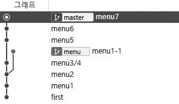
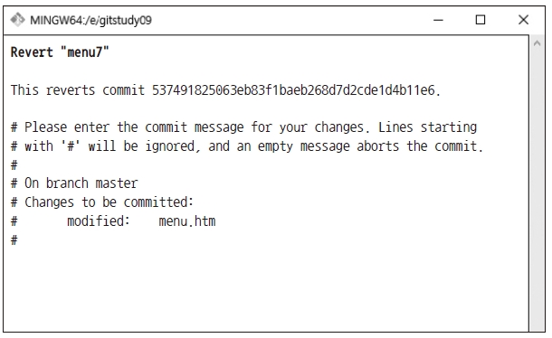
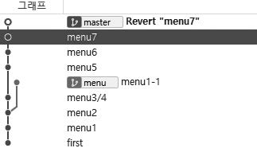
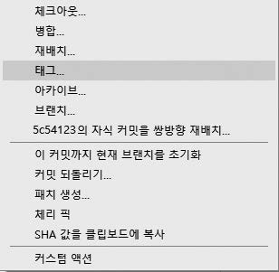
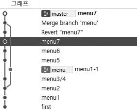
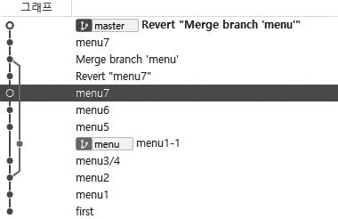

## 9.3 리버트
공개된 커밋은 보통 리셋 작업을 하지 않는다고 했습니다. 그러면 공개한 저장소에서는 이전 상태로 되돌리려면 어떻게 해야 할까요? 깃은 커밋의 버전을 되돌릴 수 있는 또 다른 방법인 리버트를 제공합니다. 리버트와 리셋 차이점은 커밋 정보 삭제 여부입니다.  

### 9.3.1 취소 커밋
리셋은 기존 커밋 정보를 삭제하는 반면, 리버트는 기존 커밋을 남겨 두고 취소에 대한 새로운 커밋을 생성합니다. 취소 커밋을 생성할 때는 revert 명령어를 사용합니다. 취소 커밋은 지정한 커밋을 삭제하지 않습니다. 그 대신 삭제를 위한 새로운 커밋을 생성합니다.  

그림 9-23] 취소 커밋  


리버트를 실습할 수 있도록 master 브랜치에서 코드를 수정한 후 커밋을 몇 개 추가하겠습니다. 먼저 menu.htm 파일에 menu5~menu7을 차례로 입력한 후 커밋합니다. code menu.htm 명령어는 생략합니다.  

menu5를 추가하고 저장한 후 커밋합니다.  

menu.htm
```html
<ul>
    <li>menu1</li>
    <li>menu2</li>
    <li>menu3</li>
    <li>menu4</li>
    <li>menu5</li>
</ul>

```
 
```
infoh@DESKTOP MINGW64 /e/gitstudy09 (master)
$ git commit -am "menu5"
[master e19c0b4] menu5
 1 file changed, 1 insertion(+)

infoh@DESKTOP MINGW64 /e/gitstudy09 (master)
$ code menu.htm

```

menu6을 추가하고 저장한 후 커밋합니다.

menu.htm
```html
<ul>
    <li>menu1</li>
    <li>menu2</li>
    <li>menu3</li>
    <li>menu4</li>
    <li>menu5</li>
    <li>menu6</li>
</ul>

```
 
```
infoh@DESKTOP MINGW64 /e/gitstudy09 (master)
$ git commit -am "menu6"
[master 1ea5e47] menu6
 1 file changed, 1 insertion(+)

infoh@DESKTOP MINGW64 /e/gitstudy09 (master)
$ code menu.htm

```

menu7을 추가하고 저장한 후 커밋합니다.

menu.htm
```
<ul>
    <li>menu1</li>
    <li>menu2</li>
    <li>menu3</li>
    <li>menu4</li>
    <li>menu5</li>
    <li>menu6</li>
    <li>menu7</li>
</ul>

```
 
```
infoh@DESKTOP MINGW64 /e/gitstudy09 (master)
$ git commit -am "menu7"
[master 5374918] menu7
 1 file changed, 1 insertion(+)

```

소스트리에서 추가한 커밋을 확인합니다. 커밋이 3개 추가되었습니다.  

그림 9-24] 추가된 커밋  


현재 마지막 커밋의 상태는 menu7까지입니다. 그리고 이 코드는 공개되어 있다고 가정합니다. 직전의 커밋인 menu7을 취소하고 싶다면 어떻게 해야 할까요? 공개된 커밋은 삭제하지 않으므로 취소하고자 하는 커밋을 리버트합니다.  

직전의 커밋을 리버트할 때는 HEAD 포인터를 사용하면 편리합니다. 리셋으로 커밋을 삭제하지 않고 리버트로 취소 커밋을 생성하겠습니다.  

```
infoh@DESKTOP MINGW64 /e/gitstudy09 (master)
$ git revert HEAD ☜ 현재의 커밋을 리버트
```

revert 명령어를 사용하면 병합할 때처럼 메시지를 작성할 수 있는 vi 에디터가 실행됩니다. 리버트 메시지를 작성한 후 저장합니다.  

그림 9-25] 리버트 메시지 입력  



메시지를 저장하면 다음과 같이 출력됩니다.  


```
infoh@DESKTOP MINGW64 /e/gitstudy09 (master)
$ git revert HEAD
[master 00d7770] Revert "menu7"
 1 file changed, 1 deletion(-)
```

성공적으로 리버트되었습니다. 이제 menu.htm 파일을 확인합니다.  

```
infoh@DESKTOP MINGW64 /e/gitstudy09 (master)
$ code menu.htm
```

menu.htm
```html
<ul>
    <li>menu1</li>
    <li>menu2</li>
    <li>menu3</li>
    <li>menu4</li>
    <li>menu5</li>
    <li>menu6</li>
</ul>
```

마지막에 있던 menu7 태그가 삭제되었습니다. 소스트리에서 커밋 그래프를 확인하면, menu7 커밋 위에 새로운 리버트 커밋이 하나 생성되어 있습니다.  

그림 9-26] 리버트 커밋 생성  



### 9.3.2 리버트 지정
직전의 커밋은 간단하게 HEAD 포인터를 이용하여 리버트했습니다. 한 번에 여러 커밋을 리버트해야 한다면 어떻게 해야 할까요? 리버트는 한 번에 커밋 하나만 취소할 수 있습니다. 따라서 여러 커밋을 리버트하려면 최신 커밋부터 순차적으로 취소해야 합니다.  

그렇다면 직전의 커밋이 아닌 다른 커밋을 취소할 때는 어떻게 해야 할까요? 커밋 해시 값을 지정합니다.  

```
$ git revert 커밋ID
```

깃의 범위 지정 연산자를 사용하여 여러 커밋을 리버트할 수도 있습니다. 연산자 `..`를 같이 사용합니다.  

```
$ git revert 커밋ID .. 커밋ID
```
 
### 9.3.3 소스트리에서 리버트
소스트리에서 리버트하는 방법은 간단합니다. 해당 커밋을 선택한 후 마우스 오른쪽 버튼을 누릅니다. 그리고 커밋 되돌리기 메뉴를 선택합니다.  

그림 9-27] 커밋 되돌리기  

 

정말 커밋을 되돌릴지 묻습니다. 되돌릴 것이라면 예를 누릅니다.  

그림 9-28] 리버트 확인  


### 9.3.4 병합 취소
리버트를 이용하여 병합한 커밋을 취소할 수 있습니다. 리셋은 방금 전 실행한 병합만 삭제합니다. 하지만 리버트는 시간이 지난 후에도 과거의 병합을 선택하여 취소할 수 있습니다.  

실습을 위해 menu 브랜치를 다시 병합하겠습니다. 병합 메시지 입력창이 뜨면 메시지를 입력하고 저장합니다.  

```
infoh@DESKTOP MINGW64 /e/gitstudy09 (master)
$ git merge menu
Auto-merging menu.htm
Merge made by the 'recursive' strategy.
 menu.htm | 6 +++++-
 1 file changed, 5 insertions(+), 1 deletion(-)
```

그리고 master 브랜치의 코드를 수정하고 커밋합니다. menu7을 다시 등록하겠습니다.  

```
infoh@DESKTOP MINGW64 /e/gitstudy09 (master)
$ code menu.htm
```

code.htm
```html
<ul>
    <li>menu1
        <ul>
            <li>menu1-1</li>
        </ul>
    </li>
    <li>menu2</li>
    <li>menu3</li>
    <li>menu4</li>
    <li>menu5</li>
    <li>menu6</li>
    <li>menu7</li>
</ul>
```
 
```
infoh@DESKTOP MINGW64 /e/gitstudy09 (master)
$ git commit -am "menu7"
[master da4d8e4] menu7
 1 file changed, 1 insertion(+)

```

소스트리에서 커밋 그래프를 확인하면 병합 커밋과 새로운 추가 커밋이 하나 더 생성되었습니다.  

그림 9-29] 병합 후 커밋이 추가된 상태  



리버트로 병합을 취소할 때는 --mainline 옵션을 같이 사용할 수 있습니다.  

```
$ git revert --mainline 숫자 병합커밋ID
```

참고로 병합은 두 브랜치가 결합된 형태입니다. 리버트로 병합이 취소 상태가 되면 둘 중 한 브랜치로 체크아웃해야 합니다. --mainline 옵션은 병합을 취소한 후 체크아웃되는 브랜치를 표시합니다. --mainline은 체크아웃으로 되돌아가는 커밋 번호입니다.  

아주 간단하게 실습해 보겠습니다. 먼저 로그를 확인합니다. --graph 옵션을 사용하면 그래프 형태로 지금까지 로그를 볼 수 있습니다.  

```
infoh@DESKTOP MINGW64 /e/gitstudy09 (master)
$ git log --oneline --graph
$ git log --oneline --graph -5
* da4d8e4 (HEAD -> master) menu7
*   84b6618 Merge branch 'menu'
|\
| * 7f5fad8 (menu) menu1-1
* | 00d7770 Revert "menu7"
* | 5374918 menu7

```

그리고 -5처럼 숫자를 추가하면 로그 5개만 출력됩니다.  

```
infoh@DESKTOP MINGW64 /e/gitstudy09 (master)

$ git log --oneline --graph -5

* da4d8e4 (HEAD -> master) menu7

* 84b6618 Merge branch 'menu'

|\

| * 7f5fad8 (menu) menu1-1

* | 00d7770 Revert "menu7"

* | 5374918 menu7
```

출력 결과에서 84b6618은 병합 시점의 커밋 ID입니다. 이 시점으로 리버트하겠습니다. 리버트 메시지도 작성해 줍니다.  

```
infoh@DESKTOP MINGW64 /e/gitstudy09 (master)
$ git revert --mainline 1 84b6618
[master 4399642] Revert "Merge branch 'menu'"
 1 file changed, 1 insertion(+), 5 deletions(-)

```

이제 기존 병합이 리버트됩니다. 소스트리에서도 확인할 수 있습니다.  

그림 9-30] 병합 리버트  



이번에는 제대로 리버트되었는지 menu.htm 파일을 확인합시다.  

```
infoh@DESKTOP MINGW64 /e/gitstudy09 (master)
$ code menu.htm
```

menu.htm
```html
<ul>
    <li>menu1</li>
    <li>menu2</li>
    <li>menu3</li>
    <li>menu4</li>
    <li>menu5</li>
    <li>menu6</li>
    <li>menu7</li>
</ul>
```
 

제대로 잘 리버트되었습니다. 참고로 리베이스된 병합은 리버트하기 어렵습니다. 리베이스로 병합된 공통 조상 커밋을 찾기 어렵기 때문입니다.  

### 9.3.5 리버트 히스토리
리버트를 실행하면 새 커밋이 추가되기 때문에 커밋 이력이 복잡합니다. 어떻게 보면 리셋으로 간단하게 이전 상태로 되돌리는 것이 간편해 보일 수도 있습니다. 하지만 저장소를 공개했다면 리셋으로 커밋을 삭제하는 것은 협업 차원에서 위험합니다. 이때는 리버트가 유용합니다.  

<br><br>