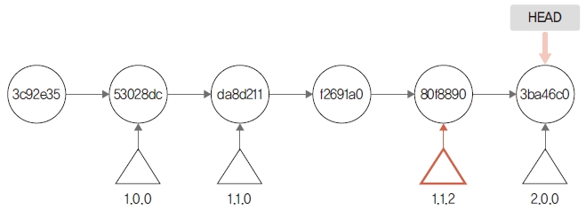
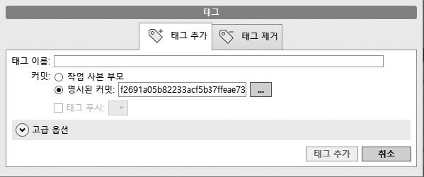

## 10.7 특정 커밋 태그
tag 명령어는 기본적으로 현재 HEAD가 가리키는 커밋을 기준으로 태그를 생성합니다. 현재 HEAD 포인터가 가리키는 커밋이 아닌 특정 커밋을 직접 지정하여 태그를 생성할 수 있습니다.  

```
$ git tag -a 태그버전 커밋ID
``` 

특정 커밋을 지정하여 커밋을 생성할 때는 마지막 옵션으로 커밋 해시 값을 적습니다. 그러면 tag 명령어는 지정된 커밋 해시 값을 기준으로 새로운 태그를 생성합니다.  

커밋을 지정해서 태그를 생성해 봅시다. 먼저 로그를 확인합니다.  

```
infoh@DESKTOP MINGW64 /e/gitstudy10 (master)
$ git log --oneline
3ba46c0 (HEAD -> master, tag: 2.0.0) test 2.0.0
80f8890 test 1.1.2 ☜ 이곳을 지정해서 생성해 보겠습니다.
f2691a0 test 1.1.1
da8d211 (tag: 1.1.0) test 1.1.0
53028dc (tag: 1.0.0) test 1.0.0
3c92e35 first

```

로그 기록 중 80f8890 커밋을 기준으로 새로운 태그를 생성합니다. 태그 이름은 1.1.2로 합니다.  

```
infoh@DESKTOP MINGW64 /e/gitstudy10 (master)
$ git tag 1.1.2 80f8890

```

그림 10-9] 특정 커밋을 지정한 태그  



태그를 생성한 후에 다시 로그를 확인합니다. 이전에 작성한 커밋에 새로운 태그가 추가되었습니다.  

```
infoh@DESKTOP MINGW64 /e/gitstudy10 (master)
$ git log --oneline
3ba46c0 (HEAD -> master, tag: 2.0.0) test 2.0.0
80f8890 (tag: 1.1.2) test 1.1.2
f2691a0 test 1.1.1
da8d211 (tag: 1.1.0) test 1.1.0
53028dc (tag: 1.0.0) test 1.0.0
3c92e35 first

```

이처럼 태그는 특정 커밋을 지정하여 생성할 수도 있습니다.  

### 10.7.1 소스트리에서 특정 커밋 지정
소스트리에서도 특정 커밋을 지정하여 태그를 생성할 수 있습니다. 가장 쉬운 방법은 그래프 목록에서 커밋을 선택하는 것입니다. 커밋을 클릭한 후 마우스 오른쪽 버튼을 눌러 명시적 커밋 메뉴를 선택합니다. 책에서는 test 2.0.0 커밋에서 마우스 오른쪽 버튼을 눌러 명시적 커밋 메뉴를 선택하고, 태그 이름에는 2.0.0을 입력합니다.

그림 10-10] 특정 커밋(test 2.0.0)의 태그 생성  


마지막으로 태그 추가를 누르면 다음과 같이 2.0.0 태그가 생성됩니다.  

<br><br>