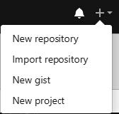

## 실습을 위한 저장소 준비
서브모듈을 실습할 수 있는 환경을 구축하겠습니다. 서브모듈을 테스트하려면 저장소가 2개 필요
합니다. 먼저 로컬 컴퓨터에 깃 저장소를 2개 생성할 것입니다. 그리고 원격 저장소도 2개 생성하
여 각 로컬 저장소와 연결하겠습니다.

그림 11-2 깃 저장소 생성 후 원격 저장소와 연결  


<br>
<hr>

### 메인 저장소 생성
먼저 부모 역할의 메인 저장소를 생성합니다.  

```
$ cd 실습폴더
$ mkdir gitstudy11_parent 새 폴더 만들기
$ cd gitstudy11_parent

infoh@DESKTOP MINGW64 /e/gitstudy11_parent (master)
$ git init 저장소 초기화
Initialized empty Git repository in E:/gitstudy11_parent/.git/
```

메인 저장소( gitstudy11_parent)에 parent.htm 파일을 생성하고 저장합니다.  

```
infoh@DESKTOP MINGW64 /e/gitstudy11_parent (master)
$ code parent.htm VS Code 실행
```

parent.htm
```html
<h1>부모 저장소</h1>
```

첫 번째 커밋을 합니다.

```
infoh@DESKTOP MINGW64 /e/gitstudy11_parent (master)
$ git add parent.htm 등록
infoh@DESKTOP MINGW64 /e/gitstudy11_parent (master)
$ git commit -m "parent first" 커밋
[master (root-commit) 6a9851e] parent first
1 file changed, 1 insertion(+)
create mode 100644 parent.htm
```

메인 저장소와 동기화할 원격 저장소를 생성합시다. 먼저 깃허브에 로그인한 후 New 버튼 또는
`+` > New repository를 클릭합니다.  

그림 11-3 깃허브에서 새 저장소 메뉴 선택  


다음 화면에서 원하는 저장소 이름을 입력하고 Create repository를 누릅니다. 필자는
gitstudy11_parent로 정했는데, 로컬 저장소 이름과 동일하지 않아도 됩니다.  

그림 11-4 원하는 이름으로 새 저장소 생성  


저장소가 생성되면 `https://github.com/jinygit/gitstudy11_parent.git` 주소가 나옵니다. 이 주
소와 로컬 저장소를 연결할 것입니다. 이 주소를 복사해 둡니다.  

다시 깃 배시 화면으로 돌아갑니다. 메인 저장소에 리모트 등록을 합시다.  

```
infoh@DESKTOP MINGW64 /e/gitstudy11_parent (master)
$ git remote add origin https://github.com/jinygit/gitstudy11_parent.git 원격 저장소 등록
커밋 정보를 원격 저장소로 전송합니다.
infoh@DESKTOP MINGW64 /e/gitstudy11_parent (master)
$ git push -u origin master 커밋 전송
Enumerating objects: 3, done.
Counting objects: 100% (3/3), done.
Writing objects: 100% (3/3), 235 bytes | 117.00 KiB/s, done.
Total 3 (delta 0), reused 0 (delta 0)
To https://github.com/jinygit/gitstudy11_parent.git
* [new branch] master -> master
```

깃허브에서 커밋 정보가 잘 전송된 것을 확인할 수 있습니다.  

그림 11-5 부모 저장소의 커밋 정보 확인  


<br>
<hr>

### 자식 저장소 생성
이번에는 메인 저장소와 연결되는 자식 저장소를 생성합니다.  

```
$ cd 실습폴더
$ mkdir gitstudy11_child 
$ cd gitstudy11_child

infoh@DESKTOP MINGW64 /e/gitstudy11_child (master)
$ git init
Initialized empty Git repository in E:/gitstudy11_child/.git/
```

자식 저장소에 child.htm 파일을 생성하고 저장합니다.
```
infoh@DESKTOP MINGW64 /e/gitstudy11_child (master)
$ code child.htm
```

child.htm
```html
<h1>자식 저장소</h1>
```

자식 저장소에서 첫 번째 커밋을 합니다.

```
infoh@DESKTOP MINGW64 /e/gitstudy11_child (master)
$ git add child.htm 등록
infoh@DESKTOP MINGW64 /e/gitstudy11_child (master)
$ git commit -m "child first" 커밋
[master (root-commit) 2573787] child first
1 file changed, 1 insertion(+)
create mode 100644 child.htm
```

자식 저장소와 동기화할 원격 저장소도 생성합시다. 깃허브에서 gitstudy11_child로 저장소를
만듭니다. 생성된 https://github.com/jinygit/gitstudy11_child.git 주소를 복사합니다.
그리고 다시 깃 배시로 돌아와 원격 저장소와 연결한 후 자식 저장소의 커밋을 원격 저장소로 전
송합니다.  

```
infoh@DESKTOP MINGW64 /e/gitstudy11_child (master)
$ git remote add origin https://github.com/jinygit/gitstudy11_child.git 
infoh@DESKTOP MINGW64 /e/gitstudy11_child (master)
$ git push -u origin master 
Enumerating objects: 3, done.
Counting objects: 100% (3/3), done.
Writing objects: 100% (3/3), 232 bytes | 116.00 KiB/s, done.
Total 3 (delta 0), reused 0 (delta 0)
To https://github.com/jinygit/gitstudy11_child.git
* [new branch] master -> master
```

깃허브에서 커밋 정보가 전송된 것을 확인할 수 있습니다.  

그림 11-6 자식 저장소의 커밋 정보 확인  


<br><br>