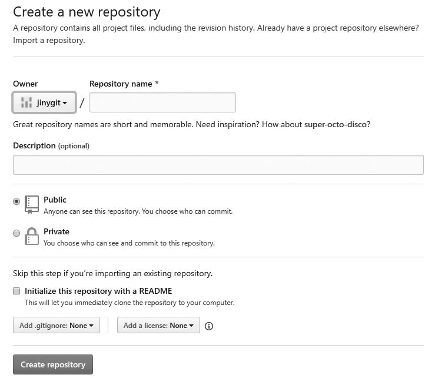
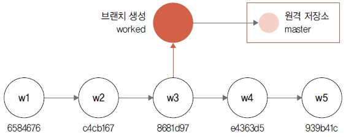
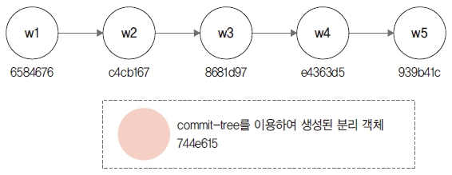
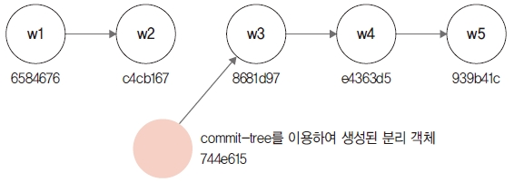
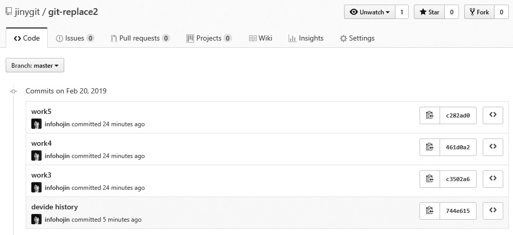
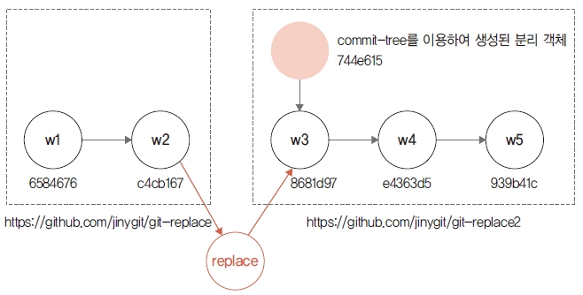
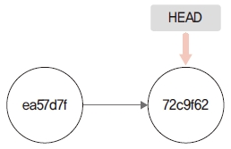
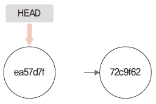
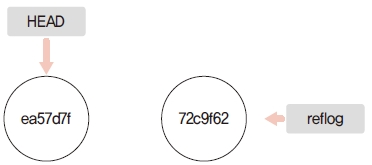
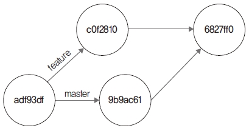

## 12.1 git
깃은 커밋으로 코드 이력을 관리합니다. 커밋은 고유의 SHA1 해시 값을 가지고 있으며, 이 해시
값은 여러 기능에서 참조합니다. 깃에서는 참조하는 해시 값을 refs 목록으로 가지고 있습니다.  

### 12.1.1 실습 환경 준비
먼저 refs 기능을 학습할 수 있도록 실습 환경을 만들겠습니다. 저장소를 생성합니다.  

```
$ cd 실습폴더
$ mkdir gitstudy12 새 폴더 만들기
$ cd gitstudy12
infoh@DESKTOP MINGW64 /e/gitstudy12 (master)
$ git init 깃 초기화
Initialized empty Git repository in E:/gitstudy12/.git/
index.htm 파일을 생성합니다.
infoh@DESKTOP MINGW64 /e/gitstudy12 (master)
$ code index.htm VS Code 실행
index.htm
hello world
```

간단한 인사말만 작성했습니다. 저장한 후 커밋합니다.  

```
infoh@DESKTOP MINGW64 /e/gitstudy12 (master)
$ git add index.htm 등록
infoh@DESKTOP MINGW64 /e/gitstudy12 (master)
$ git commit -m "first" 커밋
[master (root-commit) d0943cf] first
1 file changed, 1 insertion(+)
create mode 100644 index.htm
```

### 12.1.2 해시
깃에서 해시 값은 매우 중요합니다. 깃은 SHA1 알고리즘을 사용하여 해시 값을 생성합니다. 해
시 값은 깃의 동작을 구분하며, 중복되지 않는 유일한 값입니다.  

깃의 모든 작업은 SHA1 해시 값을 참조합니다. 깃 내부적으로 동작하는 작업들은 SHA1 해시 값
으로 연결 고리를 생성합니다. 따라서 깃의 동작을 정확히 이해하려면 해시 값을 자세히 알아볼
필요가 있습니다.  

생성된 모든 해시 값은 show 명령어로 확인할 수 있습니다.  

```
$ git show 해시값
```

저장소의 로그를 확인해 보겠습니다.  

```
infoh@DESKTOP MINGW64 /e/gitstudy12 (master)
$ git log 커밋 로그
commit d0943cfbc5e092668be3b96e98f32e363e05feb1 (HEAD -> master)
Author: hojin <infohojin@gmail.com>
Date: Sat May 25 18:06:47 2019 +0900
first
커밋 로그가 1개 출력됩니다. 출력된 d0943cf 해시 값의 정보를 확인해 봅시다.
infoh@DESKTOP MINGW64 /e/gitstudy12 (master)
$ git show d0943cf 커밋 정보
commit d0943cfbc5e092668be3b96e98f32e363e05feb1 (HEAD -> master)
Author: hojin <infohojin@gmail.com>
Date: Sat May 25 18:06:47 2019 +0900
first
diff --git a/index.htm b/index.htm
new file mode 100644
index 0000000..95d09f2
--- /dev/null
+++ b/index.htm
@@ -0,0 +1 @@
+hello world
\ No newline at end of file
```

### 12.1.3 역조회
show 명령어는 해시 값을 사용하여 커밋 정보를 확인합니다. 반대로 rev-parse 명령어로 포인터
의 해시 값을 알 수 있습니다. 예를 들어 브랜치는 커밋 해시 값을 가리키는 포인터입니다. 따라서
브랜치 이름을 사용하여 참조하는 해시 값을 조회할 수 있습니다. master 브랜치의 해시 값을 확
인해 봅시다.  

```
infoh@DESKTOP MINGW64 /e/gitstudy12 (master)
$ git rev-parse master
d0943cfbc5e092668be3b96e98f32e363e05feb1
```

### 12.1.4 참조 목록
깃은 SHA1 해시 값을 생성하고, 커밋은 생성된 해시 값을 간접적으로 사용합니다. 또 깃에서는
생성된 해시 값을 쉽게 참조할 수 있도록 refs 목록을 생성합니다. 깃의 모든 refs 목록은 저장소의
숨긴 영역인 .git/refs 폴더 안에 저장됩니다.  
또 복잡한 SHA1 해시 값을 쉽게 찾아 사용할 수 있도록 별칭도 쓸 수 있습니다. 별칭은 .git/refs
폴더 안에서 생성 및 관리할 수 있습니다. 즉, refs 정보는 깃의 기능들을 구현하는 내부 메커니즘
입니다.  

```
infoh@DESKTOP MINGW64 /e/gitstudy12 (master)
$ ls .git/refs -all 저장소 refs 파일 목록
total 4
drwxr-xr-x 1 infoh 197609 0 5월 25 18:02 .
drwxr-xr-x 1 infoh 197609 0 5월 25 18:06 ..
drwxr-xr-x 1 infoh 197609 0 5월 25 18:06 heads
drwxr-xr-x 1 infoh 197609 0 5월 25 18:02 tags
```

처음 저장소를 생성하면 .git/refs 폴더에는 heads와 tags 폴더만 있습니다. 새로운 브랜치를 만
들 때마다 해시 값을 가지는 refs 파일들을 생성합니다.  

새로운 feature 브랜치를 만들고 .git/refs 폴더를 확인합니다.

```
infoh@DESKTOP MINGW64 /e/gitstudy12 (master)
$ git branch feature 브랜치 생성
infoh@DESKTOP MINGW64 /e/gitstudy12 (master)
$ ls .git/refs/heads -all 저장소 refs 정보
total 2
drwxr-xr-x 1 infoh 197609 0 5월 25 18:14 .
drwxr-xr-x 1 infoh 197609 0 5월 25 18:02 ..
-rw-r--r-- 1 infoh 197609 41 5월 25 18:14 feature 브랜치의 HEAD 포인트
-rw-r--r-- 1 infoh 197609 41 5월 25 18:06 master
```

feature 브랜치의 refs가 생성되었습니다.

reflog 12.2 git
깃은 안정적인 작업을 유지하려고 참조된 모든 refs를 기록합니다. 그리고 내부적으로 작업한 모
든 HEAD와 브랜치 포인터를 기록합니다. 이때 사용된 포인터들의 기록을 reflog라고 합니다.
12.2.1 참조 기록
reflog 기록은 reflog 명령어를 사용하여 확인할 수 있습니다.
$ git reflog
reflog는 한 번이라도 사용했던 HEAD와 브랜치를 기록합니다. 하지만 모든 기록을 영구적으로
가지고 있지는 않습니다. reflog는 시스템에서 정의한 며칠 간의 기록만 보관합니다. 그 이전의 작업
들은 모두 삭제합니다.
깃교과서_06.indd 391 2020-03-05 오후 1:51:51
392

그림 12-1 ref 기록  


C1
C2
reflog
HEAD C3
지금까지 작업한 reflog 기록을 확인해 봅시다.
infoh@DESKTOP MINGW64 /e/gitstudy12 (master)
$ git reflog reflog 기록
d0943cf (HEAD -> master, feature) HEAD@{0}: commit (initial): first
...
12.2.2 기록 확인
reflog의 기록들은 HEAD@{숫자} 형태입니다. 각 숫자는 작업을 수행한 해시 값을 가리킵니다.
따라서 reflog에 기록된 HEAD@{숫자} 포인터를 이용하여 커밋 정보를 확인할 수 있습니다.
마지막에 참조한 refs 로그의 해시 값 정보를 확인해 봅시다.
infoh@DESKTOP MINGW64 /e/gitstudy12 (master)
$ git show HEAD@{0} 커밋 정보
commit d0943cfbc5e092668be3b96e98f32e363e05feb1 (HEAD -> master, feature)
Author: hojin <infohojin@gmail.com>
Date: Sat May 25 18:06:47 2019 +0900
first
diff --git a/index.htm b/index.htm
new file mode 100644
index 0000000..95d09f2
--- /dev/null
+++ b/index.htm
@@ -0,0 +1 @@
+hello world
\ No newline at end of file
깃교과서_06.indd 392 2020-03-05 오후 1:51:51
393
12
고급 기능
12.2.3 기간 확인
커밋의 로그 기록이 많은 경우 필터링할 수 있습니다. 필터링은 특정한 날짜, 시간 등 기준을 적용
합니다. 다음 예처럼 어제 작업한 내역만 출력할 수 있습니다.

$ git show master@{yesterday}
깃에서 참조하는 refs의 로그는 reflog 명령어 또는 git log -g 옵션을 사용하여 확인할 수 있습
니다.
infoh@DESKTOP MINGW64 /e/gitstudy12 (master)
$ git log -g 커밋 로그
commit d0943cfbc5e092668be3b96e98f32e363e05feb1 (HEAD -> master, feature)
Reflog: HEAD@{0} (hojin <infohojin@gmail.com>)
Reflog message: commit (initial): first
Author: hojin <infohojin@gmail.com>
Date: Sat May 25 18:06:47 2019 +0900
first
...
12.2.4 기록 유지
refs는 현재 로컬 저장소에서 작업한 모든 로그의 참조 기록입니다. 깃은 커밋, 브랜치 등 내부적
으로 사용한 모든 객체의 로그를 기록합니다. 하지만 refs는 로컬 저장소에만 기록하므로 원격 저
장소나 복제, 복사 등으로는 refs 기록을 옮길 수 없습니다.
파일 애너테이션 12.3 git
개발하다 보면 코드를 잘못 작성해서 오류가 발생하곤 합니다. 하지만 여러 개발자와 협업하다 보
면 잘못된 코드를 찾는 것이 쉽지 않습니다.
깃교과서_06.indd 393 2020-03-05 오후 1:51:51
394
12.3.1 blame
잘못된 코드가 어디서부터 시작되었는지 찾기 어렵습니다. 잘못된 내용을 찾으려면 모든 커밋 이
력을 살펴보아야 하는데, 생각보다 시간이 오래 걸립니다. 깃은 이러한 코드를 쉽게 찾을 수 있게
파일의 수정 이력을 분석합니다. 그리고 blame 기능은 커밋의 메타 정보를 코드 라인별로 같이
결합하여 출력합니다. 코드를 수정한 사람이 누구인지, 언제 수정한지를 쉽게 판별할 수 있으며,
메타 정보를 바탕으로 문제를 좀 더 쉽게 파악할 수 있습니다.
12.3.2 실습 환경 준비
blame 기능을 실습하기 위해 index.htm 파일을 수정한 후 커밋해 보겠습니다.
infoh@DESKTOP MINGW64 /e/gitstudy12 (master)
$ code index.htm VS Code 실행
index.htm
<h1>hello world</h1>
infoh@DESKTOP MINGW64 /e/gitstudy12 (master)
$ git commit -am "add h1 tag" 등록 및 커밋
[master 520aadf] add h1 tag
1 file changed, 1 insertion(+), 1 deletion(-)
infoh@DESKTOP MINGW64 /e/gitstudy12 (master)
$ code index.htm VS Code 실행
index.htm
<h1>hello world</h1>
깃을 이용하여 코드 이력을 관리할 수 있습니다.
infoh@DESKTOP MINGW64 /e/gitstudy12 (master)
$ git commit -am "add description" 등록 및 커밋
[master 023dade] add description
1 file changed, 2 insertions(+), 1 deletion(-)
깃교과서_06.indd 394 2020-03-05 오후 1:51:51
395
12
고급 기능
infoh@DESKTOP MINGW64 /e/gitstudy12 (master)
$ code index.htm VS Code 실행
index.htm
<h1>hello world</h1>
깃을 이용하여 코드 이력을 관리할 수 있습니다.
깃은 ref를 참조하여 작업이 이루어집니다.
infoh@DESKTOP MINGW64 /e/gitstudy12 (master)
$ git commit -am "ref description" 등록 및 커밋
[master 71099d0] ref description
1 file changed, 2 insertions(+), 1 deletion(-)
12.3.3 blame 명령어
blame 명령어는 개별 파일에서만 동작하며, 명령어 인자 값으로 개별 파일을 전달합니다.
$ git blame 파일이름
작성한 파일의 blame을 확인해 봅시다.
infoh@DESKTOP MINGW64 /e/gitstudy12 (master)
$ git blame index.htm 메타 정보 출력
023dadec (hojin 2019-05-26 16:19:05 +0900 1) <h1>hello world</h1>
71099d05 (hojin 2019-05-26 16:31:18 +0900 2) 깃을 이용하여 코드 이력을 관리할 수 있습니다.
71099d05 (hojin 2019-05-26 16:31:18 +0900 3) 깃은 ref를 참조하여 작업이 이루어집니다.
출력 결과를 보니 각 커밋에 대한 해시 값, 작성자, 코드 등 내용도 함께 보여 주네요. blame은
누가 코드의 어느 라인을 수정했는지 파악할 때 유용합니다.
12.3.4 옵션 활용
소스 코드의 용량이 클 때는 이력 정보도 많이 출력됩니다. 이때는 -L 옵션을 사용하여 파일의 특
정 영역만 지정할 수 있습니다.
깃교과서_06.indd 395 2020-03-05 오후 1:51:51
396
$ git blame -L 시작줄, 마지막줄 파일이름
파일을 수정한 히스토리를 출력해 보겠습니다.
infoh@DESKTOP MINGW64 /e/gitstudy12 (master)
$ git blame -L 2,3 index.htm 메타 정보 필터링
71099d05 (hojin 2019-05-26 16:31:18 +0900 2) 깃을 이용하여 코드 이력을 관리할 수 있습니다.
71099d05 (hojin 2019-05-26 16:31:18 +0900 3) 깃은 ref를 참조하여 작업이 이루어집니다.
blame 기능은 파일에서 특정한 수정 사항 및 커밋들을 찾는 데 매우 유용합니다. 개발 과정에서
만든 수많은 코드 중 수정한 부분만 쉽게 찾아낼 수 있습니다.
blame 명령어는 옵션을 사용하면 좀 더 다양하게 검색할 수 있습니다.
●● -e: 사용자 이름 대신 이메일을 출력합니다.
●● -w: 공백 문자를 무시합니다.
●● -M: 같은 파일 내에서 복사나 이동을 감지합니다.
●● -C: 다른 파일에서 이동이나 복사된 것을 감지할 수 있습니다.
replace 12.4 git
기본적으로 한 번 생성된 객체는 변경할 수 없습니다. 커밋을 변경하려면 깃의 원리를 응용해야
합니다. 커밋이 참조하는 해시 값을 속여서 다른 커밋으로 변경하는 것입니다. replace는 기존 커
밋을 다른 커밋인 것처럼 변경하는 기능입니다.
깃 저장소에서 오랫동안 작업하면 수많은 커밋 기록이 쌓입니다. 커밋이 많아지면 저장소 크기
도 증가합니다. 저장소를 분리할 수 있는 서브모듈이 있지만, 오래된 저장소와는 다릅니다. 이때
replace를 사용하면 커밋이 많은 오래된 저장소를 분리할 수 있습니다.
깃교과서_06.indd 396 2020-03-05 오후 1:51:52
397
12
고급 기능
12.4.1 실습 환경 준비
replace 명령어를 사용하여 저장소를 분리해 봅시다. 실습을 위해 새로운 저장소를 생성합니다.
$ cd 실습폴더
$ mkdir git-replace 새 폴더 만들기
$ cd git-replace
infoh@DESKTOP MINGW64 /e/git-replace (master)
$ git init 저장소 초기화
Initialized empty Git repository in E:/git-replace/.git/
실습을 위해 work.md 파일을 생성하고 저장한 후 커밋합니다.
infoh@DESKTOP MINGW64 /e/git-replace (master)
$ code work.md VS Code 실행
work.md
# 작업1
infoh@DESKTOP MINGW64 /e/git-replace (master)
$ git add work.md 등록
infoh@DESKTOP MINGW64 /e/git-replace (master)
$ git commit -m "work1" 커밋
[master (root-commit) 6584676] work1
1 file changed, 1 insertion(+)
create mode 100644 work.md
코드를 좀 더 수정하고, 두 번째 커밋을 합니다. 반복되는 code work.md 과정은 표시를 생략합
니다.
work.md
# 작업1 6584676
# 작업2
infoh@DESKTOP MINGW64 /e/git-replace (master)
$ git commit -am "work2" 등록 및 커밋
깃교과서_06.indd 397 2020-03-05 오후 1:51:52
398
[master c4cb167] work2
1 file changed, 2 insertions(+), 1 deletion(-)
같은 방법으로 작업5까지 순차적으로 입력한 후 여러 번 커밋합니다.
work.md
# 작업1 6584676
# 작업2 c4cb167
# 작업3
infoh@DESKTOP MINGW64 /e/git-replace (master)
$ git commit -am "work3" 등록 및 커밋
[master 8681d97] work3
1 file changed, 2 insertions(+), 1 deletion(-)
work.md
# 작업1 6584676
# 작업2 c4cb167
# 작업3 8681d97
# 작업4
infoh@DESKTOP MINGW64 /e/git-replace (master)
$ git commit -am "work4" 등록 및 커밋
[master e4363d5] work4
1 file changed, 2 insertions(+), 1 deletion(-)
work.md
# 작업1 6584676
# 작업2 c4cb167
# 작업3 8681d97
# 작업4 e4363d5
# 작업5
infoh@DESKTOP MINGW64 /e/git-replace (master)
$ git commit -am "work5" 등록 및 커밋
[master 939b41c] work5
1 file changed, 2 insertions(+), 1 deletion(-)
깃교과서_06.indd 398 2020-03-05 오후 1:51:52
399
12
고급 기능
지금까지 작업 과정을 그림으로 표현하면 다음과 같습니다.

그림 12-2 저장소의 커밋 순서  


w1
6584676
w2
c4cb167
w3
8681d97
w4
e4363d5
w5
939b41c
새 저장소의 커밋들을 확인해 봅시다. 커밋 해시 값도 같이 주의 깊게 살펴보세요.
infoh@DESKTOP MINGW64 /e/git-replace (master)
$ git log --oneline --decorate 커밋 기록
939b41c (HEAD -> master) work5
e4363d5 work4
8681d97 work3
c4cb167 work2
6584676 work1
12.4.2 저장소 분리
준비한 저장소에는 커밋이 4개 있습니다. 이 저장소를 2개로 분리해 보겠습니다.
1단계. 저장소를 분리할 수 있게 새로운 브랜치를 하나 생성합니다. 작업3을 기준으로 브랜치를
만듭니다.
infoh@DESKTOP MINGW64 /e/git-replace (master)
$ git branch worked 8681d97 work3 해시 값 입력

그림 12-3 분리할 위치에 브랜치 생성  


w1
6584676
w2
c4cb167
w3
8681d97
w4
e4363d5
브랜치 생성
worked
w5
939b41c
깃허브에서 git-replace 저장소와 동기화할 새로운 원격 저장소를 생성합니다. 먼저 깃허브에 로
그인한 후 New 버튼 또는 +  New repository를 클릭합니다.
깃교과서_06.indd 399 2020-03-05 오후 1:51:52
400

그림 12-4 깃허브에서 새 저장소 메뉴 선택  


다음 화면에서 원하는 저장소 이름을 입력하고 Create repository를 누릅니다. 필자는
gitstudy11_parent로 정했는데, 로컬 저장소 이름과 동일하지 않아도 됩니다.

그림 12-5 원하는 이름으로 새 저장소 생성  


저장소가 생성되면 https://github.com/jinygit/git-replace.git처럼 주소가 나옵니다. 이 주소
와 로컬 저장소를 연결할 것입니다. 이 주소를 복사해 둡니다.
다시 깃 배시 화면으로 돌아갑니다. 이 원격 저장소에는 분리된 저장소를 저장할 것입니다. 원격
저장소를 등록합니다.1
infoh@DESKTOP MINGW64 /e/git-replace (master)
$ git remote add old https://github.com/jinygit/git-replace.git 원격 저장소 등록
1 자신의 깃허브 계정에서 만든 저장소 주소를 사용하세요.
자신의 URL 주소
깃교과서_06.indd 400 2020-03-05 오후 1:51:52
401
12
고급 기능
2단계. 1단계에서 원격 저장소를 등록할 때 사용한 별칭을 주의 깊게 살펴봅시다. 별칭 이름을
old로 등록했습니다. 등록된 원격 저장소의 remote 목록을 확인합니다.
infoh@DESKTOP MINGW64 /e/git-replace (master)
$ git remote -v 원격 저장소 목록
old https://github.com/jinygit/git-replace.git (fetch)
old https://github.com/jinygit/git-replace.git (push)
3단계. 1단계에서 생성한 브랜치를 원격 저장소로 푸시합니다. 이때 로컬 저장소의 브랜치는 분리
기준이 되는 worked 브랜치입니다. 그리고 원격 저장소로 전송되는 브랜치는 master 브랜치입
니다. 브랜치 이름을 다르게 지정하여 전송합니다.
worked 브랜치를 원격 저장소의 master 브랜치로 푸시합니다.
infoh@DESKTOP MINGW64 /e/git-replace (master)
$ git push old worked:master 커밋 전송
Enumerating objects: 9, done.
Counting objects: 100% (9/9), done.
Delta compression using up to 8 threads
Compressing objects: 100% (3/3), done.
Writing objects: 100% (9/9), 667 bytes | 222.00 KiB/s, done.
Total 9 (delta 0), reused 0 (delta 0)
To https://github.com/jinygit/git-replace.git
* [new branch] worked -> master

그림 12-6 브랜치 전송  


w1
6584676
w2
c4cb167
w3
8681d97
w4
e4363d5
브랜치 생성
worked
원격 저장소
master
w5
939b41c
이제 원격 저장소는 커밋 3개만 master 브랜치에 가지고 있습니다. 깃허브의 원격 저장소에서 커
밋들을 확인해 봅시다. jinygit 부분을 클릭하면 다음과 같이 커밋 목록을 확인할 수 있습니다.
깃교과서_06.indd 401 2020-03-05 오후 1:51:52
402

그림 12-7 원격 저장소의 커밋  


work1, work2, work3 커밋만 전송된 것을 확인합니다.
12.4.3 저장소 분리
앞에서 우리는 저장소를 분리하려고 커밋을 지정했습니다. 또 지정한 커밋을 기준으로 브랜치를
만들고, 이를 원격 저장소의 다른 브랜치 이름으로 전송했습니다. 하지만 아직 로컬 저장소는 변
경된 것이 없습니다. 로컬 저장소는 모든 커밋 정보를 가지고 있습니다. 이제 실제적인 저장소를
분리해 보겠습니다.
4단계. 분리를 하려면 가상의 임시 객체를 하나 생성해야 합니다. 이때는 commit-tree 명령어를 사
용합니다. commit-tree는 저수준 깃 명령어입니다.
commit-tree 명령어를 사용하여 수동으로 객체를 생성합니다.
infoh@DESKTOP MINGW64 /e/git-replace (master)
$ echo "devide history" | git commit-tree c4cb167^{tree} work2의 해시 값
744e61522896c3ee222fd4f74a099964851454cf
저수준 명령어를 사용하여 임시 객체를 생성했습니다. 임시 객체는 아직 다른 어떤 객체와도 연결
되지 않고, 떨어져 있는 외톨이 객체입니다.
깃교과서_06.indd 402 2020-03-05 오후 1:51:52
403
12
고급 기능

그림 12-8 임시 객체 생성  


w1
6584676
w2
c4cb167
w3
8681d97
w4
e4363d5
commit-tree를 이용하여 생성된 분리 객체
744e615
w5
939b41c
5단계. 생성된 임시 객체를 다른 커밋 객체와 리베이스하여 병합합니다.
infoh@DESKTOP MINGW64 /e/git-replace (master)
$ git rebase --onto 744e615 c4cb167 리베이스 병합(임시 객체)
First, rewinding head to replay your work on top of it...
Applying: work3
Applying: work4
Applying: work5
새로 생성된 임시 객체와 리베이스되었습니다. 작업한 결과를 로그로 확인해 봅시다.
infoh@DESKTOP MINGW64 /e/git-replace (master)
$ git log --oneline 커밋 기록
c282ad0 (HEAD -> master) work5
461d0a2 work4
c3502a6 work3
744e615 devide history
work1과 work2 커밋이 사라졌습니다. 이전에 있던 work1과 work2 커밋은 work3과 연결 고
리가 끊어져 분리되었습니다. 그 대신 로그 기록에는 최상위 부모 커밋이 임시 객체(744e615)로
변경되었습니다.

그림 12-9 리베이스 변경  


w1
6584676
w2
c4cb167
w3
8681d97
w4
e4363d5
commit-tree를 이용하여 생성된 분리 객체
744e615
w5
939b41c
깃교과서_06.indd 403 2020-03-05 오후 1:51:52
404
새로운 원격 저장소를 또 하나 생성합니다. 이곳에는 분리된 저장소를 등록할 것입니다. 필자는
git-replace2란 이름으로 생성했습니다. https://github.com/jinygit/git-replace2.git 주소를
복사해 둡니다. 생성된 원격 저장소를 remote 명령어로 등록합니다.
infoh@DESKTOP MINGW64 /e/git-replace (master)
$ git remote add origin https://github.com/jinygit/git-replace2.git 원격 저장소 등록
이번에는 저장소 별칭을 origin으로 정했습니다.
6단계. 분리 작업한 로컬 저장소를 origin 원격 저장소로 푸시합니다.
infoh@DESKTOP MINGW64 /e/git-replace (master)
$ git push -u origin master 커밋 전송
Enumerating objects: 12, done.
Counting objects: 100% (12/12), done.
Delta compression using up to 8 threads
Compressing objects: 100% (6/6), done.
Writing objects: 100% (12/12), 939 bytes | 234.00 KiB/s, done.
Total 12 (delta 1), reused 0 (delta 0)
remote: Resolving deltas: 100% (1/1), done.
To https://github.com/jinygit/git-replace2.git
* [new branch] master -> master
Branch 'master' set up to track remote branch 'master' from 'origin'.
푸시한 원격 저장소(깃허브)를 확인해 봅시다.

그림 12-10 분리된 원격 저장소  


임시 객체로 시작되는 커밋 기록 3개를 확인할 수 있습니다.
자신의 URL 주소
깃교과서_06.indd 404 2020-03-05 오후 1:51:53
405
12
고급 기능
12.4.4 저장소 연결
임시 객체를 이용하여 로컬 저장소의 커밋 연결 고리를 분리했습니다. 연결 고리가 분리된 커밋들
은 각각 두 원격 저장소로 푸시되었습니다. 이번에는 분리된 두 저장소를 저장소 하나로 연결해
보겠습니다.
7단계. 분리된 두 원격 저장소 중에서 마지막에 작업한 커밋으로 원격 저장소를 복제합니다.
$ cd 실습폴더
$ git clone https://github.com/jinygit/git-replace2.git git-replace2 저장소 복제
Cloning into 'git-replace2'...
remote: Enumerating objects: 12, done.
remote: Counting objects: 100% (12/12), done.
remote: Compressing objects: 100% (5/5), done.
remote: Total 12 (delta 1), reused 12 (delta 1), pack-reused 0
Unpacking objects: 100% (12/12), done.
복제된 로컬 저장소의 로그를 확인합니다.
infoh@DESKTOP MINGW64 (master)
$ cd git-replace2 복제 저장소 이동
infoh@DESKTOP MINGW64 /e/git-replace2 (master)
$ git log --oneline --decorate 커밋 기록
c282ad0 (HEAD -> master, origin/master, origin/HEAD) work5
461d0a2 work4
c3502a6 work3
744e615 devide history
복제된 저장소는 분리된 커밋들만 가지고 있습니다. 이전의 커밋 정보들은 보관되어 있지 않습니
다. 이전의 커밋 정보들이 보관된 원격 저장소를 remote 명령어로 등록합시다.
infoh@DESKTOP MINGW64 /e/git-replace2 (master)
$ git remote add worked https://github.com/jinygit/git-replace.git 원격 저장소 등록
8단계. 원격 저장소를 패치하여 커밋들을 가져옵니다. 패치로 가져오는 이유는 수동으로 커밋을
변경하여 병합하기 때문입니다.
infoh@DESKTOP MINGW64 /e/git-replace2 (master)
$ git fetch worked 커밋 내려받기
warning: no common commits
자신의 URL 주소
깃교과서_06.indd 405 2020-03-05 오후 1:51:53
406
remote: Enumerating objects: 9, done.
remote: Counting objects: 100% (9/9), done.
remote: Compressing objects: 100% (3/3), done.
remote: Total 9 (delta 0), reused 9 (delta 0), pack-reused 0
Unpacking objects: 100% (9/9), done.
From https://github.com/jinygit/git-replace
* [new branch] master -> worked/master
패치로 가져온 worked의 로그 기록을 확인해 봅시다.
infoh@DESKTOP MINGW64 /e/git-replace2 (master)
$ git log --oneline worked/master 커밋 기록
8681d97 (worked/master) work3
c4cb167 work2
6584676 work1
분리된 이전의 커밋들을 확인할 수 있습니다.
9단계. 이제 origin/master의 c3502a6과 worked/master의 8681d97을 replace 명령어로 연
결합니다.
infoh@DESKTOP MINGW64 /e/git-replace2 (master)
$ git replace c3502a6 8681d97 커밋 연결

그림 12-11 원격 저장소 2개 연결  


w1
6584676
https://github.com/jinygit/git-replace https://github.com/jinygit/git-replace2
w2
c4cb167
w3
replace
w4
e4363d5
w5
939b41c
commit-tree를 이용하여 생성된 분리 객체
744e615
8681d97
replace 명령어를 사용하여 두 커밋을 연결했습니다. 저장소의 로그를 확인합니다.
깃교과서_06.indd 406 2020-03-05 오후 1:51:53
407
12
고급 기능
infoh@DESKTOP MINGW64 /e/git-replace2 (master)
$ git log --oneline 커밋 기록
c282ad0 (HEAD -> master, origin/master, origin/HEAD) work5
461d0a2 work4
c3502a6 (replaced) work3
c4cb167 work2
6584676 work1
분리된 저장소가 다시 하나로 묶인 것을 확인할 수 있습니다.
가비지 콜렉트 12.5 git
깃은 저장소를 효율적으로 유지 관리하려고 가비지 콜렉트(garbage collect)를 지원합니다. 또 깃은
가비지를 효과적으로 관리할 수 있는 별도의 명령어를 제공합니다.
12.5.1 가비지
가비지(garbage)는 동적인 언어에서 메모리를 관리하려고 생성한 개념입니다. 깃은 이력을 추적할
때 객체의 생성과 변경을 반복합니다. 여러 번 처리 동작을 반복하면서 시간이 지남에 따라 연결
고리가 없는 고립된 객체들이 생겨 비효율적인 자원 상태가 됩니다.
고립된 객체들은 대표적으로 리셋(reset) 또는 리베이스(rebase) 등을 자주 할 때 발생합니다. 연결 고
리가 없는 객체들은 불필요하며, 용량만 차지하므로 정리해 주는 작업이 필요합니다.
깃의 커밋은 생성된 객체의 연결 고리를 설정하는 동작입니다. 커밋을 변경하면 새로운 객체로 연결 고리
를 재설정합니다. 하지만 기존에 연결된 객체들은 삭제하지 않고 유지합니다. 이러한 과정에서 불필요한 가비지가 생
성됩니다. 이처럼 객체는 향후 수동으로 커밋을 복구할 때 사용할 수 있기 때문에 유지합니다.
Note
깃교과서_06.indd 407 2020-03-05 오후 1:51:53
408
12.5.2 압축 관리
깃의 내부 원리는 SHA1 해시와 객체의 응용입니다. 파일 변경, 트리 구조, 커밋 등 대부분의 내
부 작업은 객체를 생성하고 연결하는 동작들입니다. 커밋들이 실행될 때 이러한 내부 동작으로 연
결 고리가 없는 객체가 수없이 생성됩니다. 깃 내부에 이러한 객체가 많아지면 저장소 용량도 커
지고, 객체도 빠르게 관리하기 어렵습니다. 깃은 이러한 객체를 줄이려고 생성된 객체를 압축합니
다. 즉, 깃은 연결 고리가 없는 객체들을 pack 파일 형태로 압축하여 저장합니다.
12.5.3 실행
깃은 가비지를 정리하려고 별도의 gc 명령어를 제공합니다. gc는 저수준 명령어로 garbage
collect의 약어입니다. 깃에서 내부적으로 가비지 정리가 필요하다고 생각할 때, gc 명령어를 자
동으로 실행합니다. gc 명령어가 실행되면 오래된 객체들은 삭제하고 저장소 용량도 정리합니다.
자동 실행 외에 사용자가 직접 gc 명령어를 실행할 수 있습니다.
$ git gc --auto
gc 명령어를 실행할 때는 prune, repack, pack, rerere 등 하위 명령어와 같이 사용합니다. gc
명령어가 실행되면 객체를 압축하고 pack 파일 형태로 저장하거나 제거합니다.
12.5.4 refs 압축
gc 명령어는 객체의 압축과 refs를 같이 처리합니다. refs를 같이 압축하면 압축하기 전의 파일들
은 삭제됩니다. 그리고 새로운 .git/packed-refs 파일을 생성합니다.
이후 refs가 추가로 변경되면 압축한 packed-refs 값을 수정하지 않고 새로운 refs 파일을 생성
합니다. 즉, 압축한 이후에는 refs 파일이 2개가 되며, refs 파일이 여러 개 있으면 기본적으로
refs 안에 있는 파일을 먼저 찾습니다. 그리고 이후에 압축된 packed-refs 내용을 검색합니다.
깃교과서_06.indd 408 2020-03-05 오후 1:51:53
409
12
고급 기능
12.5.5 환경 설정
gc 명령어의 동작은 환경 설정으로 제어할 수 있습니다.
●● gc.reflogExpire: reflog가 보존되는 기간을 설정합니다. 기본값은 90일입니다.
●● gc.reflogExpireUnreachable: 기본값은 30일입니다.
●● gc.aggressiveWindow: 창의 크기를 정합니다. 기본값은 250입니다.
●● gc.aggressiveDepth: 압축에 사용되는 매개변수이며, 기본값은 50입니다.
●● gc.pruneExpire: 저장소에 쓰는 다른 프로세스와 동시에 실행될 때 손상을 방지합니다.
●● gc.worktreePruneExpire: 유예 기간을 설정할 수 있습니다.
gc 명령어의 동작은 gc.auto 항목으로 자동 설정을 허용하지 않을 수도 있고, gc.autopacklimit를
사용하여 최대 압축 숫자를 제어할 수도 있습니다.
prune 12.6 git
깃의 가비지를 정리하는 gc 명령어는 몇 가지 명령어와 함께 사용합니다. 그중 prune 명령어는 고
립된 객체를 정리하는 내부 유틸리티입니다.
12.6.1 고립된 객체
깃은 객체를 이용하여 이력을 추적하고 변경된 내역을 기록합니다. 새로운 변경과 커밋이 있을 때
기존 객체를 다른 객체로 연결합니다. 즉, 앞에서도 이야기했듯이 객체들은 SHA1 해시 값을 사용
하여 서로 연결되어 있습니다. 어떤 객체를 새로운 커밋으로 재설정하면 참조 링크가 해제되는데,
이것은 해당 객체가 더 이상 필요하지 않다는 것입니다. 즉, 불필요한 객체가 생기는 것입니다.
고립된 객체는 객체 간 연결 고리가 끊겨 명령어를 사용해도 해당 객체에 접근할 수 없는 객체를
의미합니다. 고립된 객체는 불필요하므로 정리해야 합니다. 깃 자체적으로 완벽하게 정리하기 어
려우므로 수동으로 정리해야 합니다. 실습으로 이 내용을 익혀 봅시다.
깃교과서_06.indd 409 2020-03-05 오후 1:51:53
410
12.6.2 실습 환경 준비
prune 명령어를 실습할 수 있게 저장소를 하나 생성합니다.
$ cd 실습폴더
$ mkdir git-prune 새 폴더 만들기
$ cd git-prune
infoh@DESKTOP MINGW64 /e/git-prune (master)
$ git init 저장소 초기화
Initialized empty Git repository in E:/git-prune/.git/
prune.md 파일을 만들고 첫 번째 커밋을 합니다.
infoh@DESKTOP MINGW64 /e/git-prune (master)
$ code prune.md VS Code 실행
prune.md
# Prune 실습입니다.
infoh@DESKTOP MINGW64 /e/git-prune (master)
$ git add prune.md 등록
infoh@DESKTOP MINGW64 /e/git-prune (master)
$ git commit -m "first" 커밋
[master (root-commit) ea57d7f] first
1 file changed, 1 insertion(+)
create mode 100644 prune.md
예제 파일을 한 번 더 수정합니다. 두 번째 커밋을 합니다.
infoh@DESKTOP MINGW64 /e/git-prune (master)
$ code prune.md VS Code 실행
prune.md
prune.md
# Prune 실습입니다.
Prune은 깃 객체를 정리하는 내부 유틸리티입니다.
깃교과서_06.indd 410 2020-03-05 오후 1:51:53
411
12
고급 기능
infoh@DESKTOP MINGW64 /e/git-prune (master)
$ git add prune.md 등록
infoh@DESKTOP MINGW64 /e/git-prune (master)
$ git commit -m "second" 커밋
[master 72c9f62] second
1 file changed, 2 insertions(+), 1 deletion(-)

그림 12-12 커밋된 실습 환경  


ea57d7f 72c9f62
HEAD
실습을 위해 커밋을 2개 생성했습니다.
12.6.3 객체 삭제
prune 명령어는 고립된 객체를 정리하는 기능입니다. 따라서 깃 내부에 고립된 객체가 있어야 합
니다. 리베이스 또는 리셋 등 명령어 작업들은 고립된 객체를 생성합니다. 실습을 위해 인위적으
로 고립된 객체를 생성해 보겠습니다.
먼저 log 명령어로 커밋 기록을 확인합니다.
infoh@DESKTOP MINGW64 /e/git-prune (master)
$ git log 커밋 기록
commit 72c9f62bc5f9577250fcc8437a2ad3883e35dff1 (HEAD -> master)
Author: hojin <infohojin@gmail.com>
Date: Tue Feb 19 16:28:38 2019 +0900
second
commit ea57d7fdd9be86740511c9ca81aba0c004302d5d
Author: hojin <infohojin@gmail.com>
Date: Tue Feb 19 16:25:43 2019 +0900
first
reset 명령어를 사용하여 마지막 커밋을 강제로 제거합니다.
깃교과서_06.indd 411 2020-03-05 오후 1:51:53
412
infoh@DESKTOP MINGW64 /e/git-prune (master)
$ git reset --hard ea57d7f 하드 리셋으로 삭제
HEAD is now at ea57d7f first
첫 번째 커밋을 --hard 옵션을 사용하여 리셋했습니다. --hard 옵션을 사용한 리셋은 워킹 디렉터
리와 스테이지를 삭제하며, 지정한 커밋으로 저장소를 되돌립니다. HEAD 포인터도 같이 이동됩
니다.

그림 12-13 - -hard 옵션을 사용한 리셋  


ea57d7f 72c9f62
HEAD
로그를 확인합니다. 리셋 후 두 번째 커밋은 log에 출력되지 않습니다.
infoh@DESKTOP MINGW64 /e/git-prune (master)
$ git log 커밋 기록
commit ea57d7fdd9be86740511c9ca81aba0c004302d5d (HEAD -> master)
Author: hojin <infohojin@gmail.com>
Date: Tue Feb 19 16:25:43 2019 +0900
first
사실 커밋을 --hard 옵션을 사용하여 리셋하더라도 내부적으로 생성한 객체를 물리적으로 삭제하
지 않습니다. 삭제한 후에도 이전의 커밋으로 직접 체크아웃할 수 있습니다. 제거된 커밋 해시로
체크아웃하겠습니다.
infoh@DESKTOP MINGW64 /e/git-prune (master)
$ git checkout 72c9f62 삭제된 커밋
Note: checking out '72c9f62'.
You are in 'detached HEAD' state. You can look around, make experimental
changes and commit them, and you can discard any commits you make in this
state without impacting any branches by performing another checkout.
If you want to create a new branch to retain commits you create, you may
do so (now or later) by using -b with the checkout command again. Example:
깃교과서_06.indd 412 2020-03-05 오후 1:51:53
413
12
고급 기능
git checkout -b <new-branch-name>
HEAD is now at 72c9f62 second
infoh@DESKTOP MINGW64 /e/git-prune ((72c9f62...))
커밋을 리셋한 후에도 체크아웃됩니다. 즉, 72c9f62 커밋 객체가 물리적으로 삭제되지 않았다는
것입니다. 리셋은 단지 객체 연결 고리를 해제하여 끊긴 상태로 처리하며, 이 커밋은 깃 내부 저장소
에 고립된 객체로 남아 있습니다.
지금까지 고립된 객체를 임의적으로 생성해 보았습니다. 다시 이전의 브랜치 상태로 돌아갑시다.
infoh@DESKTOP MINGW64 /e/git-prune ((72c9f62...))
$ git checkout master 브랜치 이동
12.6.4 객체 정리
리셋으로 제거된 객체는 삭제되지 않고 고립된 객체가 됩니다. 리셋으로 객체까지 완벽하게 삭제
하려면 prune 명령어를 사용합니다.
prune 명령어를 실행할 때는 다음 두 옵션을 같이 사용합니다.
●● --dry-run: 실행하지 않고 작업할 내역만 출력합니다.
●● --verbose: 작업한 결과를 출력합니다.
prune 명령어를 사용하여 남아 있는 고립된 객체를 삭제해 보겠습니다.
infoh@DESKTOP MINGW64 /e/git-prune (master)
$ git prune --dry-run --verbose 객체 삭제
prune 명령어는 실행 후의 작업 결과를 출력합니다. 하지만 어떤 메시지도 출력하지 않았습니다.
이처럼 작업 메시지가 없는 것은 아직 깃 내부에 고립된 객체가 없어 prune 동작 자체가 실행되
지 않은 것입니다.
그럼 이전에 리셋으로 제거한 객체는 무엇일까요? 리셋은 단지 커밋의 참고 연결 고리만 해제한
것입니다. 사실 깃은 생성된 객체를 쉽게 삭제하는 것을 허용하지 않습니다. 정확하게 말하자면
참고 연결 고리만 해제한 객체와 실제 고립된 객체는 서로 다릅니다.
깃교과서_06.indd 413 2020-03-05 오후 1:51:54
414
여기서 고립한다는 것은 어떤 명령어로도 해당 객체에 접근할 수 없어야 한다는 의미입니다. 하지만
이전에 우리는 해시 값을 사용하여 리셋으로 삭제한 커밋으로 체크아웃한 경험이 있습니다. 체크
아웃할 수 있다는 것은 아직 객체에 접근이 허용된다는 의미입니다.
깃은 참조된 모든 객체의 연결 고리를 reflog에 이중으로 기록합니다. reflog는 깃에서 참조된 모든
객체의 기록을 일정 기간 유지하는 역할을 합니다. 리셋 명령만으로는 객체와 연결한 모든 고리를
완벽하게 제거할 수 없다는 것입니다.

그림 12-14 reflog 기록  


ea57d7f 72c9f62
HEAD
reflog
prune 명령어를 실행하려면 완벽하게 고립된 객체여야 합니다. 따라서 reflog에 기록된 연결 고
리 링크도 같이 제거해야 합니다. reflog는 일정 기간이 지나면 자동으로 없어지지만, 실습을 위
해 연결 고리를 직접 제거해 보겠습니다.
infoh@DESKTOP MINGW64 /e/git-prune (master)
$ git reflog expire --expire=now --expire-unreachable=now --all reflog 삭제
현재를 기준으로 그보다 오래된 모든 reflog는 만료합니다. 이제 리셋된 객체를 참조하는 어떤 링
크도 없습니다. 완벽히 고립된 객체가 되었습니다.

그림 12-15 고립된 객체  


ea57d7f 72c9f62
HEAD
reflog
prune 명령어를 다시 실행합니다.
infoh@DESKTOP MINGW64 /e/git-prune (master)
$ git prune --dry-run --verbose 객체 삭제
72c9f62bc5f9577250fcc8437a2ad3883e35dff1 commit
7b8892419d5b2dee26a1da84a01bf87788629931 tree
9544667cca54b0546ceabb2e544761548be455d0 blob
깃교과서_06.indd 414 2020-03-05 오후 1:51:54
415
12
고급 기능
이전과 달리 작업 내역이 출력됩니다. 하지만 --dry-run 옵션을 사용했기 때문에 정리 작업은 실
제로 진행하지 않고, 예상되는 작업 결과만 미리 보여 줍니다.
정말로 완전히 삭제하려면 --expire 옵션을 사용합니다.
infoh@DESKTOP MINGW64 /e/git-prune (master)
$ git prune --expire now -v 객체 삭제 실행
72c9f62bc5f9577250fcc8437a2ad3883e35dff1 commit
7b8892419d5b2dee26a1da84a01bf87788629931 tree
9544667cca54b0546ceabb2e544761548be455d0 blob
일반적으로 prune 명령어는 개발자가 직접 실행하지 않는 편입니다. 참고로 prune 명령어는 gc 명
령어의 하위 명령어입니다.
12.6.5 원격 작업
보통 prune 명령어는 로컬 환경에서 실행합니다. 하지만 고립된 객체는 원격 저장소에도 있을 수
있습니다. remote/fetch 명령어를 같이 조합하면 원격 저장소에서도 prune 명령어를 실행할 수 있
습니다.
$ git remote prune
원격 저장소의 브랜치를 병합한 후 삭제합니다. 삭제된 원격 저장소 브랜치는 더 이상 참조할 수
없습니다.
$ git fetch --prune
fetch --prune 명령어는 오래된 브랜치를 정리합니다. 원격 저장소에 연결한 후 제거하기 전에
최신 상태를 먼저 가져옵니다.
깃교과서_06.indd 415 2020-03-05 오후 1:51:54
416
rerere 12.7 git
불특정 다수의 사람과 협업하다 보면 여러 가지 문제가 발생합니다. 깃은 협업 작업을 할 때 발생
한 문제들을 충돌이라는 형태로 알려 줍니다.
12.7.1 동일한 충돌
협업 중 발생하는 여러 문제 중에서 일부는 같은 유형의 문제입니다. 비슷한 충돌 패턴을 반복적
으로 수동으로 해결하곤 합니다. 깃은 이렇게 반복되는 같은 유형의 충돌 문제를 자동으로 해결할
수 없을까 하는 의문점에서 등장한 기능입니다.
rerere는 reuse recorded resolution의 약어로, 어떤 문제로 충돌이 발생할 때 이를 기록합니다.
rerere 기능을 활성화하면, 깃은 충돌을 해결할 때마다 해결한 문제의 유형을 기록합니다. 기록한
유형의 문제와 비슷한 문제가 향후 다시 발생한다면, 미리 기록한 해결 정보를 바탕으로 자동으로
적용합니다.
12.7.2 활성화
기본적으로 rerere 기능은 활성화되어 있지 않습니다. 이 기능을 사용하려면 다음 명령어로 활성
화해야 합니다.
$ git config rerere.enabled true
로컬의 전체 저장소에 모두 적용하고자 한다면 --global 옵션을 같이 사용합니다. 단일 저장소에
서만 rerere 기능을 활성화할 때는 글로벌 옵션을 제외합니다. 환경 설정으로 활성화하면 저장소
에서 rerere 기능을 사용할 수 있습니다.
깃교과서_06.indd 416 2020-03-05 오후 1:51:54
417
12
고급 기능
12.7.3 실습 준비
rerere 기능을 활성화해 봅시다. 실습을 위해 저장소를 하나 생성합니다.
$ cd 실습폴더
$ mkdir git-rerere 새 폴더 만들기
$ cd git-rerere
infoh@DESKTOP MINGW64 /e/git-rerere (master)
$ git init 저장소 초기화
Initialized empty Git repository in E:/git-rerere/.git/
환경 설정에서 rerere 기능을 활성화합니다.
infoh@DESKTOP MINGW64 /e/git-rerere (master)
$ git config rerere.enabled true rerere 활성화
전체 저장소가 아닌 현재의 로컬 저장소에서만 rerere 기능을 활성화했습니다. 설정된 정보는
.git/config에 저장합니다. 설정 정보를 확인해 봅시다.
infoh@DESKTOP MINGW64 /e/git-rerere (master)
$ cat .git/config 설정 확인
[core]
repositoryformatversion = 0
filemode = false
bare = false
logallrefupdates = true
symlinks = false
ignorecase = true
[rerere]
enabled = true
rerere 기능을 학습하기 위해 hello.htm 파일을 작성하고 저장한 후 커밋합니다.
infoh@DESKTOP MINGW64 /e/git-rerere (master)
$ code hello.htm VS Code 실행
hello.htm
<h1>hello world</h1>
깃교과서_06.indd 417 2020-03-05 오후 1:51:54
418
infoh@DESKTOP MINGW64 /e/git-rerere (master)
$ git add hello.htm 등록
infoh@DESKTOP MINGW64 /e/git-rerere (master)
$ git commit -m "first" 커밋
[master (root-commit) adf93df] first
1 file changed, 1 insertion(+)
create mode 100644 hello.htm
충돌 문제를 발생하려고 새로운 브랜치를 생성합니다.
infoh@DESKTOP MINGW64 /e/git-rerere (master)
$ git checkout -b feature 브랜치 생성
Switched to a new branch 'feature'
infoh@DESKTOP MINGW64 /e/git-rerere (feature)
생성한 브랜치에서 hello.htm 파일을 수정하여 인위적으로 충돌을 발생시킬 것입니다.
infoh@DESKTOP MINGW64 /e/git-rerere (feature)
$ code hello.htm VS Code 실행
hello.htm
<h1>git world</h1>
feature 브랜치에 커밋합니다.
infoh@DESKTOP MINGW64 /e/git-rerere (feature)
$ git commit -am "hello->git" 등록 및 커밋
[feature c0f2810] hello->git
1 file changed, 1 insertion(+), 1 deletion(-)
이제 다시 원본 master 브랜치로 이동합니다.
infoh@DESKTOP-VAKLOFQ MINGW64 /e/jinygit/git-rerere (feature)
$ git checkout master 브랜치 이동
Switched to branch 'master'
infoh@DESKTOP MINGW64 /e/git-rerere (master)
깃교과서_06.indd 418 2020-03-05 오후 1:51:54
419
12
고급 기능
충돌을 위해 hello.htm 파일에서 같은 위치의 코드를 수정합니다.
infoh@DESKTOP-VAKLOFQ MINGW64 /e/jinygit/git-rerere (feature)
$ code hello.htm VS Code 실행
hello.htm
<h1>hello study</h1>
infoh@DESKTOP-VAKLOFQ MINGW64 /e/jinygit/git-rerere (master)
$ git commit -am "world->study" 등록 및 커밋
[master 9b9ac61] world->study
1 file changed, 1 insertion(+), 1 deletion(-)
12.7.4 충돌 및 기록
브랜치를 생성하고 동일한 위치의 코드를 수정했습니다.

그림 12-16 충돌이 예상되는 저장소  


adf93df
c0f2810
9b9ac61
master
feature
생성한 두 브랜치를 병합합니다. 동일한 파일에서 동일한 위치를 수정했기 때문에 충돌이 발생합
니다.
infoh@DESKTOP MINGW64 /e/git-rerere (master)
$ git merge feature 병합
Auto-merging hello.htm
CONFLICT (content): Merge conflict in hello.htm
Recorded preimage for 'hello.htm' 충돌
Automatic merge failed; fix conflicts and then commit the result.
깃교과서_06.indd 419 2020-03-05 오후 1:51:54
420
충돌 메시지를 확인해 봅시다. rerere 기능을 활성화한 후 발생한 충돌은 추가 메시지 정보를 같
이 표시합니다. 메시지에서 “Recorded preimage for~”를 볼 수 있습니다. 앞으로 해결을 기록한
다는 의미입니다.
이제 앞으로는 충돌이 발생하면 rerere status 명령어로 상태를 확인할 수 있습니다.
$ git rerere status
어떤 파일들이 충돌했는지 확인해 볼까요?
infoh@DESKTOP MINGW64 /e/git-rerere (master|MERGING) 충돌
$ git rerere status 상태 확인
hello.htm
기존 status 명령어는 깃 상태를 표시하지만, rerere status 명령어는 충돌 파일들의 정보를 출
력합니다. diff 명령어로도 충돌 차이점을 확인할 수 있습니다.
infoh@DESKTOP MINGW64 /e/git-rerere (master|MERGING)
$ git rerere diff 커밋 비교
--- a/hello.htm
+++ b/hello.htm
@@ -1,5 +1,5 @@
-<<<<<<<
-<h1>git world</h1>
-=======
+<<<<<<< HEAD
<h1>hello study</h1>
->>>>>>>
+=======
+<h1>git world</h1>
+>>>>>>> feature
hello.htm 파일에서 충돌한 부분을 확인합니다.
infoh@DESKTOP MINGW64 /e/git-rerere (master|MERGING)
$ code hello.htm VS Code 실행
깃교과서_06.indd 420 2020-03-05 오후 1:51:54
421
12
고급 기능

그림 12-17 hello.htm  


코드에 충돌 메시지를 표시했습니다. 다음과 같이 코드를 수정하여 충돌 문제를 해결합니다.
hello.htm
<h1>git study</h1>
충돌을 해결한 후에는 커밋으로 병합을 완료합니다.
infoh@DESKTOP MINGW64 /e/git-rerere (master|MERGING)
$ git commit -am "solve comflict" 등록 및 커밋
[master 6827ff0] solve comflict
infoh@DESKTOP MINGW64 /e/git-rerere (master) 충돌 해결

그림 12-18 충돌 해결 및 병합  


adf93df
c0f2810 6827ff0
9b9ac61
master
feature
지금까지 충돌 문제를 rerere 기능이 활성화된 상태에서 해결했습니다. rerere 기능이 활성화된
상태에서 코드를 병합하고 충돌을 해결하면, rerere 기능은 우리가 작업한 해결 유형을 별도로 기록
합니다. 이렇게 기록한 충돌 해결 유형은 나중에 비슷한 유형이 또 발생했을 때 rerere 기록을 참
조하여 자동으로 반영합니다.
깃교과서_06.indd 421 2020-03-05 오후 1:51:55
422
12.7.5 자동 해결
이전의 충돌 해결 유형은 rerere 기능을 사용하여 기록했습니다. 방금 발생한 문제가 동일한 유형
으로 나타난다면, 깃은 기존에 기록한 rerere 정보를 참조하여 코드를 자동으로 수정할 것입니다.
충돌을 해결한 로그 기록을 확인합니다.
infoh@DESKTOP MINGW64 /e/git-rerere (master)
$ git log --graph 커밋 기록
* commit eb528657153e566fd126d8ed2c02c82d47685093 (HEAD -> master)
|\ Merge: 240deb0 9a5faec
| | Author: hojin <infohojin@gmail.com>
| | Date: Wed Feb 20 16:16:35 2019 +0900
| | solve comflict
| |
...
rerere 기능을 실행하려고 이전의 병합 커밋을 강제로 삭제합니다.
infoh@DESKTOP MINGW64 /e/git-rerere (master)
$ git reset --hard HEAD^ 커밋 삭제
HEAD is now at 9b9ac61 world->study
병합을 삭제했습니다. 이번에는 3-way 병합이 아닌 리베이스 방식으로 두 브랜치를 병합하겠습
니다.
infoh@DESKTOP MINGW64 /e/git-rerere (feature)
$ git rebase master 병합
First, rewinding head to replay your work on top of it...
Applying: hello->git
Using index info to reconstruct a base tree...
M hello.htm
Falling back to patching base and 3-way merge...
Auto-merging hello.htm
CONFLICT (content): Merge conflict in hello.htm
Resolved 'hello.htm' using previous resolution.
error: Failed to merge in the changes.
hint: Use 'git am --show-current-patch' to see the failed patch
Patch failed at 0001 hello->git
Resolve all conflicts manually, mark them as resolved with
"git add/rm <conflicted_files>", then run "git rebase --continue".
깃교과서_06.indd 422 2020-03-05 오후 1:51:55
423
12
고급 기능
You can instead skip this commit: run "git rebase --skip".
To abort and get back to the state before "git rebase", run "git rebase --abort".
리베이스를 이용한 병합도 이전의 3-way 병합과 동일한 충돌이 발생합니다. 코드 수정이 필요합
니다. 하지만 오류 메시지 없이 잘 병합했습니다. 리베이스 메시지를 확인하니 다음과 같이 새로
생긴 메시지가 있네요.
Resolved 'hello.htm' using previous resolution.
이전에 해결한 기록을 이용하여 코드를 수정했다는 의미입니다.
소스 코드를 확인해 볼까요? 코드에 충돌 표시가 없습니다. 방금 전 충돌이 발생했을 때 해결한
코드와 같은 상태가 되었습니다.
infoh@DESKTOP MINGW64 /e/git-rerere (feature)
$ code hello.htm VS Code 실행
hello.htm
<h1>git study</h1>
rerere 기능은 이전 충돌 해결 작업들을 기억하고 있다가 유사한 문제가 발생하면 이를 다시 적용
합니다.
이제 리베이스 처리를 완료합시다.
infoh@DESKTOP MINGW64 /e/git-rerere (feature|REBASE 1/1)
$ git add hello.htm 등록
infoh@DESKTOP MINGW64 /e/git-rerere (feature|REBASE 1/1)
$ git rebase --continue 계속 처리
Applying: hello->git
infoh@DESKTOP MINGW64 /e/git-rerere (feature) 리베이스 완료
rerere 기능은 병합과 리베이스로 잦은 충돌이 발생하여 이를 좀 더 손쉽게 해결하고 싶을 때 매
우 유용합니다.
깃교과서_06.indd 423 2020-03-05 오후 1:51:55
424
정리 12.8 git
일반적인 사용자는 깃의 고급 기능까지 알 필요가 없습니다. 하지만 자신이 프로젝트에서 중요한
자리를 맡았거나 저장소를 운영한다면 좀 더 많은 기능을 알고 있는 것이 좋습니다. 깃의 고급 기
능을 이용하면 협업할 때 발생하는 저장소 문제들을 복구하고 해결할 수 있습니다.