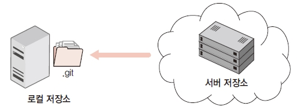

# 저장소 복제
---
`init` 초기화 명령은 새 저장소를 생성하는 방법 입니다.
> 처음 프로젝트를 시작할 때는 직접 로컬 컴퓨터에 명령어를 실행하여 저장소를 생성합니다.  

깃은 `init` 명령외에 저장소를 생성할 수 있는 다른 방법이 또하나 존재 합니다. 그 방법은 기존에 생성된 저장소를 복제 하는 것입니다.

 

## 복제
---
깃은 개발작업시 실수를 줄이기 위해서 코드의 작성 이력을 순차적으로 기록합니다.  
이처럼 실수를 방지하기 위한 목적외에 다른 사람들과 협업을 위해서 깃을 사용하는 용도가 더 많습니다.  

외부에는 수많은 프로젝트가 존재합니다. 이러한 프로젝트들은 깃으로 형상관리되어 깃허브, 비트버킷과 같은 외부 공개 저장소에 등록되어 배포됩니다. 이렇게 외부로 공개된 저장소를 복제하여 로컬 컴퓨터에 새로운 저장소를 생성할 수 있습니다.  

  

이처럼 외부 저장소를 이용하여 로컬 저장소를 생성하는 것을 `깃 저장소 복제`라고 합니다.   

 

## [공개 저장소](open)
---
공개 저장소란? 로컬 컴퓨터가 아닌 외부의 서버에 존재하는 원격 저장소를 의미합니다. 
원격저장소는 직접 서버를 구축하여 만들수도 있고, 깃허브와 같은 호스팅 서비스를 이용할 수도 있습니다.

* [호스팅 저장소](open)
* [공개/비공개](open)

 

## [다운로드](download)  vs 복제
---
원격 서버에 접속하여 깃 저장소를 자신의 컴퓨터에 복제할 수 있습니다. 깃허브와 같은 호스팅 서비스는 원격 저장소의 코드를 2가지 방십으로 받을 수 있습니다.  

* [내려받기](download)
* [복제](download)

 

## [복제](clone) 명령어
---
* 저장소 URL
* 복제 실습
* 저장소 이름 변경

