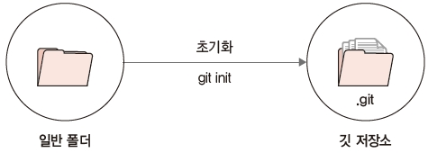

# 깃 초기화
---
깃 저장소를 생성하기 위해서는 먼저 `초기화`라는 작업이 필요합니다.  
초기화란 이미 존재하는 폴더에 깃 초기화 명령어를 실행하여, 기존 폴더를 `VCS`로 관리할 수 있도록
숨겨진 영역을 생성하는 작업입니다. 

그럼 깃 저장소의 숨겨진 영역을 만들어 보면서 보다 깊이 저장소에 대해서 알아가 보도록 하겠습니다.  

<br>

## 깃 베시: CLI
---
깃은 모든 명령어를 텍스트 입력 기반의 `콘솔창`에서 `실행`합니다. 
윈도우 운영체제에 깃을 설치하게 되면, 깃은 유닉스 기반의 명령어를 입력하고 실행할 수 있도록 `깃베시`를 기본적으로 제공합니다.  

윈도우 바탕화면에서 다음과 같이 보이는 아이콘을 더블클릭하여 실행합니다.  


깃 배시(터미널 콘솔창)을 실행합니다.  
깃 배시 콘솔창에서 직접 명령을 입력하여 깃 저장소를 초기화 해보도록 하겠습니다.

> Nodte: 터미널은 텍스트로 명령어를 입력할 수 있는 대화창입니다.  
> 깃 배시 터미널 프로그램 외에도 윈도에 기본 내장된 CMD, powerShell 등을 사용해도 됩니다.  
> 책에서는 깃 배시를 기준으로 합니다. 윈도우 메뉴 말고 바탕화면의 깃 배시 아이콘으로 실행해도 됩니다.

<br>

#### 실습준비
깃 저장소 생성 실습을 위한 새 폴더를 하나 만듭니다. 또는 기존에 있던 폴더를 사용해도 괜찮습니다.  
다음과 같이 실습 폴더를 생성하고 이동합니다. 예제에서는 `jinygit03` 폴더로 만들고 이동했습니다.  

```bash
$ mkdir jinygit03  ☜ 폴더를 만듭니다.
$ cd jinygit03     ☜ 만든 폴더로 이동합니다.
```

> Note: mkdir 명령어와 cd 명령어  
> mkdir 명령어는 make directory의 약어로 셸(터미널)에서 폴더를 만드는 명령입니다.  
> `cd 명령어`는 change directory의 약어로 디렉터리를 이동하는 명령입니다.  
> 명령 프롬프트를 사용하는 것이 익숙하지 않다면, 윈도 탐색기에서 마우스 오른쪽 버튼을 누른 후 `새로 만들기` > `폴더 메뉴`를 선택하여 만들어도 좋습니다.  

<br>

> Note: 지정된 폴더에서 깃 배시 열기  
> 명령 프롬프트에서 원하는 경로로 이동하기 불편하다면, 윈도 탐색기를 사용하여 원하는 폴더로 이동한 후 해당 폴더에서 터미널을 열 수 있습니다. 
> 원하는 폴더에서 마우스 오른쪽 버튼을 누른 후 Git Bash Here 메뉴를 선택합니다.  


<br>

## 초기화 명령어
---
실습을 위한 폴더가 준비가 되어 있다면, 다음은 `초기화 명령어`를 입력하여 깃 저장소를 생성해 봅니다.  

깃 명령어는 `git`이라는 키워드와 명령어를 함께 사용합니다.

```
$ git 명령어 옵션 입력값
```

명령어 뒤에는 `옵션`을 추가할 수도 있고, 그 뒤에는 깃에게 전달하는 값을 입력할 수 도 있습니다.  

<br>

깃 저장소를 만드는 명령어는 `init`입니다. init 명령 뒤에는 초기화 하고자 하는 폴더를 지정합니다. 

```bash
$ git init 경로명
```

만일 경로명을 `생략`하게 되면, 현재의 폴더가 깃 저장소로 초기화 됩니다.

앞에서 설명했듯이 git init 명령어를 실행하게 되면 기존 폴더에 숨겨진 영역(숨겨진 폴더)을 `추가`됩니다.   
즉, 깃 저장소의 생성이란, 숨겨진 영역을 추가 하는 것으로써 `깃 저장소`로 `변경`되는 것입니다.  

<br>

## 저장소 생성하기 실습
---
깃 명령어의 구조와 초기화 명령어에 대해서 알아 보았습니다. 방금 학습한 내용을 실습을 통하여 직접 만들어 보도록 하겠습니다.  

우리는 현재 원하는 폴더로 이동한 상태입니다. 현재의 폴더에서 깃 저장소를 생성할 것이므로 경로명을 생략합니다.

```
$ git init ☜ 저장소 초기화 명령
```

명령을 입력하게 되면 다음과 같이 초기화가 잘 되었다는 `성공 메시지`를 확인할 수 있습니다.

```
$ git init ☜ 저장소 초기화 명령
Initialized empty Git repository in E:/jinygit03/.git/
```

`Initialized empty~` 같은 메시지가 출력되었다면, 정상적으로 초기화 된 것입니다.  
이와 다르게 경로명을 생략하는 대신에 리눅스에서 현재의 폴더를 의미하는 `닷(.)` 기호를 사용할 수도 있습니다.  

```
$ git init . ☜ 현재의 폴더기호 사용
```
깃 초기화는 완전히 `비어` 있는 폴더나 `기존에 사용하던` 폴더에서 모두 가능합니다.  
저장소를 생성한 후에 `ls -all` 명령어를 입력해 봅니다. 이전과 달리 `.git`이라는 숨겨진 폴더가 하나 더 생성된 것을 볼 수 있습니다.  



 
깃 저장소는 영어 표현으로 `리포지터리`라고 부릅니다.
저장소와 리포지터리 모두 같은 말이니 두 용어를 혼동하지 말고 동일한 것으로 이해하면 됩니다.  

`git init` 명령어는 기본적으로 로컬 저장소를 생성하며, 다양한 옵션을 추가로 제공합니다.  
추가 옵션을 사용하여 원격 저장소도 초기화할 수 있습니다. 

<br>

## 윈도우에서 숨김화면 관리하기
---
깃 베시에서는 숨겨진 폴더를 `ls -al`명령으로 확인할 수 있었습니다. 하지만 윈도우의 경우 숨겨진 폴더는 기본적으로 보이지 않습니다.  
윈도우 탐색기에서 숨겨진 폴더를 확인하기 위해서는 탐색기의 설정값을 약간 변경해 주어야 합니다.  

탐색기 > 보기 메뉴를 선택합니다. 항목중에서 `숨김 항목` 체급합니다.  


 
  

<br>