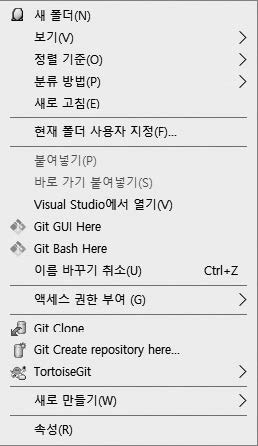

# 초기화: CLI
---
그럼 깃 저장소의 숨겨진 영역을 살펴보면서 저장소를 좀 더 알아봅시다.  
저장소를 생성하려면 먼저 `초기화 작업`이 필요합니다.  
깃에서 초기화란 이미 존재하는 폴더에 초기화 명령어로 `VCS` 관리를 위한 숨겨진 영역을 생성하는 작업을 의미합니다.  

<br>

## 깃 베시
---
깃 초기화를 해 봅시다. 먼저 터미널(깃 배시)을 실행합니다.  


>Nodte: 터미널은 텍스트로 명령어를 입력할 수 있는 대화창입니다.  
깃 배시 터미널 프로그램 외에도 윈도에 기본 내장된 CMD, powerShell 등을 사용해도 됩니다.  
책에서는 깃 배시를 기준으로 합니다. 윈도 메뉴 말고 바탕화면의 깃 배시 아이콘으로 실행해도 됩니다.

실습에 필요한 새 폴더를 하나 만들겠습니다.  
또는 기존에 있던 폴더에서 시작해도 괜찮습니다.  
먼저 실습 폴더를 만들고 해당 폴더로 이동합니다.  

책에서는 `jinygit03` 폴더를 만들고 해당 폴더로 이동했습니다.  

```
$ mkdir jinygit03  ☜ 폴더를 만듭니다.
$ cd jinygit03     ☜ 만든 폴더로 이동합니다.
```

>Note: mkdir 명령어와 cd 명령어  
mkdir 명령어는 make directory의 약어로 셸(터미널)에서 폴더를 만드는 명령입니다.  
`cd 명령어`는 change directory의 약어로 디렉터리를 이동하는 명령입니다.  
명령 프롬프트를 사용하는 것이 익숙하지 않다면, 윈도 탐색기에서 마우스 오른쪽 버튼을 누른 후 `새로 만들기` > `폴더 메뉴`를 선택하여 만들어도 좋습니다.  

>Note:지정된 폴더에서 깃 배시 열기  
명령 프롬프트에서 원하는 경로로 이동하기 불편하다면, 윈도 탐색기를 사용하여 원하는 폴더로 이동한 후 해당 폴더에서 터미널을 열 수 있습니다. 원하는 폴더에서 마우스 오른쪽 버튼을 누른 후 Git Bash Here 메뉴를 선택합니다.  



<br>

## 명령어 입력
---
이제 `터미널`에서 다음 `초기화 명령어`를 입력합니다.  
깃 명령어는 보통 `git` 키워드와 명령어를 함께 입력합니다.  
`옵션`을 추가할 수도 있습니다.  

```bash
$ git init 경로명
```

앞에서 설명했듯이 git init 명령어는 기존 폴더에 숨겨진 영역(숨겨진 폴더)을 `추가`합니다.  
숨겨진 영역을 추가함으로써 `깃 저장소로 변경`되는 것입니다.  

<br>

## 현재 폴더 초기화 하기
---
초기화 명령어를 입력할 때 경로명을 입력하지 않으면, 현재 폴더에서 초기화됩니다.  
우리는 원하는 폴더로 이동한 상태이므로 경로명을 입력하지 않고 실행할 것입니다.  
정상적으로 초기화되었다면 `Initialized empty~` 같은 메시지를 출력합니다.  

```
$ git init ☜ 저장소 초기화 명령
Initialized empty Git repository in E:/jinygit03/.git/
```

현재 폴더를 의미하는 `.`을 사용할 수도 있습니다.
```
$ git init .
```


깃 초기화는 완전히 `비어` 있는 폴더나 `기존에 사용하던` 폴더에서 모두 가능합니다.  

앞에서 언급했듯이 깃 저장소는 영어로 `리포지터리`라고 하니, 두 용어를 혼동하지 말고 동일한 것으로 이해하면 됩니다.  

<br>

## 윈도우에서 숨김화면 관리하기
---
초기화된 저장소에서 `숨긴 항`’을 볼 수 있게 허용하면, 숨겨진 영역을 확인할 수 있습니다.  

>Note: 윈도 탐색기에서 숨겨진 파일을 표시하려면 설정을 변경해야 합니다. 탐색기  보기 메뉴를 선택한 후 숨긴 항목을 체크합니다.  


`git init` 명령어는 기본적으로 로컬 저장소를 생성하며, 다양한 옵션을 추가로 제공합니다.  
추가 옵션을 사용하여 원격 저장소도 초기화할 수 있습니다.  
  

<br>