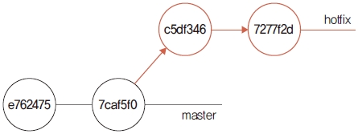
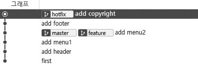
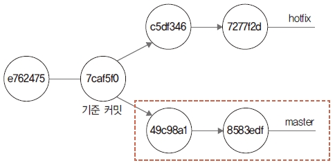
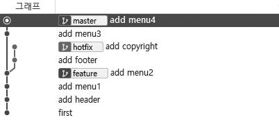
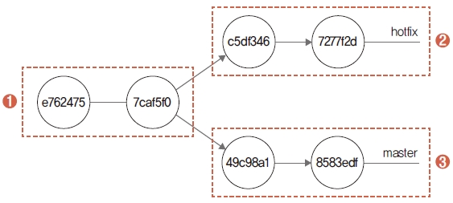
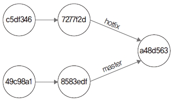
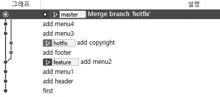

# 3-way 병합
---
이번에는 깃의 또 다른 병합 알고리즘인 3-way 방식을 알아보겠습니다. 3-way 병합은 좀 더 복잡한 병합을 처리할 수 있는 방법입니다. 여러 개발자와 협업으로 작업하는 경우 대부분 3-way 병합을 사용합니다.  

<br>
<a name="1"></a>

## 브랜치 생성과 수정 작업
---
직접 실습하며 3-way 병합을 익히겠습니다. 새로운 작업을 할 hotfix 브랜치를 생성하고, hotfix 브랜치로 체크아웃합니다.  

```
infoh@DESKTOP MINGW64 /e/gitstudy08 (master)
$ git checkout -b hotfix
Switched to a new branch 'hotfix'

infoh@DESKTOP MINGW64 /e/gitstudy08 (hotfix)
```

현재 브랜치 위치는 hotfix입니다.  

그림 8-12] hotfix 브랜치 생성  


이번에는 소스 코드에 `<footer></footer>` 태그를 추가하고 내용을 적을 것입니다. 커밋 두 번으로 나누어 진행합니다. 먼저 `<footer>` 태그를 추가하고 저장합니다.  

```
infoh@DESKTOP MINGW64 /e/gitstudy08 (hotfix)
$ code index.htm
```

index.htm
```html
<!DOCTYPE html>
<html>
<head>
    <meta charset="utf-8" />    
    <meta name="viewport" content="width=device-width, initial-scale=1">
    <title>Page Title</title>
</head>
<body>
    <header>
        <ul>
            <li>깃소개</li>
            <li>깃설치</li>
        </ul>
    </header>        
    <h1>hello GIT world!</h1>

    <footer> ☜ 추가
    </footer>

</body>
</html>
```

수정한 파일은 Modified 상태가 됩니다. 수정한 파일을 다시 스테이지에 등록한 후 커밋합니다.  

```
infoh@DESKTOP MINGW64 /e/gitstudy08 (hotfix)
$ git commit -am "add footer"
[hotfix c5df346] add footer
 1 file changed, 3 insertions(+)
```

다시 index.htm 파일에 `<footer>` 내용을 추가한 후 커밋합니다.  

```
infoh@DESKTOP MINGW64 /e/gitstudy08 (hotfix)
$ code index.htm
```

index.htm
```html
<!DOCTYPE html>
<html>
<head>
    <meta charset="utf-8" />    
    <meta name="viewport" content="width=device-width, initial-scale=1">
    <title>Page Title</title>
</head>
<body>
    <header>
        <ul>
            <li>깃소개</li>
            <li>깃설치</li>
        </ul>
    </header>        
    <h1>hello GIT world!</h1>
    <footer>
        copyright all right 2018 reserved by hojinlee ☜ 추가
    </footer>
</body>
</html>
```
 
```
infoh@DESKTOP MINGW64 /e/gitstudy08 (hotfix)
$ git commit -am "add copyright"
[hotfix 7277f2d] add copyright
 1 file changed, 1 insertion(+)
```

이 과정을 그림으로 나타내면 다음과 같습니다.  

그림 8-13] hotfix 브랜치에서 파일 수정 및 커밋 로그  


소스트리에서 커밋 로그 기록을 확인하면 다음과 같습니다.  

그림 8-14] 소스트리에서 hotfix 브랜치의 커밋 로그 확인  


hotfix 브랜치에 새로운 커밋이 2개 추가되었습니다. 지금까지 hotfix 브랜치에서 진행한 수정은 앞에서 실습한 Fast-Forward 병합과 유사합니다. Fast-Forward 병합에서는 생성한 브랜치에만 수정과 커밋을 했고, 원본 master 브랜치에서는 어떤 작업도 하지 않았습니다.  

<br>
<a name="2"></a>

## 마스터 변경
---
이번에는 브랜치 모양을 변경해 보겠습니다. master 브랜치에도 새로운 커밋을 추가하여 실습을 진행하겠습니다. 먼저 hotfix 브랜치에서 master 브랜치로 이동합니다.  

```
infoh@DESKTOP MINGW64 /e/gitstudy08 (hotfix)
$ git checkout master
Switched to branch 'master'

infoh@DESKTOP MINGW64 /e/gitstudy08 (master) ☜ 원본 브랜치로 이동
```

그림 8-15] 원본 브랜치로 이동  


hotfix 브랜치의 마지막 커밋은 7277f2d입니다. 그리고 master 브랜치의 마지막 커밋은 7caf5f0입니다. 시간적으로 좀 더 앞 단계인 master 브랜치에 새로운 커밋을 추가해 보겠습니다.  

master 브랜치의 index.htm 파일에 menu3을 추가하고 커밋합니다.

```
infoh@DESKTOP MINGW64 /e/gitstudy08 (master)
$ code index.htm
```

index.htm
```html
<!DOCTYPE html>
<html>
<head>
    <meta charset="utf-8" />    
    <meta name="viewport" content="width=device-width, initial-scale=1">
    <title>Page Title</title>
</head>
<body>
    <header>
        <ul>
            <li>깃소개</li>
            <li>깃설치</li>
            <li>커밋</li>
        </ul>
    </header>        
    <h1>hello GIT world!</h1>
</body>
</html>
```
 
```
infoh@DESKTOP MINGW64 /e/gitstudy08 (master)
$ git commit -am "add menu3"
[master 49c98a1] add menu3
 1 file changed, 1 insertion(+)
```

다시 한 번 menu4를 추가하고 커밋합니다.

```
infoh@DESKTOP MINGW64 /e/gitstudy08 (master)
$ code index.htm
```
 

index.htm
```html
<!DOCTYPE html>
<html>
<head>
    <meta charset="utf-8" />    
    <meta name="viewport" content="width=device-width, initial-scale=1">
    <title>Page Title</title>
</head>
<body>
    <header>
        <ul>
            <li>깃소개</li>
            <li>깃설치</li>
            <li>커밋</li>
            <li>브랜치</li>☜ 추가
        </ul>
    </header>        
    <h1>hello GIT world!</h1>
</body>
</html>
```
 
```
infoh@DESKTOP MINGW64 /e/gitstudy08 (master)
$ git commit -am "add menu4"
[master 8583edf] add menu4
 1 file changed, 1 insertion(+)
```

이제 메뉴가 4개입니다. master 브랜치에 추가 커밋이 발생하면 다음과 같이 브랜치는 7caf5f0을 기준으로 hotfix와 master 브랜치로 갈라집니다. 기준 커밋에서 서로 다른 브랜치의 커밋이 연결됩니다.  

그림 8-16] 기준 커밋에서 분기



소스트리에서 master 브랜치의 그래프 모양을 확인해 보겠습니다. 이전 Fast-Forward 병합과는 달리 브랜치가 좀 더 확실하게 나뉘어 있습니다.  

그림 8-17] 소스트리에서 브랜치 그래프 확인  


<br>
<a name="3"></a>

## 공통 조상
---
앞의 실습에서 브랜치별로 각각 커밋하면 두 브랜치로 갈라지는 모습을 보았습니다. 이처럼 브랜치 모양이 갈라지는 형태로 나뉠 때는 Fast-Forward 방식의 알고리즘을 적용하여 병합할 수 없습니다. 이때는 다른 병합 알고리즘인 3-way 방식을 이용해야 합니다.  

두 브랜치를 병합하려면 먼저 분할 기준인 공통 커밋을 찾아야 합니다. 이를 공통 조상 커밋이라고 합니다. 공통 조상 커밋을 포함하는 브랜치와 새로운 두 브랜치, 이렇게 3개를 하나로 병합해야 합니다. 브랜치가 3개 있다고 해서 3-way 병합이라고 합니다.  

그림 8-18] 브랜치 3개 병합  


깃은 3-way 병합을 할 때 공통 조상 커밋을 자동으로 찾아 줍니다. 이는 다른 VCS들보다 서로 다른 브랜치를 편리하게 병합할 수 있는 깃의 장점입니다.  

<br>
<a name="4"></a>

## 병합 커밋
---
병합은 각 브랜치에서 독립적으로 작업된 소스를 파일 하나로 결합합니다. 하지만 브랜치별로 각각 작업한 내용을 병합하는 과정은 힘들고 어렵습니다. 하지만 깃을 사용하면 복잡한 병합도 좀 더 손쉽게 처리할 수 있습니다.  

3-way 병합은 두 브랜치에서 공통 조상 커밋을 자동으로 찾아 주며, 공통 조상 커밋을 기준으로 브랜치를 병합합니다. 그리고 병합을 성공적으로 완료한 후에는 새로운 커밋을 추가로 하나 생성합니다. 새로 생성된 커밋을 병합 커밋이라고 합니다. 병합 커밋은 부모 커밋이 2개라는 특징이 있습니다.  

그림 8-19] 병합 커밋  


그럼 앞에서 실습한 hotfix 브랜치를 master 브랜치에 병합해 봅시다. hotfix 브랜치를 병합하려면 먼저 기준이 되는 master 브랜치로 체크아웃해야 합니다. 다른 브랜치에 있다면 git checkout master로 체크아웃하세요.  

```
infoh@DESKTOP MINGW64 /e/gitstudy08 (master) ☜ 기준 브랜치
$ git merge hotfix ☜ 기준 브랜치에 hotfix를 병합
Auto-merging index.htm
Merge made by the 'recursive' strategy.
 index.htm | 3 +++
 1 file changed, 3 insertions(+)
```

3-way 방식으로 hotfix 브랜치와 master 브랜치를 병합했습니다. 그림으로 병합 구조를 나타내면 그림 8-20과 같습니다.  

그림 8-20] hotfix 브랜치의 3-way 병합  


성공적으로 병합한 후에는 커밋 로그를 확인합니다.  

```
infoh@DESKTOP MINGW64 /e/gitstudy08 (master)
$ git log -1
commit a48d563373f777f5f19a1ad9426297c5bc31d01c (HEAD -> master)
Merge: 8583edf 7277f2d
Author: hojin <infohojin@gmail.com>
Date:   Fri May 17 16:30:07 2019 +0900
    Merge branch 'hotfix'
```

새로운 병합 커밋이 하나 추가되었습니다. 소스트리에서도 병합된 모습을 확인할 수 있습니다.  

그림 8-21] 소스트리에서 병합 커밋 확인  


<br>
<a name="5"></a>

## 병합 메시지
---
3-way 병합을 간단히 실습해 보았습니다. 앞에서 3-way 병합을 할 때 새로운 병합 커밋이 생성되었습니다. 3-way 병합은 Fast-Forward 병합과 달리 병합 메시지가 필요합니다. 그리고 “Merge branch ‘hotfix’”라고 커밋 메시지가 자동 삽입된 것을 확인할 수 있습니다. 깃은 두 브랜치를 병합한 후에 새로운 커밋을 하면서 동시에 메시지를 자동 생성합니다.  

자동으로 작성되는 메시지 외에 직접 커밋 메시지를 작성할 수도 있습니다. merge 명령어를 실행할 때 -e 또는 --edit 옵션을 사용하면 됩니다.  

```
$ git merge 브랜치이름 --edit
```

그럼 직접 병합 메시지를 작성해 봅시다. 실습을 위해 바로 앞에서 진행한 병합을 취소하고 메시지를 추가하여 다시 병합하겠습니다. reset 명령어로 바로 앞의 병합을 취소할 수 있습니다. 리셋은 9장에서 자세히 설명하겠습니다.   

```
infoh@DESKTOP MINGW64 /e/gitstudy08 (master)
$ git reset --hard HEAD^ ☜ 병합을 취소합니다.
HEAD is now at 8583edf add menu4

infoh@DESKTOP MINGW64 /e/gitstudy08 (master)
$ git merge hotfix --edit
```

개발자가 직접 입력할 수 있는 vi 에디터 창이 열립니다.  

그림 8-22] 병합 메시지를 입력할 수 있는 vi 에디터 창  


병합 메시지를 작성하고 에디터를 종료합니다. 그러면 다음과 같이 병합 결과 메시지가 출력되고 직접 작성한 메시지로 커밋됩니다.  

```
Auto-merging index.htm
Merge made by the 'recursive' strategy.
 index.htm | 3 +++
 1 file changed, 3 insertions(+)

```

<br><br>