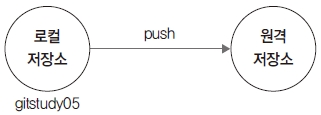
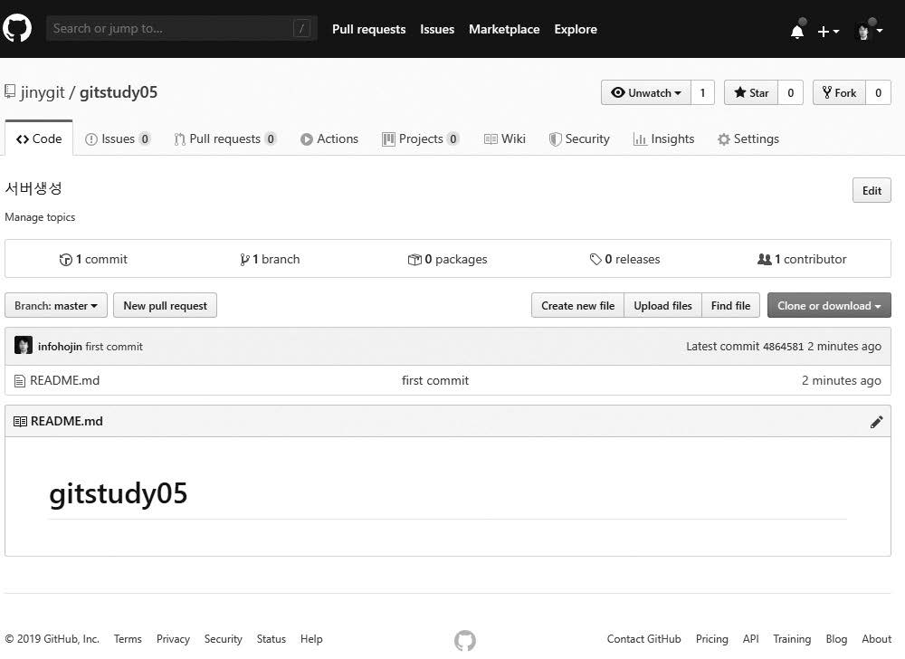

## 서버 전송
로컬 저장소의 커밋을 원격 저장소로 전송하는 방법을 알아보았습니다. 원격 저장소가 연결되면 로컬 저장소의 커밋들을 업로드할 수 있습니다.  

<br>
<a name="1"></a>

## push: 서버에 전송
---
푸시(push)는 원격 저장소로 커밋된 파일들을 업로드하는 동작입니다. 원격 저장소와 연결된 서버 목록을 확인해 봅시다.  

```
infoh@hojin MINGW64 /e/gitstudy05 (master)
$ git remote -v
origin  https://github.com/jinygit/gitstudy05.git (fetch)
origin  https://github.com/jinygit/gitstudy05.git (push)
```

처럼 업로드가 가능한 원격 저장소가 등록된 것을 확인할 수 있습니다. 원격 저장소로 로컬 깃 저장소의 내용을 전송할 때는 push 명령어를 사용합니다.  

```
$ git push 원격저장소별칭 브랜치이름
```
 
별칭 이름을 가지는 서버의 master 브랜치에 현재 브랜치를 업로드합니다. 브랜치(branch)는 다음 장에서 상세하게 설명합니다.  

그림 5-7] 푸시 동작  


그럼 실제로 push 명령어를 사용하여 현재 master 브랜치를 origin 서버로 전송해 보겠습니다.  

```
infoh@hojin MINGW64 /e/gitstudy05 (master)
$ git push origin master ☜ 서버로 전송합니다
Enumerating objects: 3, done.
Counting objects: 100% (3/3), done.
Writing objects: 100% (3/3), 222 bytes | 222.00 KiB/s, done.
Total 3 (delta 0), reused 0 (delta 0)
To https://github.com/jinygit/gitstudy05.git
 * [new branch]      master -> master
```

준비한 깃허브 저장소를 확인합니다. 처음 푸시하면 서버에 새로운 master 브랜치를 생성합니다. 그리고 로컬의 master 브랜치 안에 있는 소스 코드를 서버의 master 브랜치로 업로드합니다. 다음과 같이 깃허브에서 확인할 수 있습니다.  

그림 5-8] 원격 저장소에 푸시  


>Note: 원격 저장소에 푸시하면 master 저장소가 총 2개 생성됩니다. 로컬 저장소의 master 브랜치와 서버의 master 브랜치입니다. 전송은 두 브랜치 간에 전송과 수신을 동기화합니다.  

자신의 로컬 저장소를 백업하는 용도로 원격 저장소를 사용할 수 있습니다. 꼭 다른 사람들과 협업하려고 깃의 원격 저장소를 사용하는 것은 아닙니다. 혼자 개발할 때도 백업을 위해 원격 저장소를 같이 사용하면 좋습니다.  

<br><br>